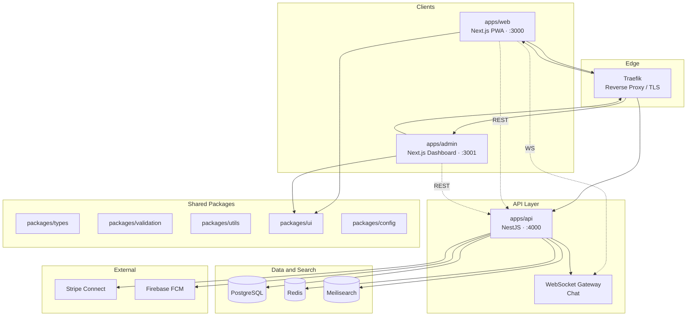

# Community Marketplace

[](LICENSE)
[](https://nodejs.org/)
[](https://pnpm.io/)
[](https://www.typescriptlang.org/)

Full-stack community marketplace platform built as an enterprise-grade **pnpm monorepo**. Buyers and sellers connect through listings, real-time messaging, payments, and search — with a dedicated admin dashboard for operations, moderation, and platform governance.

---

## Table of Contents

- [Overview](#overview)
- [Features](#features)
- [Architecture](#architecture)
- [Technology Stack](#technology-stack)
- [Repository Structure](#repository-structure)
- [Prerequisites](#prerequisites)
- [Getting Started](#getting-started)
- [Environment Configuration](#environment-configuration)
- [Development](#development)
- [Build & Deployment](#build--deployment)
- [API Modules](#api-modules)
- [Documentation](#documentation)
- [Contributing](#contributing)
- [License](#license)

---

## Overview

Community Marketplace is a multi-tenant-style community trading platform designed for local and niche marketplaces. The system separates **public buyer/seller experiences** (web PWA), **internal operations** (admin dashboard), and a **unified backend API** (NestJS) backed by PostgreSQL, Redis, and Meilisearch.

Shared contracts — types, validation schemas, UI primitives, and configuration — live in workspace packages so all applications stay consistent and type-safe end to end.

---

## Features

| Domain | Capabilities |
|--------|--------------|
| **Authentication** | Email/password registration, JWT sessions, OTP login, email activation |
| **Users & Profiles** | Profile management, identity verification, RBAC (buyer, seller, admin) |
| **Listings** | CRUD, categories, images, lifecycle states (draft → active → sold) |
| **Search** | Full-text search via Meilisearch with automatic indexing |
| **Messaging** | Real-time buyer–seller chat over WebSockets (Socket.IO) |
| **Payments** | Stripe Connect onboarding and card payments |
| **Notifications** | Push notifications via Firebase Cloud Messaging (FCM) |
| **Moderation** | User reports, bans, and admin review workflows |
| **Administration** | Platform stats, user/listing management, audit logging |

---

## Architecture



| Service | Default Port | Responsibility |
|---------|--------------|----------------|
| `web` | 3000 | Public marketplace UI (PWA-capable) |
| `admin` | 3001 | Operations and moderation dashboard |
| `api` | 4000 | REST API + WebSocket backend |
| `postgres` | 5432 | Primary relational datastore |
| `redis` | 6379 | Cache, sessions, job queues |
| `meilisearch` | 7700 | Full-text search index |
| `traefik` | 80 / 443 | Routing and TLS termination |

---

## Technology Stack

| Layer | Technologies |
|-------|--------------|
| **Monorepo** | pnpm workspaces, TypeScript project references |
| **Frontend** | Next.js 15, React 19, Tailwind CSS, Zustand |
| **Backend** | NestJS 10, Prisma ORM, Passport JWT, Socket.IO |
| **Database** | PostgreSQL |
| **Search** | Meilisearch |
| **Payments** | Stripe Connect |
| **Validation** | Zod (shared schemas), class-validator (API DTOs) |
| **Infrastructure** | Docker Compose, Kubernetes manifests, Traefik |

---

## Repository Structure

```
community-marketplace/
├── apps/
│   ├── api/          # NestJS REST + WebSocket API (Prisma, auth, listings, payments, chat)
│   ├── web/          # Public Next.js marketplace application
│   └── admin/        # Next.js admin dashboard
├── packages/
│   ├── config/       # Shared env loaders, constants, TypeScript base configs
│   ├── types/        # Shared TypeScript interfaces and enums
│   ├── validation/   # Shared Zod validation schemas
│   ├── utils/        # Shared utility functions
│   └── ui/           # Shared React component library
├── docs/
│   ├── architecture/ # System design, module boundaries, sequence diagrams
│   ├── api/          # REST endpoint documentation
│   ├── db/           # Schema and migration guides
│   └── product/      # Requirements, user stories, roadmap
├── infra/
│   ├── docker/       # Dockerfiles and docker-compose stack
│   ├── k8s/          # Kubernetes base manifests and overlays
│   └── traefik/      # Reverse proxy configuration
├── package.json      # Root workspace scripts
└── pnpm-workspace.yaml
```

---

## Prerequisites

| Tool | Version |
|------|---------|
| [Node.js](https://nodejs.org/) | ≥ 20.0.0 |
| [pnpm](https://pnpm.io/) | ≥ 9.0.0 |
| [PostgreSQL](https://www.postgresql.org/) | 15+ (local or Docker) |
| [Docker](https://www.docker.com/) | Optional — for full local stack |

---

## Getting Started

### 1. Clone the repository

```bash
git clone https://github.com/golpochat/community-marketplace.git
cd community-marketplace
```

### 2. Install dependencies

```bash
pnpm install
```

### 3. Configure environment variables

Copy the example env files and adjust values for your environment:

```bash
cp apps/api/.env.example apps/api/.env
cp apps/web/.env.example apps/web/.env
cp apps/admin/.env.example apps/admin/.env
```

See [Environment Configuration](#environment-configuration) for variable details.

### 4. Start infrastructure services

Using Docker Compose (recommended for local development):

```bash
docker compose -f infra/docker/docker-compose.yml up -d
```

### 5. Initialize the database

```bash
pnpm --filter @community-marketplace/api prisma:generate
pnpm --filter @community-marketplace/api prisma:migrate
pnpm --filter @community-marketplace/api prisma:seed
```

### 6. Build shared packages and start development

```bash
# All apps in parallel
pnpm dev

# Or run individually
pnpm dev:web    # http://localhost:3000
pnpm dev:admin  # http://localhost:3001
pnpm dev:api    # http://localhost:4000
```

---

## Environment Configuration

### API (`apps/api/.env`)

| Variable | Description | Example |
|----------|-------------|---------|
| `PORT` | API listen port | `4000` |
| `NODE_ENV` | Runtime environment | `development` |
| `CORS_ORIGIN` | Allowed frontend origins (comma-separated) | `http://localhost:3000,http://localhost:3001` |
| `DATABASE_URL` | PostgreSQL connection string | `postgresql://localhost:5432/community_marketplace` |
| `JWT_SECRET` | Secret for signing JWT tokens | *(set a strong value in production)* |
| `STRIPE_SECRET_KEY` | Stripe API secret key | |
| `MEILISEARCH_HOST` | Meilisearch server URL | `http://localhost:7700` |
| `MEILISEARCH_API_KEY` | Meilisearch API key | |
| `FCM_PROJECT_ID` | Firebase Cloud Messaging project ID | |

### Web & Admin (`apps/web/.env`, `apps/admin/.env`)

| Variable | Description | Example |
|----------|-------------|---------|
| `NEXT_PUBLIC_API_URL` | Base URL for API requests | `http://localhost:4000/api` |

> **Security note:** Never commit `.env` files. Only `.env.example` templates are tracked in version control.

---

## Development

### Root workspace scripts

| Command | Description |
|---------|-------------|
| `pnpm dev` | Start all apps in parallel |
| `pnpm dev:web` | Start public web app only |
| `pnpm dev:admin` | Start admin dashboard only |
| `pnpm dev:api` | Build packages, then start API with hot reload |
| `pnpm build` | Build all packages, then all apps |
| `pnpm typecheck` | Run TypeScript checks across the monorepo |
| `pnpm lint` | Run linters in all workspaces |
| `pnpm test` | Run tests in all workspaces |
| `pnpm format` | Format code with Prettier |
| `pnpm clean` | Remove build artifacts and `node_modules` |

### Package build order

Shared packages must be built before apps that depend on them. The root `build` and `dev:api` scripts handle this automatically:

```
packages/config → packages/types → packages/validation → packages/utils → packages/ui → apps/*
```

### API-specific commands

```bash
pnpm --filter @community-marketplace/api prisma:generate   # Regenerate Prisma client
pnpm --filter @community-marketplace/api prisma:migrate      # Run migrations
pnpm --filter @community-marketplace/api prisma:seed         # Seed development data
```

---

## Build & Deployment

### Production build

```bash
pnpm build
```

### Docker

Build individual service images from the repository root:

```bash
docker build -f infra/docker/Dockerfile.api   -t cm-api .
docker build -f infra/docker/Dockerfile.web   -t cm-web .
docker build -f infra/docker/Dockerfile.admin -t cm-admin .
```

Run the full local stack:

```bash
docker compose -f infra/docker/docker-compose.yml up -d
```

### Kubernetes

Kubernetes manifests live under `infra/k8s/` with environment-specific overlays (`dev`, `prod`). See [`infra/k8s/README.md`](infra/k8s/README.md) for deployment instructions.

### Deployment targets

| Environment | Tooling |
|-------------|---------|
| Local | Docker Compose + `infra/scripts/deploy.sh` |
| Kubernetes | `infra/k8s/base` with `dev` / `prod` overlays |

---

## API Modules

The NestJS API is organized into domain modules under `apps/api/src/modules/`:

| Module | Responsibility |
|--------|----------------|
| `auth` | Registration, login, JWT, OTP, email activation |
| `users` | Profiles, verification, account management |
| `listings` | Listing CRUD, categories, images |
| `search` | Meilisearch integration and query endpoints |
| `chat` | Conversations, messages, WebSocket gateway |
| `payments` | Stripe Connect, payment records |
| `notifications` | FCM push notifications, device tokens |
| `moderation` | Reports, bans, content review |
| `admin` | Platform administration and audit logs |
| `health` | Health check endpoints |

REST endpoint documentation is available in [`docs/api/`](docs/api/README.md).

---

## Documentation

| Area | Location |
|------|----------|
| Architecture & system design | [`docs/architecture/`](docs/architecture/README.md) |
| API reference | [`docs/api/`](docs/api/README.md) |
| Database schema & migrations | [`docs/db/`](docs/db/README.md) |
| Product requirements & roadmap | [`docs/product/`](docs/product/README.md) |
| Docker infrastructure | [`infra/docker/`](infra/docker/README.md) |
| Kubernetes deployment | [`infra/k8s/`](infra/k8s/README.md) |

---

## Contributing

1. Fork the repository and create a feature branch from `main`.
2. Follow existing code conventions — TypeScript strict mode, functional React components, NestJS module patterns.
3. Run `pnpm typecheck` and `pnpm lint` before opening a pull request.
4. Keep changes scoped; shared types and validation belong in `packages/`, not duplicated in apps.
5. Open a pull request with a clear description of the change and test plan.

---

## License

This project is licensed under the [MIT License](LICENSE).

---

<p align="center">
  <strong>Community Marketplace</strong> — built with pnpm, Next.js, and NestJS
</p>
