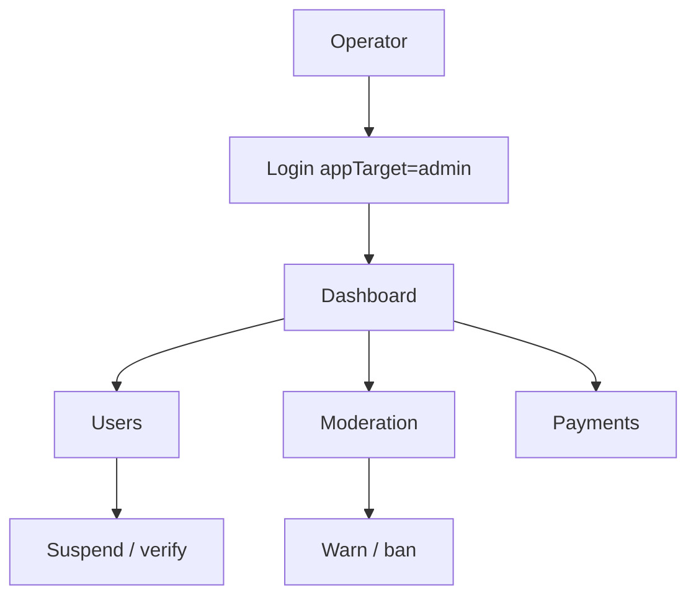

# Admin Panel — Operator Guide

> **App:** `apps/admin` (port 3001) · **API:** [admin.md](../api/admin.md) · **Feature spec:** [admin-panel.md](../features/admin-panel.md)

Enterprise admin console for **ADMIN** and **SUPER_ADMIN** personas with granular RBAC.

## Architecture

```
apps/admin/
├── src/app/admin/dashboard/**       # ADMIN URLs
├── src/app/super-admin/dashboard/** # SUPER_ADMIN URLs
├── src/app/dashboard/**             # Shared page implementations
├── components/                      # Feature panels + AdminShell
├── lib/navigation.ts                # buildAdminNav()
└── lib/server-rbac.ts               # requireAdminPermission()
```

## Getting started

```bash
pnpm dev:admin    # http://localhost:3001
```

Credentials: [dev-credentials.md](../dev-credentials.md)

## Screen index

| Screen | Guide | Permission |
|--------|-------|------------|
| Dashboard | — | `view_platform_stats` |
| [User management](./user-management.md) | Suspend, list, filter | `view_users` |
| [Seller verification](./seller-verification.md) | Approve/reject KYC | `approve_verification` |
| [Listings & moderation](./listings-moderation.md) | Ban listings, reports | `view_listings` |
| [Payments](./payments.md) | Refunds, disputes | `view_payments` |
| [Search](./search.md) | Reindex, health | `manage_search_index` |
| [Notifications](./notifications.md) | Templates, broadcast | `manage_notifications` |
| [System settings](./settings.md) | Platform config | SUPER_ADMIN |

## RBAC layers

| Layer | Mechanism |
|-------|-----------|
| Middleware | Role cookie enforcement |
| Server pages | `requireAdminPermission()` |
| Client UI | `<PermissionGate>` |

`SUPER_ADMIN` bypasses all permission checks.

## Workflow diagram



## Screenshots

> Placeholder: add screenshots to `docs/admin/assets/` in future releases.
> - `dashboard-overview.png`
> - `moderation-queue.png`
> - `verification-approve.png`

## Related

- [Admin API](../api/admin.md)
- [Security — RBAC](../security/rbac.md)
