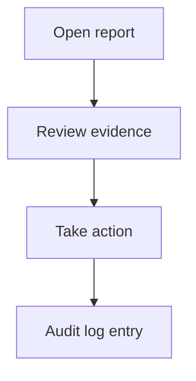

# Listings & Moderation (Admin)

> **Screens:** `/dashboard/listings`, `/dashboard/moderation`

## Listings management

- Filter by status, seller, category
- **Ban** / **Unban** listing (`ban_listing`)
- Banned listings hidden from search (`moderationHiddenAt`)

## Moderation queue

- Reports from users, listings, messages
- Assign to moderator, add notes
- Actions: warn, suspend, ban, approve/reject listings, escalate
- Appeals review

**Operational workflow:** [master-blueprint-v1.md §9](../product/master-blueprint-v1.md#9-admin-moderation-workflow)

## API

- [moderation.md](../api/moderation.md)
- [admin.md](../api/admin.md#moderation-apadminmoderation)

## Screenshot placeholder

`docs/admin/assets/moderation-queue.png`
