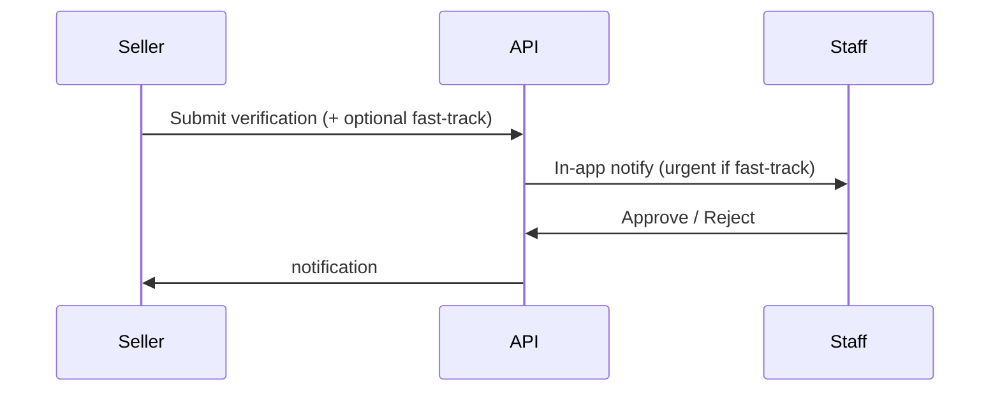

# Seller Verification (Admin)

> **Screen:** `/admin/seller-verification/*` · **Permission:** `review_seller_verification`

Live seller identity verification (KYC) for unified **MEMBER** and **SELLER** accounts. This is the queue fed by `/account/verification`.

The legacy **Account Verifications** (`user_verifications` badge queue) has been removed from admin.

## Workflow

1. Seller completes the verification wizard and clicks **Submit for review**
2. Staff receive an in-app notification (bell)
3. Open **Seller Verification → Pending** (filter **Fast-track** / **Standard** as needed)
4. Review documents (R2 `verification-documents/` prefix)
5. **Approve** or **Reject** with a required reason
6. Seller notified via the Notifications module

## Standard vs fast-track

| | Standard (free) | Fast-track (paid) |
|---|---|---|
| Same documents & rules | Yes | Yes |
| Separate request row | No — one open case per seller | No — `priority` flag on same case |
| Admin queue | Chronological among standard | Sorted first + SLA target (24h from submission) |
| Instant verify | Never | Never |

**Fast-track** sets `priority = true` and persists `priorityActivatedAt` / `slaDueAt`. Paying does not skip document review.

### Staff notifications

| Event | When |
|---|---|
| `user.verification_requested` | Seller submits (urgent copy if priority) |
| `seller.verification_priority_activated` | Seller pays for fast-track after submit |
| `seller.verification_sla_overdue` | Priority case past SLA (job, once per case) |

Reviewers: `ADMIN`, `SUPER_ADMIN`, and roles with `review_seller_verification` (e.g. Accounts Admin).

### Rejecting a paid fast-track case

If the rejected request had **priority**, the seller receives one **complimentary priority re-queue** on their next resubmission (stored on the fast-track purchase metadata). Payment covers review speed, not approval.

## Edge cases

- At most **one pending** request per seller (DB-enforced)
- Rejected sellers may resubmit; paid fast-track reject includes one free priority re-queue
- Approved sellers gain verified capabilities; auto **8%** platform fee unless manually overridden

## API

See seller verification admin routes under `/admin/seller-verification`.
