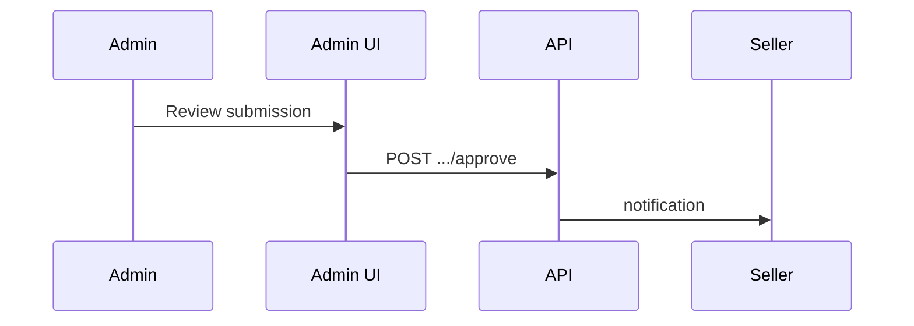

# Seller Verification (Admin)

> **Screen:** `/dashboard/verifications` · **Permission:** `approve_verification`

## Workflow

1. Open **Verifications** queue (pending submissions)
2. Review documents (R2 `verification-documents/` prefix)
3. **Approve** or **Reject** with notes
4. Seller notified via Notifications module

## Edge cases

- Rejected sellers may resubmit per policy
- Approved sellers gain seller capabilities on next session

## API

See [users API](../api/users.md#admin-verification)

## Screenshot placeholder

`docs/admin/assets/verification-queue.png`
