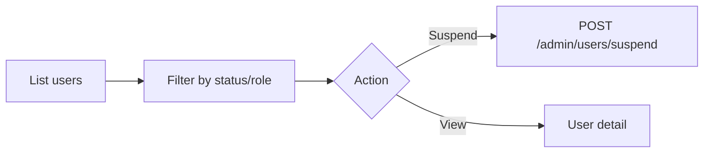

# User Management (Admin)

> **Screen:** `/admin/users` · `/super-admin/users` · **Permission:** `view_users`, `suspend_user`

## Workflow

## Procedures

### Suspend a user

1. Navigate to **Users**
2. Locate user → **Suspend**
3. Confirm — requires `suspend_user`
4. User receives notification; sessions may be invalidated

### Unsuspend

Same flow with unsuspend action.

## API

`GET /api/admin/users` · `POST /api/admin/users/suspend`

## Screenshot placeholder

`docs/admin/assets/users-list.png`
