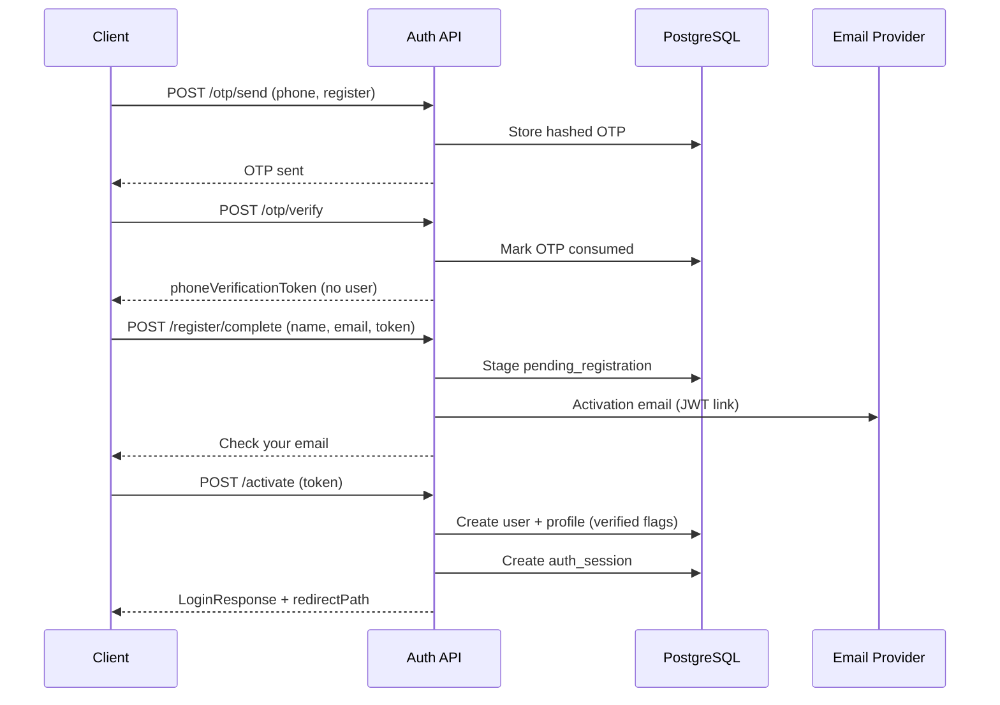

# Auth API

> Base path: `/api/auth`

Enterprise authentication for Community Marketplace: **phone OTP registration**, **JWT email activation**, **access + refresh token sessions** with rotation, **RBAC-aware login redirection**, brute-force protection, audit logging, and secure HTTP-only refresh cookies.

---

## Overview

| Flow | Description |
|------|-------------|
| **Registration** | Phone OTP → verify (no user created) → name + email → activation email → user created on activation |
| **Login** | Email/password or OTP (existing users) → JWT session pair |
| **Session** | 15 min access token + 7 day refresh token, stored hashed in PostgreSQL with rotation |
| **RBAC redirect** | Login response includes `redirectPath` and `appTarget` based on role |

---

## Endpoints

| Method | Path | Auth | Description |
|--------|------|------|-------------|
| `POST` | `/register` | Public | Deprecated — returns 400; use OTP registration flow |
| `POST` | `/register/complete` | Public | After OTP verify: submit name + email, send activation email |
| `POST` | `/login` | Public | Password login → session tokens + RBAC redirect |
| `POST` | `/otp/send` | Public | Send rate-limited OTP (phone or email) |
| `POST` | `/otp/verify` | Public | Verify OTP; register purpose returns phone verification token only |
| `POST` | `/activate` | Public | Validate activation JWT + set password → create user → optional auto-login |
| `POST` | `/activate/preview` | Public | Preview activation token (email, account type) |
| `POST` | `/activate/resend` | Public | Resend activation email for pending registration |
| `POST` | `/password/forgot` | Public | Request password reset email |
| `POST` | `/password/reset/preview` | Public | Preview reset token |
| `POST` | `/password/reset` | Public | Complete password reset → optional auto-login |
| `POST` | `/password/change` | Bearer | Change password (authenticated) |
| `POST` | `/refresh` | Public | Rotate refresh token (body or `cm_refresh_token` cookie) |
| `POST` | `/logout` | Bearer | Revoke session(s); clears refresh cookie |
| `POST` | `/admin-invite/preview` | Public | Preview admin invitation |
| `POST` | `/admin-invite/accept` | Public | Accept admin invitation → session |

All successful responses are wrapped as `{ "data": ... }`.

---

## 3.1 — OTP Verification Flow

### Send OTP

```http
POST /api/auth/otp/send
Content-Type: application/json

{
  "channel": "phone",
  "phone": "+14155552671",
  "purpose": "register"
}
```

**Rate limits:** max 5 sends per recipient per 10 minutes. OTP expires in 10 minutes. Max 5 verification attempts per code.

**Response:**

```json
{
  "data": {
    "channel": "phone",
    "recipient": "+14155552671",
    "purpose": "register",
    "expiresInSeconds": 600,
    "message": "OTP sent to your phone"
  }
}
```

In development, the OTP code is logged to the API console.

### Verify OTP (registration)

```http
POST /api/auth/otp/verify
Content-Type: application/json

{
  "channel": "phone",
  "phone": "+14155552671",
  "code": "123456",
  "purpose": "register"
}
```

**Important:** No user is created at this step.

```json
{
  "data": {
    "verified": true,
    "phone": "+14155552671",
    "phoneVerificationToken": "eyJ...",
    "expiresInSeconds": 900,
    "message": "Phone verified. Complete registration with your name and email."
  }
}
```

### Verify OTP (login — existing users)

Use `purpose: "login"` with a registered phone or email. On success, returns a full `LoginResponse` with session tokens.

---

## 3.2 — Email Activation Flow (JWT)

### Complete registration (after OTP)

```http
POST /api/auth/register/complete
Content-Type: application/json

{
  "name": "Jane Buyer",
  "email": "jane@example.com",
  "phoneVerificationToken": "eyJ..."
}
```

Validates the phone verification JWT, checks email/phone uniqueness, stages pending registration, and publishes an activation email event.

```json
{
  "data": {
    "email": "jane@example.com",
    "activationExpiresIn": 86400,
    "message": "Check your email to activate your account."
  }
}
```

### Activation token payload

Signed JWT (`type: email_activation`, 24h TTL):

| Claim | Type | Description |
|-------|------|-------------|
| `name` | string | Display name |
| `email` | string | Email address |
| `phone` | string | E.164 phone |
| `type` | `"email_activation"` | Token kind |
| `iat` / `exp` | number | Issued / expiry (Unix seconds) |

### Activate email

```http
POST /api/auth/activate
Content-Type: application/json

{
  "token": "eyJ...",
  "password": "SecurePass1!",
  "confirmPassword": "SecurePass1!"
}
```

Creates the user with `email_verified_at` and `phone_verified_at` set. Default marketplace role is **`MEMBER`**. Returns auto-login session on first activation:

```json
{
  "data": {
    "activated": true,
    "email": "jane@example.com",
    "userId": "uuid",
    "login": {
      "user": { "id": "...", "role": "MEMBER", "..." : "..." },
      "accessToken": "eyJ...",
      "refreshToken": "eyJ...",
      "expiresIn": 900,
      "sessionId": "uuid",
      "issuedAt": "2026-06-24T12:00:00.000Z",
      "redirectPath": "/account",
      "appTarget": "web"
    }
  }
}
```

Activation link format: `{WEB_APP_URL}/auth/activate?token={jwt}`

---

## 3.3 — JWT Session Management

### Access token (`AuthPayload`)

| Claim | Description |
|-------|-------------|
| `sub` | User ID |
| `email` | User email |
| `role` | RBAC role code |
| `primaryRoleId` | Role FK |
| `sid` | Session ID |
| `exp` | 15 minutes |

Send as `Authorization: Bearer <accessToken>`.

### Refresh token

Same payload shape, 7-day TTL. Stored as **SHA-256 hash** in `auth_sessions`. On refresh:

1. Validate refresh JWT + session row
2. Revoke old session
3. Issue new access + refresh pair (rotation)
4. Set new `cm_refresh_token` httpOnly cookie

### Refresh

```http
POST /api/auth/refresh
Cookie: cm_refresh_token=eyJ...
```

Or:

```json
{ "refreshToken": "eyJ..." }
```

### Logout

```http
POST /api/auth/logout
Authorization: Bearer <accessToken>

{ "sessionId": "uuid" }
```

Revokes the session and clears the refresh cookie.

---

## 3.4 — RBAC-Aware Login Redirection

`LoginResponse` includes:

| Role | `redirectPath` | `appTarget` |
|------|----------------|-------------|
| `SUPER_ADMIN` | `/super-admin/dashboard` | `web` |
| `ADMIN` (+ personas) | `/admin/dashboard` | `web` |
| `MEMBER` / `SELLER` / `BUYER` | `/account` | `web` |

All roles use the unified `apps/web` frontend (`appTarget` is always `web`).

Protected API routes use global `AuthGuard` + `RolesPermissionsGuard` with `@RequireRole` / `@RequirePermissions`.

---

## 3.5 — Security & Hardening

| Control | Implementation |
|---------|----------------|
| **Brute-force protection** | Max 10 failed logins per email or IP / 15 min → HTTP 429 |
| **OTP rate limiting** | 5 sends / 10 min per recipient; 5 verify attempts per code |
| **Device fingerprint** | SHA-256 of `User-Agent` + IP + optional `X-Device-Fingerprint` header |
| **Audit logs** | `auth_login_audit` table — login, logout, OTP, activation, refresh, brute-force blocks |
| **Uniqueness** | `users.email` unique; `user_profiles.phone` unique |
| **Secure cookies** | `cm_refresh_token` — `httpOnly`, `sameSite=lax`, `secure` in production, path `/api/auth` |
| **Token storage** | Refresh tokens hashed at rest; plain tokens never stored |

---

## Error cases

| HTTP | Scenario |
|------|----------|
| `400` | Validation error, invalid/expired OTP, missing refresh token |
| `401` | Invalid credentials, invalid/expired JWT |
| `403` | Email not activated, account suspended, no pending registration |
| `409` | Email or phone already linked to an account (context-specific message) |
| `429` | OTP rate limit, brute-force lockout, too many OTP attempts |

Example error body:

```json
{
  "statusCode": 401,
  "message": "Invalid email or password",
  "error": "Unauthorized"
}
```

---

## Shared types & validation

Types (`@community-marketplace/types`):

- `AuthPayload`, `ActivationTokenPayload`, `PhoneVerificationTokenPayload`
- `SessionTokens`, `LoginResponse`
- `OtpVerifiedResponse`, `CompleteRegistrationResponse`

Zod schemas (`@community-marketplace/validation`):

- `sendOtpSchema`, `verifyOtpSchema`, `completeRegistrationSchema`
- `activateEmailSchema`, `refreshTokenSchema`, `logoutSchema`

---

## Environment variables

| Variable | Required | Description |
|----------|----------|-------------|
| `JWT_SECRET` | Yes (prod) | Signs access, refresh, activation, and phone verification JWTs |
| `WEB_APP_URL` | Yes | Base URL for activation links (e.g. `http://localhost:3000`) |
| `DATABASE_URL` | Yes | PostgreSQL connection |
| `CORS_ORIGIN` | Yes | Must include the web app origin(s) (e.g. `https://sellnearby.ie`); `credentials: true` required for cookies |

---

## Security notes

1. **Never commit `JWT_SECRET`** — use a cryptographically random value ≥ 32 bytes in production.
2. **Access tokens** should live in memory on the client; refresh tokens use httpOnly cookies where possible.
3. **Role cookies** (`cm-role`) on frontends are UX hints only — authorization is enforced server-side.
4. **OTP delivery** is event-bus based in development; wire a real SMS/email provider before production.
5. **Session fixation** is mitigated by refresh token rotation and session revocation on logout.

---

## Sequence: full registration


