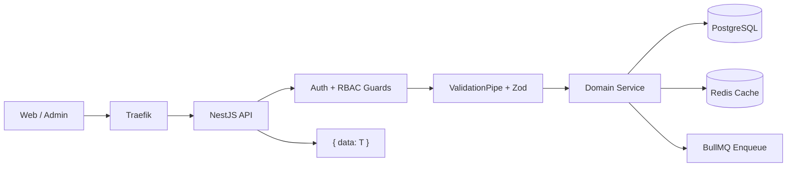
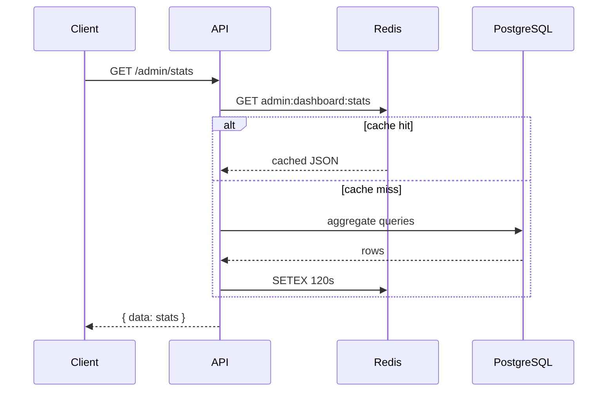
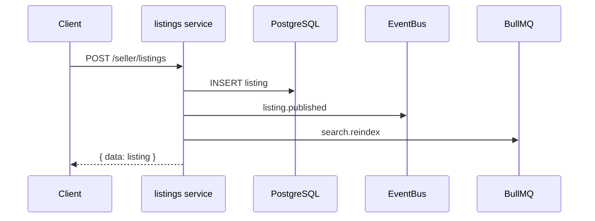
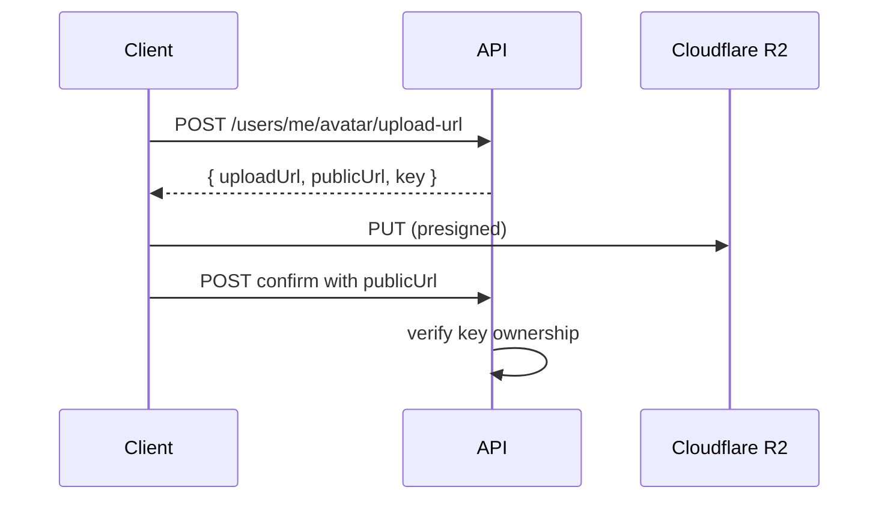

# Data Flow Diagrams

> **Category:** Architecture

## Request flow (REST)

## Read path with cache

## Write path with side effects

## File upload flow (R2)

## Related

- [Sequence Diagrams](./sequence-diagrams.md)
- [Deployment Architecture](./deployment-architecture.md)
