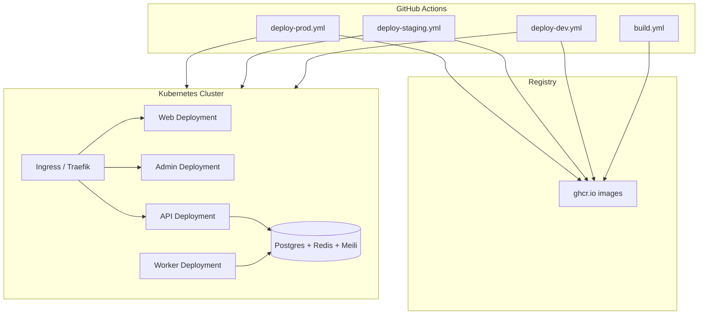

# Deployment Architecture

> **Category:** Architecture

End-to-end deployment: GitHub Actions → container registry → Kubernetes → Traefik ingress.

## Environment matrix

| Env | Branch trigger | Namespace | Overlay |
|-----|----------------|-----------|---------|
| Development | `develop` | `community-marketplace` | `overlays/dev` |
| Staging | `main` | `community-marketplace-staging` | `overlays/staging` |
| Production | Manual workflow | `community-marketplace` | `overlays/prod` |

## TLS & routing

- Traefik terminates TLS (Let's Encrypt ACME)
- Host-based routing: `api.*`, `community.market`, `admin.*`
- Middlewares: rate limit, compression, security headers

## Post-deploy verification

1. `kubectl rollout status deployment/<env>-api`
2. `curl https://api.<domain>/api/health/ready`
3. Grafana: error rate, latency, `bullmq_queue_waiting`
4. Smoke test: login, listing search, admin dashboard

## Related

- [Infrastructure](../infrastructure/README.md)
- [Deploy runbook](../runbooks/deploy.md)
- [Rollback runbook](../runbooks/rollback.md)
