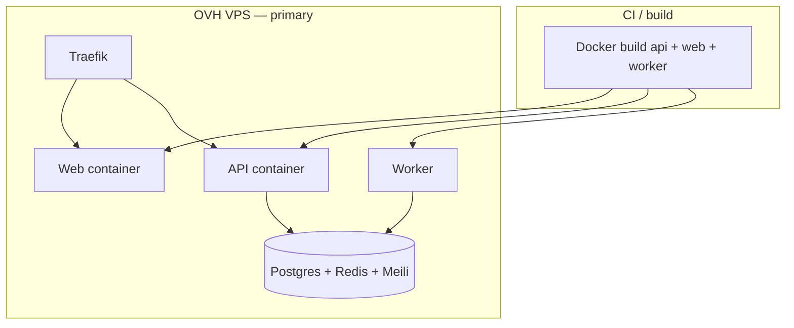

# Deployment Architecture

> **Category:** Architecture · **Last updated:** 2026-07-22

**Primary (pilot / current production):** GitHub Actions (optional) or manual build → Docker images → **OVH VPS Docker Compose** + Traefik. See [ovh-vps-deploy.md](../runbooks/ovh-vps-deploy.md).

**Optional / future:** Kubernetes overlays under `infra/k8s/` (includes leftover admin deployment manifests — **not** required for the unified web app).

## Environment matrix (Compose)

| Env | Typical path | Notes |
|-----|--------------|-------|
| Local | `infra/docker/docker-compose.dev.yml` | Infra + optional API |
| Pilot / prod | `infra/docker/docker-compose.prod.yml` | Web + API + worker + data — **no separate admin service** |

## TLS & routing

- Traefik terminates TLS (Let's Encrypt ACME) where configured
- Host-based routing for **web** + **api** (e.g. `sellnearby.ie`, `api.*`)
- Admin UI is **path-based** on the web app (`/admin`, `/super-admin`) — no `admin.*` host required
- Middlewares: rate limit, compression, security headers (where enabled)

## Post-deploy verification

1. Compose health: `docker compose … ps` / API `GET /api/health/ready`
2. Smoke: login → `/account` or `/admin/dashboard`
3. Grafana / logs if observability stack is enabled

## Related

- [Infrastructure](../infrastructure/README.md)
- [OVH VPS deploy](../runbooks/ovh-vps-deploy.md)
- [Deploy runbook](../runbooks/deploy.md) (K8s-oriented — demoted vs Compose for pilot)
