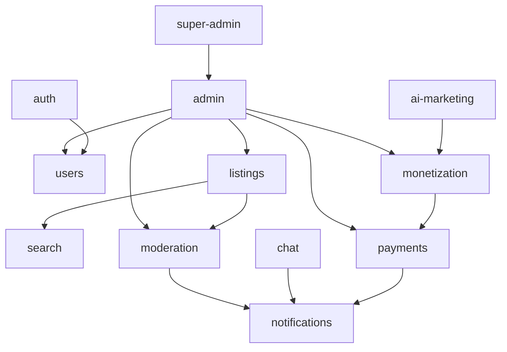

# Domain Modules

> **Category:** Architecture · **Code:** `apps/api/src/modules/` · **Last updated:** 2026-07-22

Each domain module owns its controllers, services, and persistence boundaries.

## Module catalog

| Module | Responsibility | Key integrations |
|--------|----------------|------------------|
| **auth** | OTP, JWT sessions, activation, password reset, brute-force | users, events |
| **admin-invitations** | Invite + accept admin operators | auth, super-admin |
| **users** | Profiles, settings, avatars (R2), store banner, phone change OTP | auth, admin |
| **listings** | CRUD, images, favorites, feeds, lifecycle, **stores** | search, moderation, monetization |
| **chat** | Threads, messages, WebSocket gateway | notifications, moderation |
| **payments** | Stripe Connect, intents, refunds, Stripe disputes | notifications, events |
| **disputes** | Marketplace buyer/seller disputes | payments, notifications, admin |
| **fraud** | Fraud signals / admin queue | admin, payments |
| **notifications** | Templates, providers, FCM/email, preferences | events, jobs |
| **search** | Meilisearch indexing, autocomplete, optional semantic | jobs, listings |
| **moderation** | Reports, actions, appeals, content checks | jobs, notifications |
| **monetization** | Boosts, featured, wallet, display ads, growth packs | payments, admin, listings |
| **ai-marketing** | Seller Marketing Hub generations + credits | monetization, listings |
| **verification** | Seller ID verification (seller + admin APIs) | users, admin |
| **share** | Short links / share attribution | listings |
| **statements** | Buyer statements / admin finance | payments |
| **platform** | Public platform meta | config |
| **admin** | Cross-domain admin APIs, dashboard stats | all domain modules |
| **super-admin** | Platform settings, RBAC, admins, invitations | admin, rbac |
| **buyer / seller** | Role-scoped route namespaces | users, listings, chat, payments |
| **health / metrics** | Probes + Prometheus | infra |

## Dependency graph (simplified)

## Persona routing

| Persona | API prefix | Frontend (`apps/web`) |
|---------|------------|------------------------|
| Public | `/api/listings`, `/api/stores`, `/api/ads`, … | `(site)` routes |
| Marketplace member | `/api/buyer/*`, `/api/seller/*`, `/api/users/me` | `/account/*` |
| Admin | `/api/admin/*` | `/admin/*` |
| Super admin | `/api/super-admin/*` | `/super-admin/*` |

## Related

- [Feature specs](../features/README.md)
- [API reference](../api/README.md)
