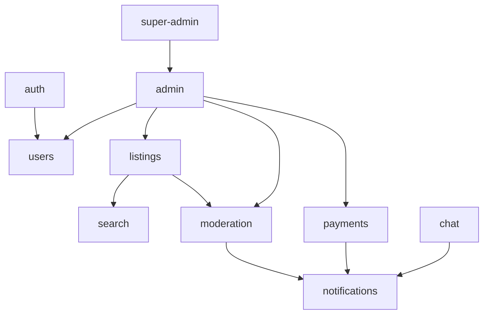

# Domain Modules

> **Category:** Architecture · **Code:** `apps/api/src/modules/`

Each domain module owns its controllers, services, and persistence boundaries.

## Module catalog

| Module | Responsibility | Key integrations |
|--------|----------------|------------------|
| **auth** | OTP, JWT sessions, activation, brute-force protection | users, events |
| **users** | Profiles, settings, verification, avatars (R2) | auth, admin |
| **listings** | CRUD, images, favorites, feeds, lifecycle | search, moderation |
| **chat** | Threads, messages, WebSocket gateway | notifications, moderation |
| **payments** | Stripe Connect, intents, refunds, disputes, ledger | notifications, events |
| **notifications** | Templates, providers, FCM/email, preferences | events, jobs |
| **search** | Meilisearch indexing, autocomplete, analytics | jobs, listings |
| **moderation** | Reports, actions, appeals, content checks | jobs, notifications |
| **admin** | Cross-domain admin APIs, dashboard stats | all domain modules |
| **super-admin** | Platform settings, RBAC matrix, admin users | admin, rbac |
| **buyer / seller** | Role-scoped route namespaces | users, listings, chat, payments |

## Dependency graph

## Persona routing

| Persona | API prefix | Frontend |
|---------|------------|----------|
| Public / buyer | `/api/buyer/*`, `/api/listings` | `apps/web` |
| Seller | `/api/seller/*` | `apps/web` |
| Admin | `/api/admin/*` | `apps/admin` |
| Super admin | `/api/super-admin/*` | `apps/admin` |

## Related

- [Feature specs](../features/README.md)
- [API reference](../api/README.md)
