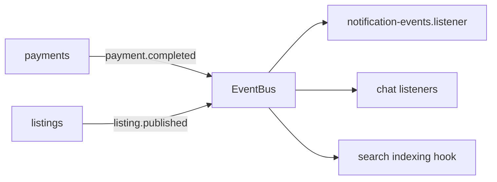
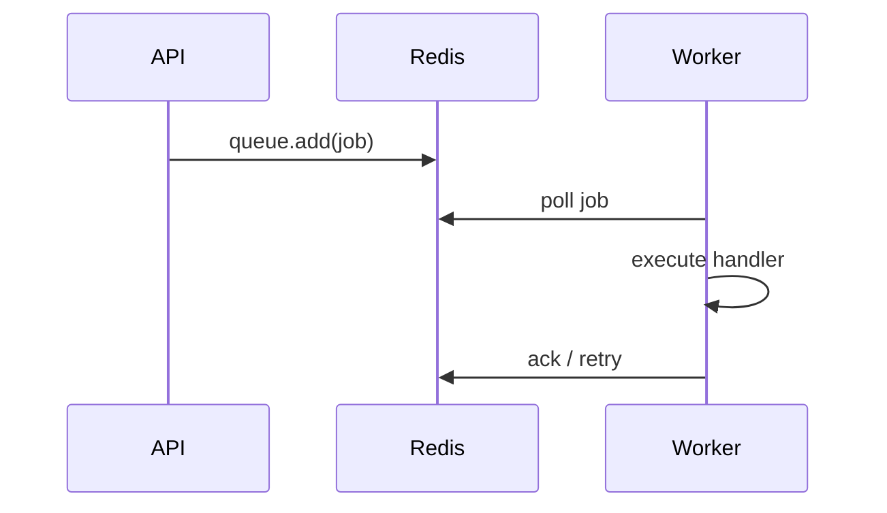

# Event-Driven Architecture

> **Category:** Architecture

Async and decoupled flows use an in-process **event bus** (`EventBusService`) and **BullMQ** job queue for durable background work.

## Event bus (synchronous dispatch)

**Characteristics**

- In-process, same Node event loop
- Listeners in `*/listeners/*.ts`
- Failures logged; no automatic retry (use jobs for retryable work)

## BullMQ jobs (async, durable)

| Job name | Producer | Handler |
|----------|----------|---------|
| `search.reindex` | Search admin API | `SearchIndexingService` |
| `search.nightly_sync` | Cron / scheduler | `SearchIndexingService` |
| `moderation.lift_suspension` | Moderation actions | `ModerationSuspensionJob` |
| `storage.cleanup_orphans` | Scheduler | `R2CleanupJob` |

**Modes:** `BULLMQ_MODE=producer` (API) · `worker` (dedicated process) · `both` (local dev)

## Notification pipeline

1. Domain service emits event or calls `NotificationDispatcherService`
2. Dispatcher checks user preferences + rate limits
3. Channel services (email, push) deliver via providers
4. Delivery logged in `notification_deliveries`

## Search indexing pipeline

1. Listing created/updated → event or direct enqueue
2. `search.reindex` job builds Meilisearch document
3. Fallback to DB search if Meilisearch unavailable

## Moderation automation

1. Content check on report submission (`ModerationContentCheckService`)
2. Auto-flag triggers report queue
3. Suspension expiry via `moderation.lift_suspension` delayed job

## Related

- [Data Flow](./data-flow.md)
- [Infrastructure — Queues](../infrastructure/README.md)
- [Search feature](../features/search.md)
