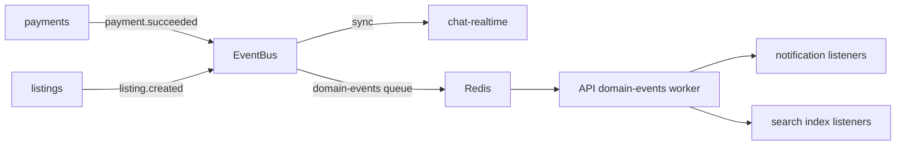
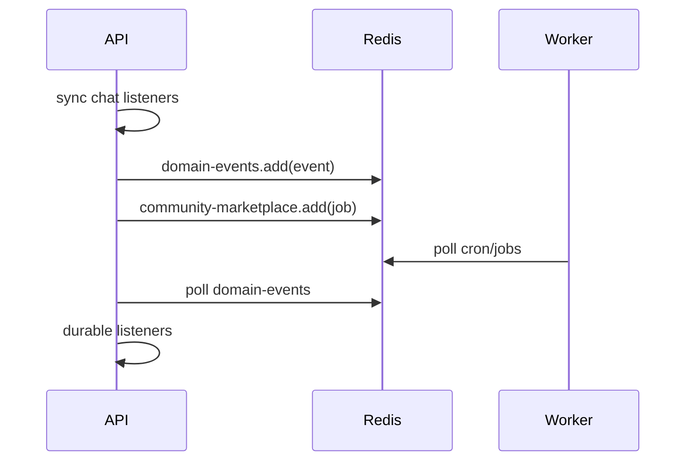

# Event-Driven Architecture

> **Category:** Architecture

Domain side effects go through `EventBusService`. Chat fan-out stays in-process; everything else is a durable BullMQ job on the `domain-events` queue. Scheduled work uses the separate `community-marketplace` job queue.

## Event bus

```mermaid
flowchart LR
  PAY[payments] -->|payment.succeeded| EVT[EventBus]
  EVT -->|sync| CHAT_RT[chat-realtime]
  EVT -->|domain-events queue| REDIS[Redis]
  REDIS --> WORKER[API domain-events worker]
  WORKER --> NOTIF[notification listeners]
  WORKER --> SEARCH[search index listeners]
  LISTINGS[listings] -->|listing.created| EVT
```

**Delivery**

| Kind | When | Retry |
|------|------|--------|
| `sync` | Same process, immediately (Socket.IO / chat presence) | None — caller already succeeded |
| `durable` (default) | Enqueued to Redis `domain-events`; consumed by API (`BULLMQ_MODE=producer` or `both`) | 3 attempts, exponential backoff |

`BULLMQ_MODE=worker` (job worker) **enqueues** domain events but does not consume them, so listeners that live on the API are not skipped.

Without Redis, durable handlers run inline in development and test. Production refuses to boot if `REDIS_URL` is missing or Redis is unreachable.

Listeners live in `*/listeners/*.ts` and subscribe with `eventBus.subscribe(type, handler)`. Chat realtime passes `{ delivery: 'sync' }`.

## BullMQ jobs (async, durable)

| Job name | Producer | Handler |
|----------|----------|---------|
| `domain.event` | `EventBusService.publish` | Durable EventBus subscribers |
| `search.reindex` | Search admin API | `SearchIndexingService` |
| `search.nightly_sync` | Cron / scheduler | `SearchIndexingService` |
| `moderation.lift_suspension` | Moderation actions | `ModerationSuspensionJob` |
| `storage.cleanup_orphans` | Scheduler | `R2CleanupJob` |

```mermaid
sequenceDiagram
  participant API
  participant Redis
  participant Worker

  API->>API: sync chat listeners
  API->>Redis: domain-events.add(event)
  API->>Redis: community-marketplace.add(job)
  Worker->>Redis: poll cron/jobs
  API->>Redis: poll domain-events
  API->>API: durable listeners
```

**Modes:** `BULLMQ_MODE=producer` (API) · `worker` (dedicated process) · `both` (local dev)

## Notification pipeline

1. Domain service emits event or calls `NotificationDispatcherService`
2. Dispatcher checks user preferences + rate limits
3. Channel services (email, push) deliver via providers
4. Delivery logged in `notification_deliveries`

## Search indexing pipeline

1. Listing created/updated → durable event
2. `search.reindex` job builds Meilisearch document
3. Fallback to DB search if Meilisearch unavailable

## Moderation automation

1. Content check on report submission (`ModerationContentCheckService`)
2. Auto-flag triggers report queue
3. Suspension expiry via `moderation.lift_suspension` delayed job

## Related

- [Data Flow](./data-flow.md)
- [Infrastructure — Queues](../infrastructure/README.md)
- [Search feature](../features/search.md)
