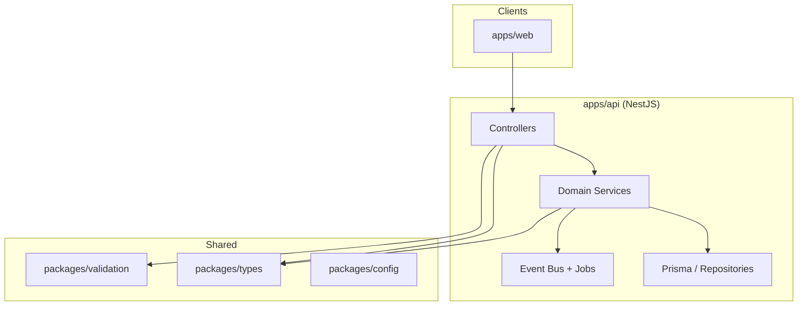

# Modular Monolith Architecture

> **Category:** Architecture

Community Marketplace uses a **modular monolith** pattern: a single deployable API (`apps/api`) with strict internal module boundaries, shared packages for contracts, and optional horizontal scaling of workers.

## Why modular monolith

| Benefit | How |
|---------|-----|
| **Simplicity** | One codebase, one database, straightforward local dev |
| **Type safety** | Shared `packages/types` and `packages/validation` |
| **Clear boundaries** | NestJS modules mirror domain areas |
| **Evolution path** | High-traffic modules (search, notifications) can extract to workers/services later |

## Layering

## Module rules

1. **Controllers** — HTTP/WebSocket only; delegate to services
2. **Services** — business logic; may emit events or enqueue jobs
3. **Cross-module calls** — via exported services, never direct Prisma on foreign entities
4. **Shared validation** — Zod schemas in `packages/validation`
5. **No UI → DB** — frontends call API only

## Deployment units

| Unit | Process | Scales independently |
|------|---------|----------------------|
| API | `node dist/main.js` | ✅ HPA |
| Worker | `node dist/worker.js` | ✅ HPA |
| Web | Next.js standalone | ✅ HPA / Compose scale |
| Postgres / Redis / Meili | Stateful or managed | Per environment |

## Related

- [Domain Modules](./domain-modules.md)
- [Module Boundaries](./module-boundaries.md)
- [Event-Driven Architecture](./event-driven.md)
