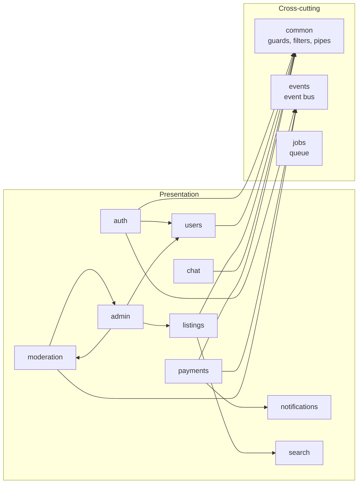

# Module Boundaries

> **Category:** Architecture · Reflects `apps/api/src/modules`

## Monorepo layout

```
community-marketplace/
├── apps/
│   ├── web/          # Marketplace + /account + /admin + /super-admin — no direct DB access
│   ├── admin/        # DEPRECATED — do not use
│   └── api/          # Sole owner of business logic & persistence
├── packages/         # Shared, framework-agnostic code
└── infra/            # Docker, Traefik, optional K8s, scripts
```

## API domain modules

Each module owns its controllers, services, DTOs, and entities. Cross-module calls go through exported services — not direct entity access.



## Boundary rules

| Rule | Description |
|------|-------------|
| **Single write path** | All mutations flow through `apps/api` modules |
| **Shared types** | Domain interfaces live in `packages/types` |
| **Validation** | Request schemas in `packages/validation`; DTOs in API modules |
| **No UI → DB** | Frontends only call API / WebSocket |
| **Search indexing** | `listings` module publishes events; `search` module indexes |
| **Payments** | `payments` owns Stripe; `notifications` sends payment alerts |
| **Moderation** | `moderation` is the only module that creates bans/reports |
| **Admin** | `admin` orchestrates cross-domain ops; does not duplicate domain logic |

## Shared package contracts

| Package | Consumed by | Must not contain |
|---------|-------------|------------------|
| `types` | all apps | Runtime logic |
| `validation` | api, web | NestJS / React deps |
| `utils` | all apps | Framework code |
| `ui` / `ui-dashboard` | web | API calls |
| `config` | all apps | Secrets (only env loaders) |

## Future considerations

- [ ] Extract `search` indexing to async worker (`jobs` module)
- [ ] Add `media` module for image upload / CDN
- [ ] Introduce API gateway rate limiting at Traefik layer
- [ ] Event-driven integration via message broker (replace in-process event bus)
