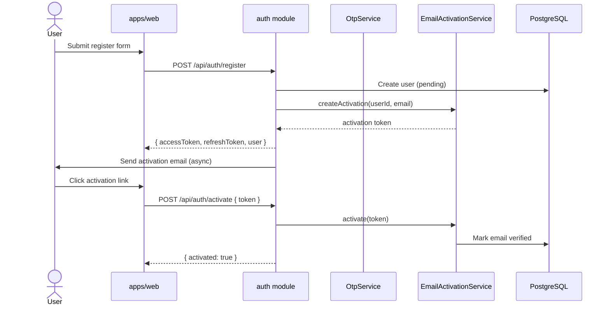
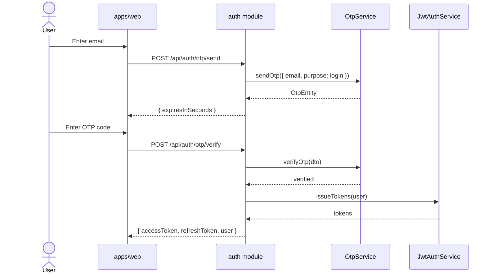
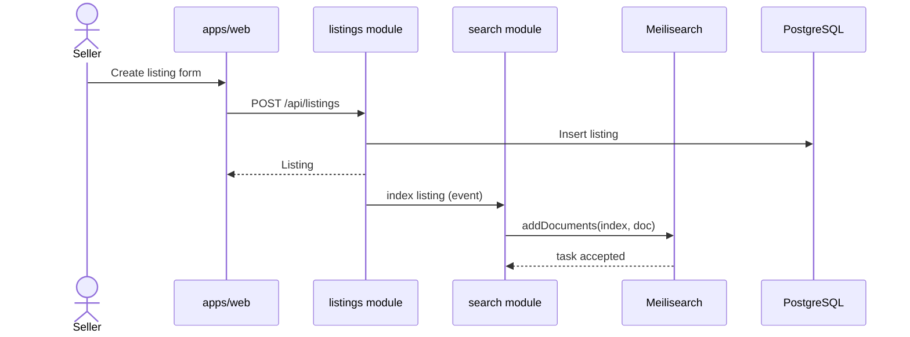
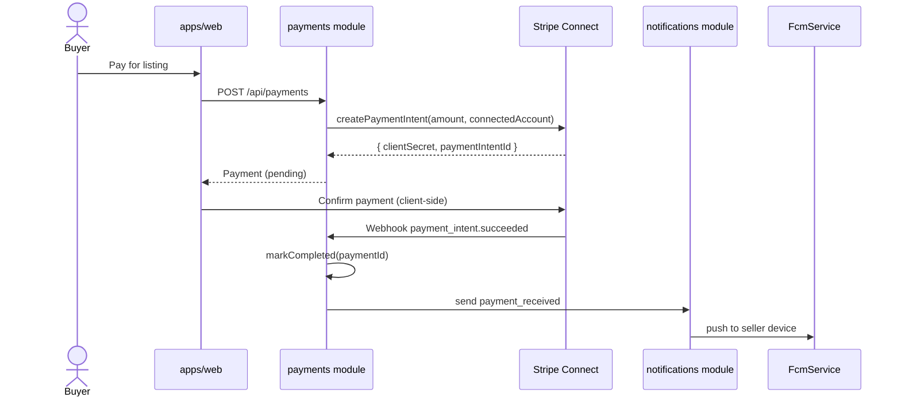
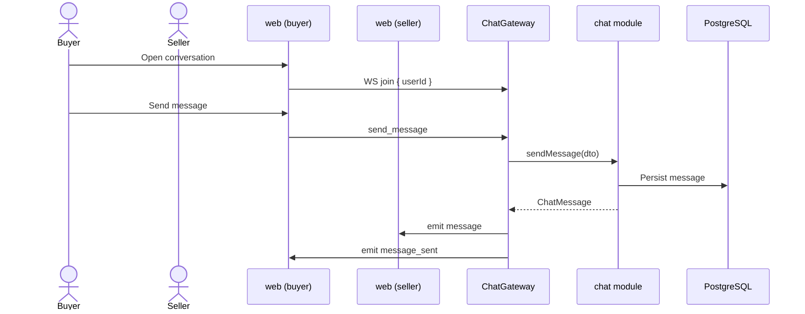

# Sequence Diagrams

> **Status:** Placeholder — align with implemented API endpoints.

## 1. Registration with email activation

## 2. OTP login

## 3. Create listing with search indexing

## 4. Stripe Connect payment

## 5. Real-time chat

## Diagram index

| # | Flow | Primary module |
|---|------|----------------|
| 1 | Email activation | `auth` |
| 2 | OTP login | `auth` |
| 3 | Listing + search index | `listings`, `search` |
| 4 | Stripe payment | `payments`, `notifications` |
| 5 | WebSocket chat | `chat` |
