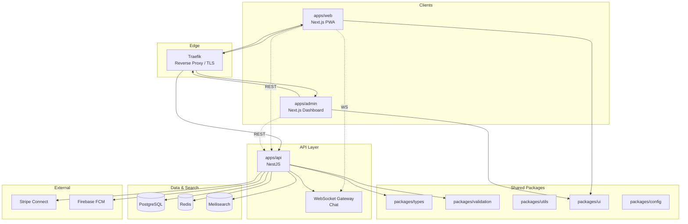

# System Overview

> **Category:** Architecture · **Version:** 0.1.0

Community Marketplace is a pnpm monorepo with three client apps, a NestJS API, shared packages, BullMQ workers, and supporting infrastructure services.

## High-level architecture

## Service map

| Service | Port | Responsibility |
|---------|------|----------------|
| `web` | 3000 | Public marketplace UI |
| `admin` | 3001 | Operations dashboard |
| `api` | 4000 | REST + WebSocket backend |
| `meilisearch` | 7700 | Full-text search |
| `postgres` | 5432 | Primary datastore |
| `redis` | 6379 | Cache, sessions, job queues |
| `traefik` | 80/443 | Routing, TLS termination |

## Deployment targets

| Environment | Tooling |
|-------------|---------|
| Local | `docker compose` + `infra/scripts/deploy.sh` |
| Kubernetes | `infra/k8s/base` + overlays (`dev`, `staging`, `prod`) |

## Related docs

- [Modular Monolith](./modular-monolith.md)
- [Domain Modules](./domain-modules.md)
- [Deployment Architecture](./deployment-architecture.md)
- [Module boundaries](./module-boundaries.md)
- [Sequence diagrams](./sequence-diagrams.md)
