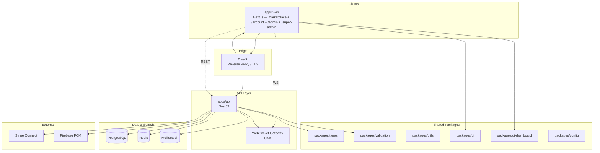

# System Overview

> **Category:** Architecture · **Version:** 0.1.0 · **Last updated:** 2026-07-22

SellNearby (Community Marketplace) is a pnpm monorepo with a **unified Next.js web app**, a NestJS API, shared packages, BullMQ workers, and supporting infrastructure.

## High-level architecture

> **`apps/admin` is deprecated.** Admin UI lives under `apps/web` at `/admin` and `/super-admin`. Leftover `Dockerfile.admin` / K8s admin manifests are legacy scaffolding.

## Service map

| Service | Port | Responsibility |
|---------|------|----------------|
| `web` | 3000 | Marketplace + `/account` + operator consoles |
| `api` | 4000 | REST + WebSocket backend |
| `meilisearch` | 7700 | Full-text search |
| `postgres` | 5432 (host map often 5434) | Primary datastore |
| `redis` | 6379 (host map often 6380) | Cache, sessions, job queues |
| `traefik` | 80/443 | Routing, TLS termination |

## Deployment targets

| Environment | Tooling |
|-------------|---------|
| Local | `docker compose` (`infra/docker`) + `pnpm dev` |
| **Pilot / production (current)** | OVH VPS + Docker Compose — see [ovh-vps-deploy.md](../runbooks/ovh-vps-deploy.md) |
| Kubernetes | Optional / future scaffolding in `infra/k8s/` (not the primary pilot path) |

## Related docs

- [Modular Monolith](./modular-monolith.md)
- [Domain Modules](./domain-modules.md)
- [Deployment Architecture](./deployment-architecture.md)
- [Module boundaries](./module-boundaries.md)
- [Sequence diagrams](./sequence-diagrams.md)
