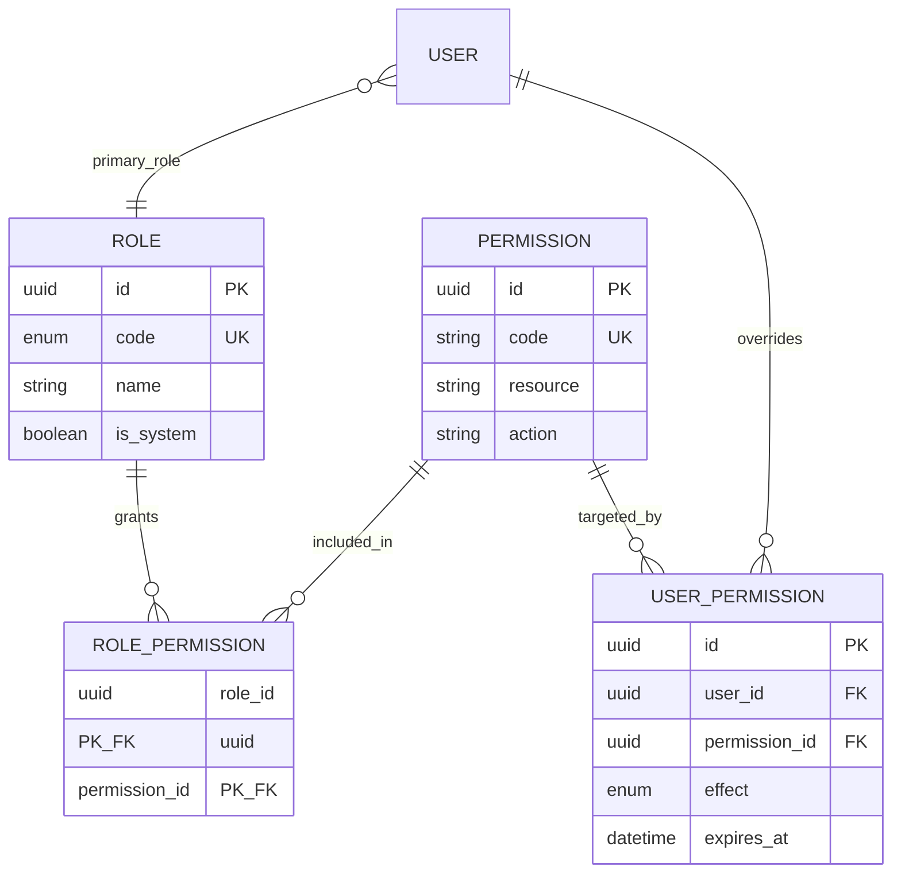
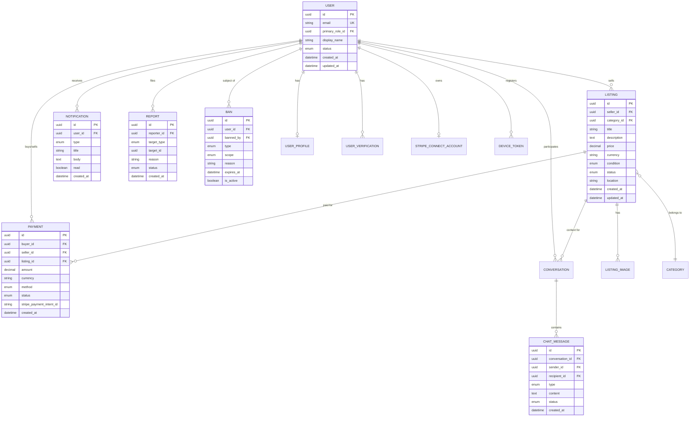

# Entity Relationship Diagram

> Canonical schema: [`apps/api/prisma/schema.prisma`](../../apps/api/prisma/schema.prisma)

## RBAC

**Roles:** `SUPER_ADMIN`, `ADMIN`, `SELLER`, `BUYER`

**Override semantics:** `user_permissions.effect` — `GRANT` adds a permission; `DENY` revokes it even if the role grants it.

## Domain (core)

## Index strategy (planned)

| Table | Index | Purpose |
|-------|-------|---------|
| `listings` | `(status, created_at DESC)` | Browse feed |
| `listings` | `(seller_id)` | Seller dashboard |
| `listings` | `(category_id)` | Category filter |
| `chat_messages` | `(conversation_id, created_at)` | Message history |
| `notifications` | `(user_id, read, created_at DESC)` | Unread feed |
| `payments` | `(buyer_id)`, `(seller_id)` | User payment history |

## Related

- [schema.prisma](./schema.prisma)
- [migrations/](./migrations/)
