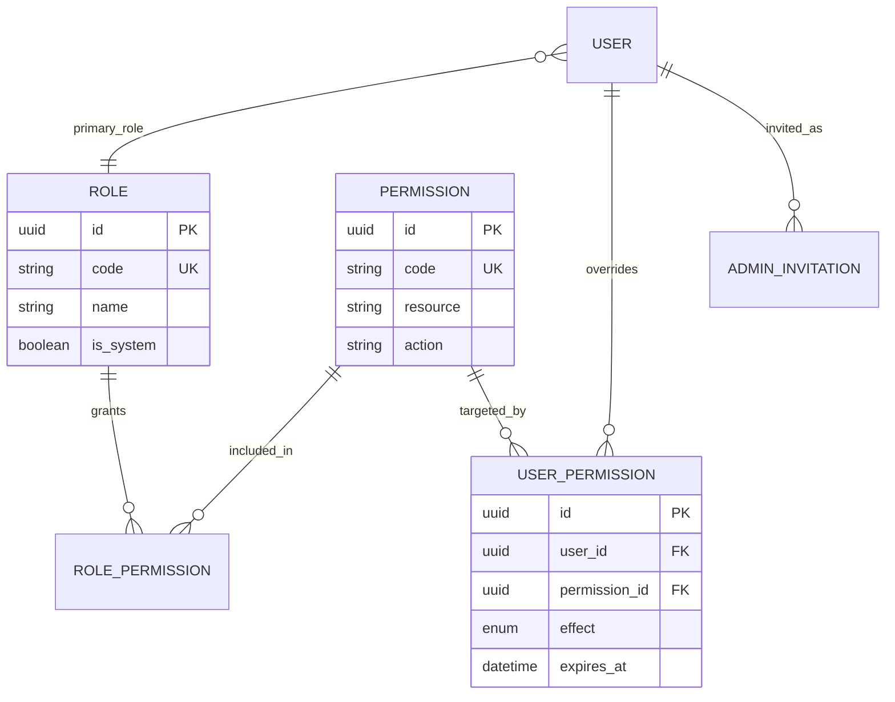
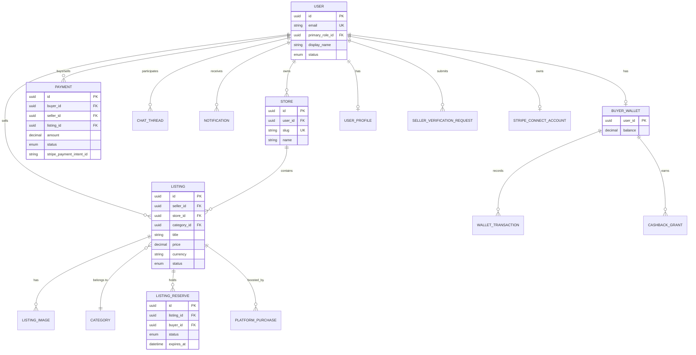
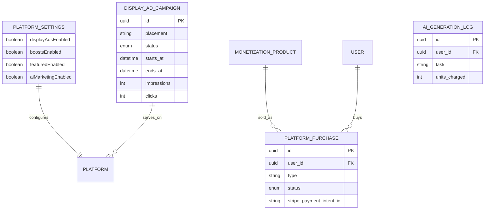

# Entity Relationship Diagram

> **Canonical schema:** [`apps/api/prisma/schema.prisma`](../../apps/api/prisma/schema.prisma)  
> **Migrations:** [`apps/api/prisma/migrations/`](../../apps/api/prisma/migrations/) — see [migrations/README.md](./migrations/README.md)  
> This ERD is an overview. Prefer Prisma for field-level truth. `docs/db/schema.prisma` is a **stale mirror — do not migrate from it**.

**Last reviewed:** 2026-07-22

## RBAC

**Role codes:** `SUPER_ADMIN`, `ADMIN`, `MEMBER` (default marketplace), `SELLER`, `BUYER` (+ admin personas e.g. `ACCOUNTS_ADMIN`).

**Override semantics:** `GRANT` adds a permission; `DENY` revokes it even if the role grants it.

## Domain (core)

### Listing status (Prisma)

`draft`, `pending_review`, `active`, `reserved`, `paused`, `expired`, `sold`, `ended`, `removed`, `rejected`, `flagged`, `under_investigation`, `suspended_seller`

## Monetization & ads

Also in schema: `MarketplaceDispute`, fraud signals, chat flags, short links / share, notification templates/providers, title/price/delivery change logs.

## Related

- Canonical: `apps/api/prisma/schema.prisma`
- [migrations/README.md](./migrations/README.md)
- Product: [storefront-model.md](../product/storefront-model.md), [monetization.md](../product/monetization.md), [listing-reserve.md](../product/listing-reserve.md)
