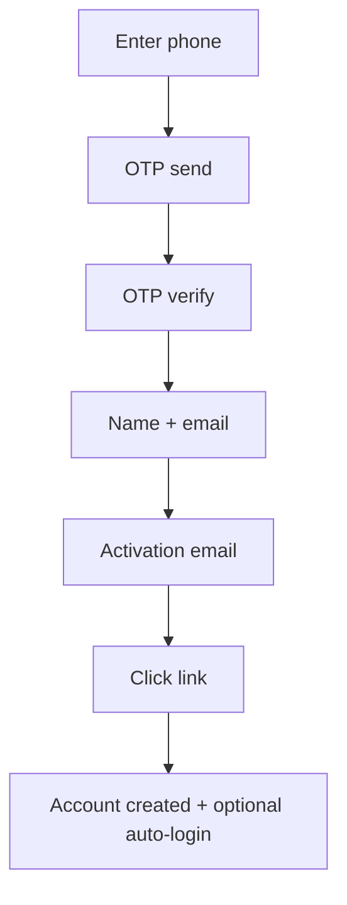

# Authentication System

> **Feature:** OTP + JWT + Email Activation · **API:** [auth.md](../api/auth.md)

## Functional requirements

- Phone OTP registration (verify phone before account creation)
- Email activation JWT after `register/complete` (user created on activation)
- Email/password and OTP login for existing users
- Access token (15 min) + refresh token (7 days) with rotation
- RBAC-aware redirect (`redirectPath`, `appTarget`) on login
- Brute-force protection on OTP send/verify and login
- HTTP-only refresh cookie (`cm_refresh_token`) optional
- Admin login via `appTarget: admin`

## Non-functional requirements

| Requirement | Target |
|-------------|--------|
| OTP expiry | 10 minutes |
| OTP send rate limit | 5 per recipient / 10 min |
| OTP verify attempts | 5 per code |
| Session storage | Hashed refresh tokens in PostgreSQL |
| Audit | Auth events logged via `AuthAuditService` |

## User flows

## Edge cases

| Case | Behavior |
|------|----------|
| Expired OTP | 400 with retry message |
| Already registered phone | OTP login flow instead |
| Activation link reused | `already activated` response |
| Invalid refresh token | 401, clear cookie |
| Suspended user login | 403 |

## Acceptance criteria

- [ ] New user can register with phone OTP and activate email
- [ ] Login returns correct redirect for BUYER, SELLER, ADMIN, SUPER_ADMIN
- [ ] Refresh rotates token and invalidates old refresh hash
- [ ] Rate limits enforced on OTP endpoints
- [ ] Logout revokes session server-side

## Related

- [Security — Authentication](../security/authentication.md)
- [RBAC](./rbac.md)
