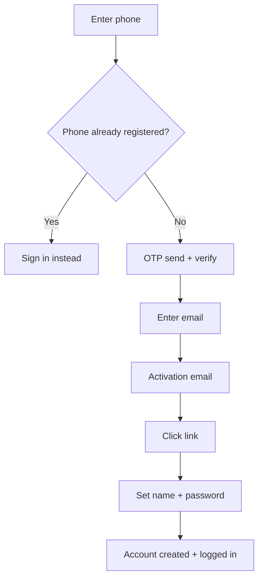

# Authentication System

> **Feature:** OTP + JWT + Email Activation · **API:** [auth.md](../api/auth.md)

## Functional requirements

- Phone OTP registration (verify phone before account creation)
- Email activation JWT after `register/complete` (user created on activation with **password** + `confirmPassword`)
- Default role **`MEMBER`** → redirect `/account` (`appTarget: web`)
- Email/password and OTP login for existing users
- Password forgot / reset / change endpoints
- Access token (15 min) + refresh token (7 days) with rotation
- RBAC-aware redirect (`redirectPath`, `appTarget`) on login — all targets are **`web`**
- Brute-force protection on OTP send/verify and login
- HTTP-only refresh cookie (`cm_refresh_token`) optional
- Admin / super-admin login still uses `apps/web` (`/admin/dashboard`, `/super-admin/dashboard`)
- Admin invitation accept flow (`/api/auth/admin-invite/*`)
- OTP pilot mode: `OTP_PILOT_MODE` (API) + `NEXT_PUBLIC_OTP_PILOT_MODE` (web banner)

## Non-functional requirements

| Requirement | Target |
|-------------|--------|
| OTP expiry | 10 minutes |
| OTP send rate limit | 5 per recipient / 10 min |
| OTP verify attempts | 5 per code |
| Session storage | Hashed refresh tokens in PostgreSQL |
| Audit | Auth events logged via `AuthAuditService` |

## User flows

## Edge cases

| Case | Behavior |
|------|----------|
| Expired OTP | 400 with retry message |
| Already registered phone | Block OTP on register; prompt sign in |
| Activation link reused | `already activated` response; sign in with password |
| Invalid refresh token | 401, clear cookie |
| Suspended user login | 403 |

## Acceptance criteria

- [ ] New user can register with phone OTP and activate email (password at activate → `MEMBER`)
- [ ] Login returns correct redirect: MEMBER/SELLER/BUYER → `/account`; ADMIN → `/admin/dashboard`; SUPER_ADMIN → `/super-admin/dashboard`
- [ ] Refresh rotates token and invalidates old refresh hash
- [ ] Rate limits enforced on OTP endpoints
- [ ] Logout revokes session server-side

## Related

- [Security — Authentication](../security/authentication.md)
- [RBAC](./rbac.md)
