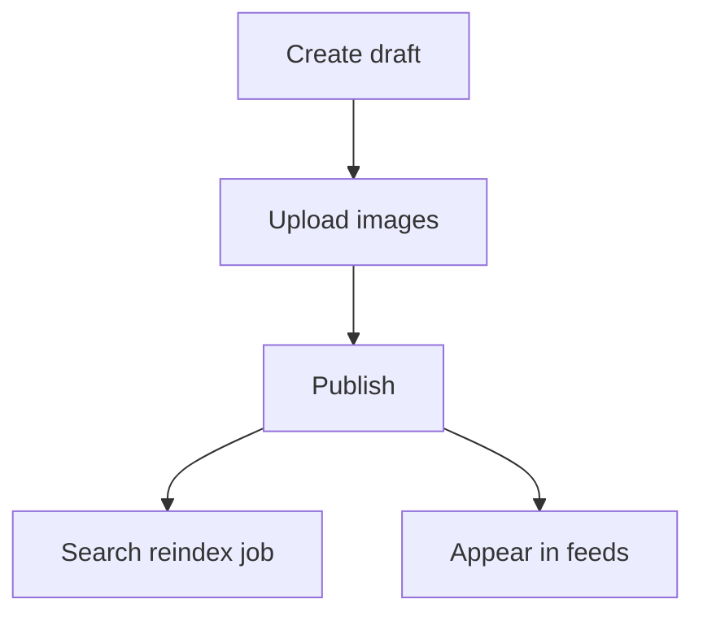

# Listings Module

> **Feature:** Marketplace listings · **API:** [listings.md](../api/listings.md)

## Functional requirements

- Listing CRUD with categories, conditions, pricing
- Multi-image upload (R2 presigned URLs, max 10 images)
- Lifecycle: draft → active → sold → archived
- Favorites, feeds, search integration
- Buyer/seller reports (delegates to moderation)
- Admin ban/unban with `moderationHiddenAt`
- Listing analytics (views)

## Non-functional requirements

- Images optimized URL hints (webp, width) for CDN
- Search index updated async via BullMQ
- Moderation-hidden listings excluded from public search

## User flows

## Edge cases

| Case | Behavior |
|------|----------|
| Ban by admin | Hidden from search, seller notified |
| Sold listing | No new payments |
| Report listing | Creates moderation report |

## Acceptance criteria

- [ ] Seller can publish listing with images
- [ ] Banned listing not visible in buyer search
- [ ] Reindex job runs after publish

## Related

- [Search](./search.md)
- [Moderation](./moderation.md)
