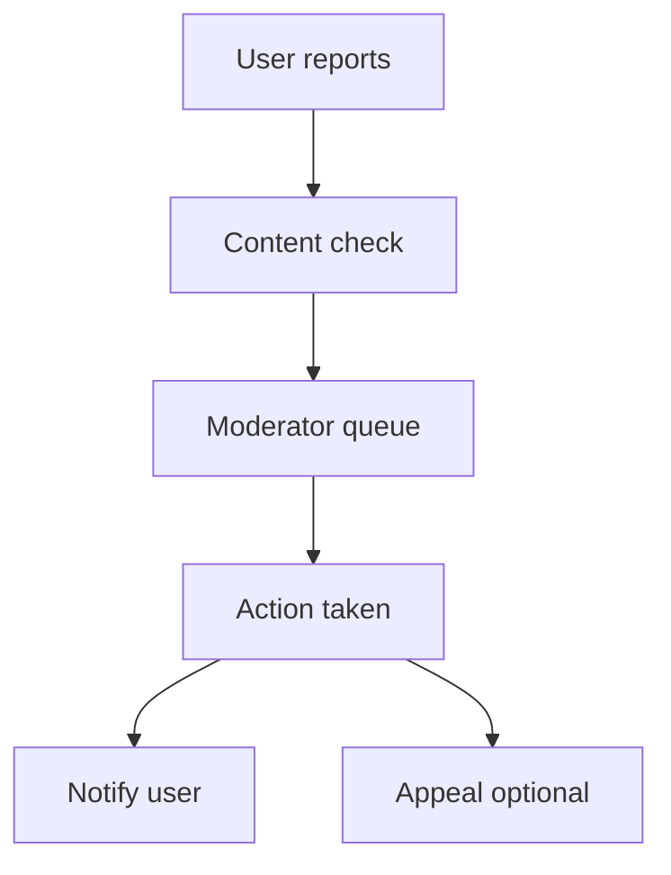

# Moderation Module

> **Feature:** Reports, actions, appeals · **API:** [moderation.md](../api/moderation.md)

## Functional requirements

- Unified reports (users, listings, messages)
- Automated content checks with auto-flag — see [master blueprint §7–9](../product/master-blueprint-v1.md)
- Moderator actions: warn, suspend, ban
- Appeals workflow with status tracking
- Moderation audit log
- Analytics dashboard (Redis-cached)
- Scheduled suspension lift via BullMQ

## Non-functional requirements

- Action audit immutable log
- Analytics cache TTL 60–120s
- Hidden listings via `moderationHiddenAt`

## User flows

## Edge cases

| Case | Behavior |
|------|----------|
| Duplicate report | Link or ignore per policy |
| Suspension expiry | Job lifts suspension |
| Appeal approved | Reverse action where applicable |
| Prohibited item (haram / illegal) | Remove listing; warn/suspend per [master blueprint §6](../product/master-blueprint-v1.md#6-prohibited-items-policy) |

## Acceptance criteria

- [ ] User can report listing and see confirmation
- [ ] Admin can assign report and take action
- [ ] Analytics reflect open/resolved counts

## Related

- [Admin — Listings moderation](../admin/listings-moderation.md)
- [Master blueprint §6–9](../product/master-blueprint-v1.md)
