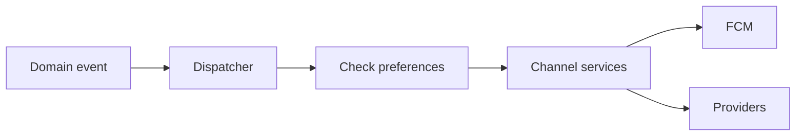

# Notifications Module

> **Feature:** Multi-channel notifications · **API:** [notifications.md](../api/notifications.md)

## Functional requirements

- In-app notification inbox
- Push (FCM), email (SendGrid), SMS hooks
- User preference matrix per channel/type
- Template engine with variable substitution
- Admin broadcast and targeted send
- Provider health monitoring
- Rate limits per user and provider

## Non-functional requirements

- Async dispatch via event listeners
- Delivery logging for audit
- Failed delivery retry policy per provider

## User flows

## Edge cases

| Case | Behavior |
|------|----------|
| User opted out | Skip channel |
| Provider rate limited | Queue or skip with log |
| Invalid device token | Prune token |

## Acceptance criteria

- [ ] User sees in-app notification after payment
- [ ] Preferences suppress email when disabled
- [ ] Admin broadcast respects role filter

## Related

- [Admin — Notifications](../admin/notifications.md)
