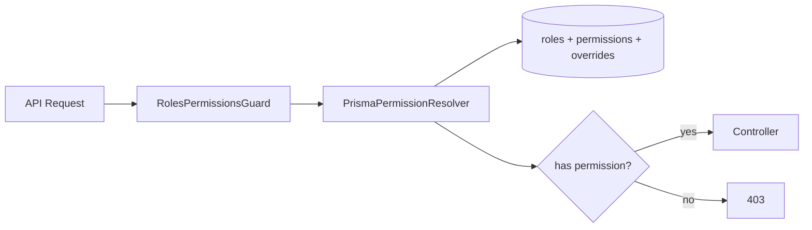

# RBAC System

> **Feature:** Roles + Permissions + Overrides · **API:** [admin.md](../api/admin.md)

## Functional requirements

- Role codes: `BUYER`, `SELLER`, `ADMIN`, `SUPER_ADMIN`
- Granular permissions (e.g. `view_users`, `suspend_user`, `manage_roles`)
- Role → permission matrix stored in PostgreSQL
- Per-user permission overrides (grant/deny)
- Effective permission resolution at request time
- `SUPER_ADMIN` bypasses all permission checks
- Admin UI gated by effective permissions

## Non-functional requirements

- Permission resolution cached per request (in-memory during guard execution)
- RBAC seed script for development (`pnpm seed:rbac`)
- Audit log on role/permission changes

## User flows

## Edge cases

| Case | Behavior |
|------|----------|
| User with multiple roles | Union of permissions minus denies |
| Override deny beats grant | Deny wins |
| SUPER_ADMIN | Always allow |
| Missing permission decorator | Auth only (authenticated users) |

## Acceptance criteria

- [ ] Admin without `view_users` cannot list users
- [ ] Permission override grant unlocks specific action
- [ ] SUPER_ADMIN accesses all admin routes
- [ ] Effective permissions returned in `/admin/me`

## Related

- [Security — RBAC](../security/rbac.md)
- [Admin Panel](./admin-panel.md)
