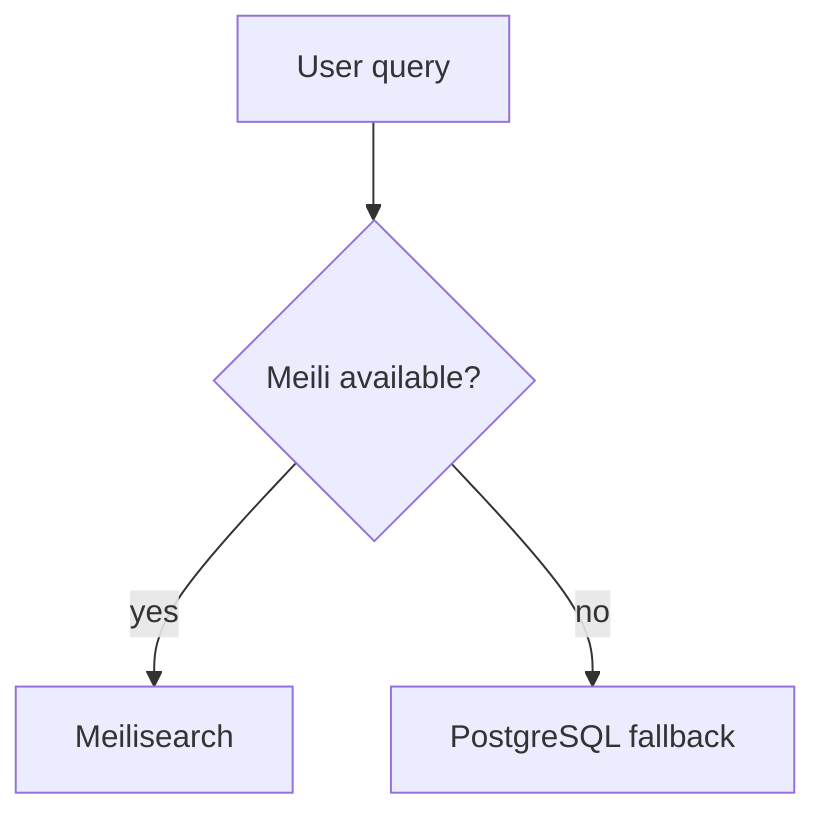

# Search Module

> **Feature:** Meilisearch-powered search · **API:** [search.md](../api/search.md)

## Functional requirements

- Full-text listing search with filters (category, price, geo)
- Optional semantic hybrid search when OpenAI embeddings are configured (`semantic=true`)
- Global search across listings/users (scoped)
- Autocomplete with Redis cache
- Admin reindex, synonyms, stop-words, relevance tuning
- Nightly sync job
- DB fallback when Meilisearch down
- Primary public UI: `/listings`

## Non-functional requirements

- Index updates via BullMQ (non-blocking)
- p95 search < 200ms (Meilisearch healthy)
- Analytics aggregated for admin dashboard

## User flows

## Edge cases

| Case | Behavior |
|------|----------|
| Meilisearch offline | Degraded search via DB |
| Reindex in progress | Status endpoint shows progress |
| Moderation-hidden listing | Excluded from index |

## Acceptance criteria

- [ ] Search returns relevant listings with filters
- [ ] Admin reindex completes and updates health
- [ ] Autocomplete cached in Redis

## Related

- [Admin — Search management](../admin/search.md)
