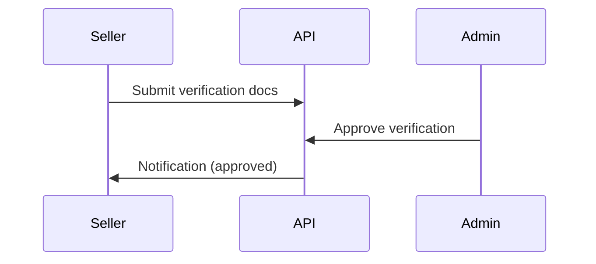

# User Module

> **Feature:** Profiles, verification, settings · **API:** [users.md](../api/users.md)

## Functional requirements

- Profile CRUD (buyer/seller personas)
- Avatar upload via R2 presigned URLs
- Seller verification submission + admin approval workflow
- User settings (notifications, privacy, deletion request)
- Admin suspend/unsuspend lifecycle
- User audit trail

## Non-functional requirements

- Avatar max size enforced at upload URL generation
- Verification documents in `verification-documents/` R2 prefix
- PII access restricted by role

## User flows

## Edge cases

| Case | Behavior |
|------|----------|
| Upload key not owned by user | Reject confirm |
| Suspended user | 403 on mutating endpoints |
| Deletion request | Soft flag; admin review |

## Acceptance criteria

- [ ] Seller can submit verification and see pending status
- [ ] Admin approve updates seller capabilities
- [ ] Avatar upload uses presigned URL when R2 configured

## Related

- [Admin — Seller verification](../admin/seller-verification.md)
