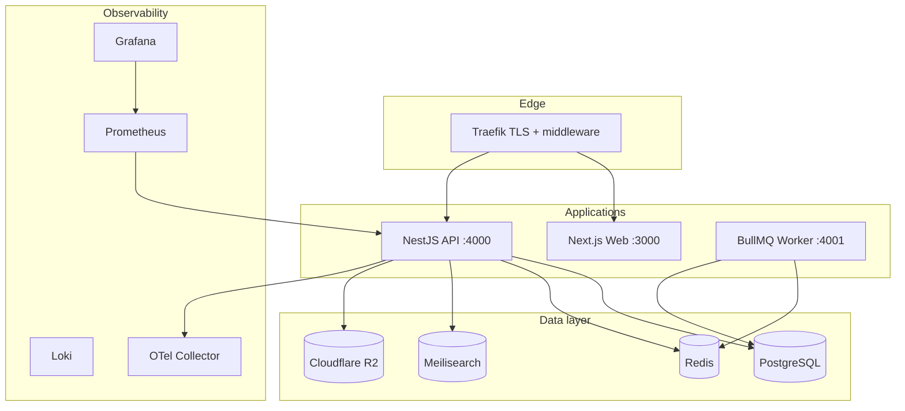

# Infrastructure — Community Marketplace

> **Category:** Infrastructure · **See also:** [Runbooks](../runbooks/README.md) · [Deployment architecture](../architecture/deployment-architecture.md)

Enterprise-grade deployment, observability, and operations reference.

## Architecture overview



## Docker

| Image | Dockerfile | Purpose |
|-------|------------|---------|
| API | `infra/docker/Dockerfile.api` | NestJS multi-stage build |
| Web | `infra/docker/Dockerfile.web` | Next.js standalone (marketplace + all dashboards) |
| Worker | `infra/docker/Dockerfile.worker` | BullMQ background jobs |
| Redis | `infra/docker/Dockerfile.redis` | Custom redis.conf + AOF |
| Meilisearch | `infra/docker/Dockerfile.meilisearch` | Search engine |

**Compose:** `docker-compose.dev.yml` (local) · `docker-compose.prod.yml` (prod simulation)

**Health:** `GET /api/health/live` · `GET /api/health/ready` · `GET /api/metrics`

## Kubernetes

```
infra/k8s/base/ + overlays/dev | staging | prod
```

Per-environment isolation: separate DB, Redis, R2 bucket, and namespace.

## CI/CD

| Workflow | Trigger |
|----------|---------|
| `build.yml` | PR / push |
| `deploy-dev.yml` | `develop` branch |
| `deploy-staging.yml` | `main` branch |
| `deploy-prod.yml` | Manual with confirmation |

## Secrets, logging, queues, R2, security, backups

See sections in this doc's extended reference — full detail preserved from Feature 12 implementation:

- **Secrets:** K8s Secrets, GitHub Actions secrets, `packages/config` Zod validation, `rotate-secrets.sh`
- **Logging:** Pino (API), Traefik JSON access logs, Loki aggregation
- **Monitoring:** Prometheus + Grafana + alerts (`infra/observability/`)
- **Queues:** BullMQ with `BULLMQ_MODE` producer/worker split
- **R2:** `user-avatars/`, `listing-images/`, `verification-documents/`, `system-assets/`
- **Backups:** `infra/scripts/backup.sh`, `restore.sh`, `migrate.sh`, `deploy.sh`

## Operational runbooks

| Procedure | Document |
|-----------|----------|
| Deploy | [runbooks/deploy.md](../runbooks/deploy.md) |
| Rollback | [runbooks/rollback.md](../runbooks/rollback.md) |
| Restore backup | [runbooks/restore-backup.md](../runbooks/restore-backup.md) |
| Scale services | [runbooks/scaling.md](../runbooks/scaling.md) |

## Quick reference

```bash
docker compose -f infra/docker/docker-compose.dev.yml up -d
pnpm --filter @community-marketplace/api start:worker
curl localhost:4000/api/health/ready
```
