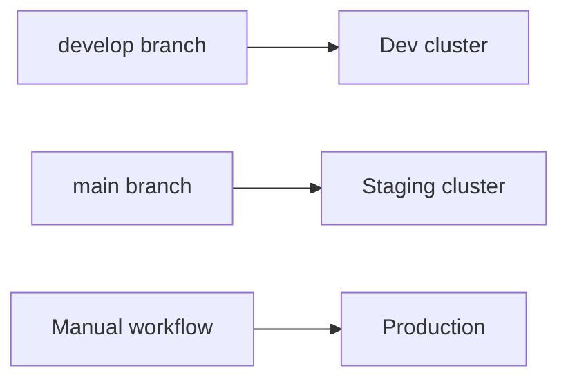

# Deployment (Developer Guide)

## Paths to production

**Primary (pilot):** build images → deploy with Docker Compose on OVH — see [ovh-vps-deploy.md](../runbooks/ovh-vps-deploy.md) and [pilot-kickoff.md](../runbooks/pilot-kickoff.md).

**Optional CI / K8s path** (scaffolded, not required for current pilot):



## Developer responsibilities

1. Feature branch → PR → `build.yml` green
2. For VPS pilot: follow OVH runbook after merge
3. Optional: merge to `develop` / `main` for automated K8s deploys if that pipeline is enabled
4. Release manager confirms prod Compose / workflow

## Local prod simulation

```bash
cp infra/docker/.env.prod.example infra/docker/.env.prod
docker compose -f infra/docker/docker-compose.prod.yml --env-file infra/docker/.env.prod up -d
```

Compose runs **api + web + worker** (no separate admin container).

## Detailed runbooks

- [OVH VPS deploy](../runbooks/ovh-vps-deploy.md)
- [Deploy runbook](../runbooks/deploy.md) (K8s-oriented)
- [Rollback](../runbooks/rollback.md)
- [RELEASE.md](../RELEASE.md)
