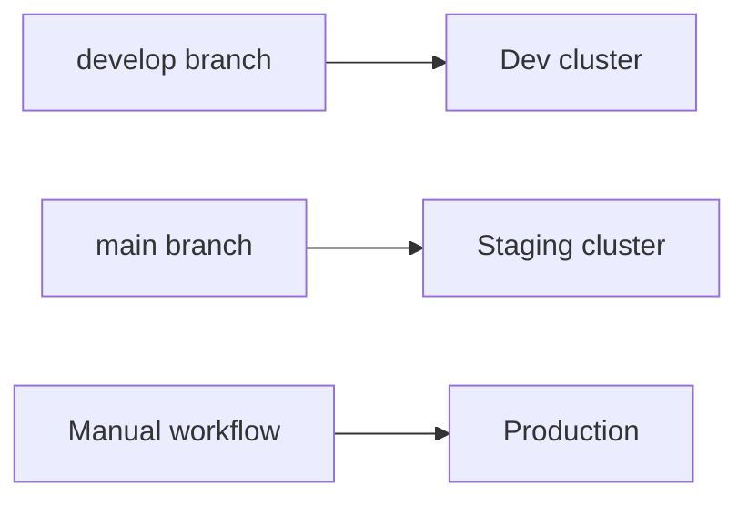

# Deployment (Developer Guide)

## Paths to production



## Developer responsibilities

1. Feature branch → PR → `build.yml` green
2. Merge to `develop` → auto dev deploy
3. Merge to `main` → auto staging deploy
4. Release manager triggers prod workflow

## Local prod simulation

```bash
cp infra/docker/.env.prod.example infra/docker/.env.prod
docker compose -f infra/docker/docker-compose.prod.yml --env-file infra/docker/.env.prod up -d
```

## Detailed runbooks

- [Deploy runbook](../runbooks/deploy.md)
- [Rollback](../runbooks/rollback.md)
- [RELEASE.md](../RELEASE.md)
