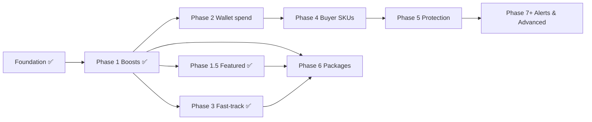
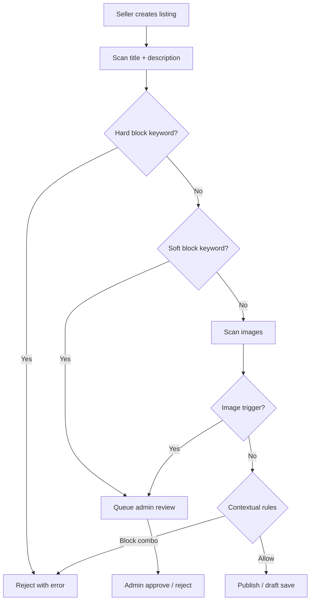
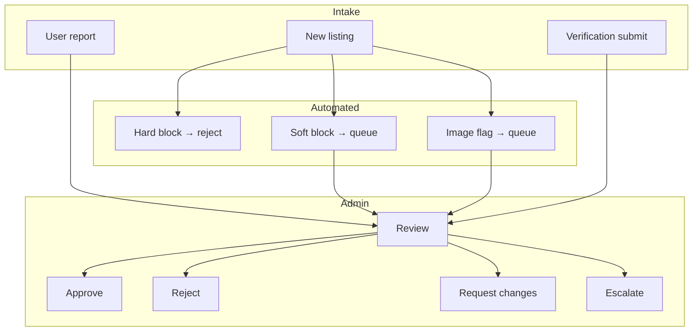

# SellNearby — Master Blueprint (v1)

> **Status:** Approved direction — single canonical planning document  
> **Scope:** Ireland-wide marketplace · card-only payments · haram-free catalog  
> **Audience:** Engineering, Product, Design, Admin, Investors  
> **Last updated:** 2026-07-22  
> **Implementation:** Foundation ✅ · Growth **Phase 1**, **1.5**, **2**, **3** ✅ shipped · **Phase 4–6+** 📋 planned · Admin display-ad campaigns ✅ (self-serve later)

**Covers:** Monetization · Pricing · Rollout · Revenue model · UX flows · Safety · Moderation · Category tree

> **Note:** Sections 0–10 are the executive blueprint. Appendices A–L contain the full detail from all previously separate planning documents.

---

## Table of contents

### Main blueprint (sections 0–10)
- [0. Executive summary](#0-executive-summary)
- [1. Monetization model](#1-monetization-model)
- [2. Pricing table](#2-pricing-table)
- [3. Rollout plan](#3-rollout-plan)
- [4. Revenue projection](#4-revenue-projection-12-months)
- [5. UX flows](#5-ux-flows)
- [6. Prohibited items policy](#6-prohibited-items-policy)
- [7. Keyword filter system](#7-keyword-filter-system)
- [8. UX copy](#8-ux-copy)
- [9. Admin moderation workflow](#9-admin-moderation-workflow)
- [10. Category tree adjustments](#10-category-tree-adjustments)

### Appendices (full detail from consolidated docs)
- [A. Full monetization strategy](#appendix-a--full-monetization-strategy)
- [B. Phase 1 technical specification](#appendix-b--phase-1-technical-specification)
- [C. Rollout plan (detailed)](#appendix-c--rollout-plan-detailed)
- [D. Revenue projection model (detailed)](#appendix-d--revenue-projection-model-detailed)
- [E. UX flows (detailed)](#appendix-e--ux-flows-detailed)
- [F. Prohibited items policy (full)](#appendix-f--prohibited-items-policy-full)
- [G. Keyword filter list (full)](#appendix-g--keyword-filter-list-full)
- [H. Moderation UX copy (full)](#appendix-h--moderation-ux-copy-full)
- [I. Admin moderation workflow (full)](#appendix-i--admin-moderation-workflow-full)
- [J. Category tree (full)](#appendix-j--category-tree-full)
- [K. Admin pricing JSON reference](#appendix-k--admin-pricing-json-reference)
- [L. Related engineering docs](#appendix-l--related-engineering-docs)

---

## 0. Executive summary

SellNearby is a **free-to-start, trust-first, micro-priced** community marketplace for Ireland.

**Revenue:**

- Platform fees on card sales (live today)
- Listing boosts, featured listings, fast-track verification (**live** — Phases 1, 1.5, 3)
- Wallet credit spend on boosts / fast-track / early unlock (**live** — Phase 2)
- Buyer micro-SKUs and seller packages (planned — Phases 4–6)

**Safety:** No haram products, illegal items, or unsafe content — family-friendly, Ireland-appropriate, high-trust.

**Live today:** 10% platform fee (8% auto-applied for verified sellers), 1.5% buyer cashback (earn + spend on platform purchases), paid boosts + featured slots + fast-track verification, free core (list, message, browse, verify, Stripe onboarding). Admin-run brand display ads MVP.

This blueprint defines everything needed to build, scale, and govern SellNearby.

---

## 1. Monetization model

### 1.1 Core principles

| Principle | Rule |
|-----------|------|
| Free core | Listing, messaging, browsing, standard verification, Stripe onboarding |
| Pay for upside | Visibility, trust, speed, convenience — not access |
| No buyer platform fee | Buyers pay listing price only |
| Card-only v1 | No bank transfer in growth phases |
| Micro-pricing | €0.49–€4.99 impulse band |
| Cashback wallet | Earn → spend loop (spend live on boosts / fast-track / early unlock; full GMV checkout wallet+card still Phase 2+) |
| No haram products | Policy + keyword + category enforcement |
| No subscriptions | Until seller packages / buyer alerts (Phase 6+) |

### 1.2 Revenue streams

| Stream | Default | Phase | Status |
|--------|---------|-------|--------|
| Platform fee | 10% (8% verified) | Foundation | ✅ Live |
| Listing boosts | €1.99 / €4.99 | 1 | ✅ Live |
| Featured listings | €2.99 / €1.99 | 1.5 | ✅ Live |
| Fast-track verification | €2.99 | 3 | ✅ Live |
| Buyer SKUs | €0.49–€1.99 | 4–5 | 📋 Planned |
| Wallet spend | Credits → boosts / fast-track / early unlock | 2 | ✅ Live |
| Seller packages | €2.99–€9.99 | 6 | 📋 Planned |

**Economics:** 10% fee − 1.5% cashback ≈ 8.5% net · 8% verified ≈ 6.5% net.

### 1.3 Platform purchases (non-GMV revenue)

All paid upgrades use one table — separate from buyer→seller `Payment`:

```
PlatformPurchase {
  id
  userId
  type                  // listing_boost | featured_slot | fast_track_verification | ...
  amount
  currency              // EUR
  status                // pending | succeeded | failed | refunded
  listingId             // nullable
  stripePaymentIntentId
  metadata
  fulfilledAt
  createdAt
}
```

**Phase 1 (✅ shipped):** Boost payment, `boostedUntil`, search ranking bump, Boosted badge, auto 8% fee on verification approve.

### 1.4 Free core (never paywalled)

- 5 listings for unverified sellers; unlimited when verified
- Messaging, search, storefront, standard verification
- Stripe Connect onboarding (free — required to receive card payments)

### 1.5 What not to do

- Paywall verification · Charge for Stripe Connect · Buyer platform fee
- Boosts without ranking bump · Big subscriptions too early · Bank transfer in v1

---

## 2. Pricing table

All prices **EUR (€)**. Admin-configurable via `platform_settings.pricing` JSON.

### 2.1 Seller pricing

| Feature | Price | Phase |
|---------|-------|-------|
| 7-day boost | €1.99 | 1 |
| 30-day boost | €4.99 | 1 |
| Urgent badge | €0.99 | 1.5/2 |
| Auto-refresh | €1.49 | 1.5/2 |
| Featured (homepage, 24h) | €2.99 | 1.5 |
| Featured (category, 24h) | €1.99 | 1.5 |
| Fast-track verification | €2.99 | 3 |
| Starter package | €2.99 | 6 |
| Pro package | €5.99 | 6 |
| Premium package | €9.99 | 6 |

**Launch promo:** First boost 50% off (optional).

### 2.2 Buyer pricing

| Feature | Price | Phase |
|---------|-------|-------|
| Priority message | €0.49 | 4 |
| Early cashback unlock | €0.99 | 4 |
| Buyer protection (low) | €0.49 | 5 |
| Buyer protection (high) | €1.99 | 5 |
| Wanted ad | €0.99 | 7+ |
| Buyer alerts | €1.99/month | 7+ |

### 2.3 Platform fees

| Rule | Value |
|------|-------|
| Default | 10% |
| Verified seller | 8% (reward — auto on approve) |
| Custom override | Admin-set |

### 2.4 Wallet (cashback)

| Rule | Value |
|------|-------|
| Earn rate | 1.5% (card only) |
| Min order | €5 |
| Unlock | 14 days |
| Caps | €10/order · €20/month |
| Expiry | 6 months |
| Spend | Phase 2+ (boosts, early unlock first) |

---

## 3. Rollout plan

### 3.1 Phase order

| Step | Phase | Focus |
|------|-------|-------|
| ✅ | Foundation | Platform fee + earn-only cashback |
| ✅ | 1 | Paid boosts + verified 8% auto-fee | Highest ROI |
| ✅ | 1.5 | Featured listings (slot caps) | Scarcity revenue |
| 2 | Wallet spend (boosts + early unlock only) | Credit loop |
| ✅ | 3 | Fast-track verification | Trust / speed |
| 4 | Buyer micro-SKUs | Priority msg, early unlock |
| 5 | Buyer protection | **Legal sign-off required** |
| 6 | Seller packages | Bundle existing SKUs |
| 7+ | Buyer alerts, wanted ads, analytics Pro, etc. | Volume-gated |

### 3.2 Why this order

1. Fastest revenue first (boosts)
2. Lowest risk first
3. Legal-heavy features later (buyer protection)
4. Wallet spend only after boosts exist
5. Packages only after à la carte SKUs work

### 3.3 Phase 1 scope (in / out)

> **Delivered 2026-06-27** (`b0787f2`). Original boundary below; featured and fast-track shipped in later phases.

**In (shipped):** Boost prices, Stripe payment, `boostedUntil`, ranking bump, badge, `PlatformPurchase`, 8% on verify approve.

**Deferred to later phases:** Wallet spend (2), buyer protection (5), packages (6), urgent badge, auto-refresh.

---

## 4. Revenue projection (12 months)

**Moderate scenario** (most realistic):

| Stream | 12-month total |
|--------|----------------|
| Platform fee | €144,000 |
| Boosts | €12,500 |
| Featured | €12,000 |
| Buyer SKUs | €5,000 |
| Packages | €2,100 |
| **Total** | **€175,600** |

| Scenario | Year 1 range |
|----------|----------------|
| Conservative | €95,000 – €120,000 |
| Aggressive | €250,000 – €320,000 |

**Year 1 mix:** Platform fee ~82% · Boosts ~7% · Featured ~7% · Buyer SKUs ~3% · Packages ~1%.

**Key levers:** Boost visibility, first-boost discount, fast-track promo, wallet spend, verification trust, GMV growth.

---

## 5. UX flows

### 5.1 Boost flow

1. Seller clicks **Boost** (listing card, detail, or dashboard row)
2. Modal: 7-day (€1.99) or 30-day (€4.99) + views/favorites stats
3. Stripe payment (Phase 2: optional **Use credits**)
4. Success toast: *“Boost activated until [date]”*
5. **Boosted** badge + search ranking bump
6. Daily cron expires boost

**Edge cases:** Payment fail → retry · Already boosted → extend time · Expired listing → renew first

### 5.2 Featured flow

1. Seller clicks **Feature listing** (Promote tab or listing detail)
2. Choose homepage (€2.99) or category (€1.99); show slots left
3. Payment (same as boosts)
4. **Featured** badge + placement in featured section
5. Auto-expiry at 24h; max 8 homepage slots/day

### 5.3 Fast-track verification flow

1. Copy: *“Verification is free. Speed up for €2.99 (24h priority).”*
2. Payment → `priority = true` on verification request
3. Admin queue: priority first
4. Approve → Verified badge + 8% fee · Reject → reason + resubmit

**Never:** instant auto-verify without human review.

### 5.4 Buyer SKUs

| SKU | Flow |
|-----|------|
| Priority message | Checkbox in chat (€0.49) → pinned in seller inbox |
| Early unlock | Wallet or order detail → confirm receipt → pay €0.99 → credit available |
| Buyer protection | Checkout toggle (€0.49–€1.99) → badge on purchase (Phase 5 + legal) |

---

## 6. Prohibited items policy

Applies to all listings, messages, images, transactions. **Ireland + Islamic principles.**

### 6.1 Haram (explicitly banned)

- **Alcohol** — beer, wine, spirits, gift sets, homebrew kits
- **Pork** — bacon, ham, sausages, lard, pork snacks
- **Adult** — sex toys, pornographic material, explicit content
- **Gambling** — casino equipment, slot machines, betting tokens, lottery resale
- **Intoxicants** — drugs, vapes, e-cigarettes, shisha, tobacco, unverified CBD

### 6.2 Illegal (Ireland)

- **Weapons** — firearms, ammunition, combat knives, pepper spray, tasers
- **Drugs** — cannabis (non-medical), controlled substances, paraphernalia
- **Stolen / counterfeit** — fake designer, fake documents, removed serial numbers
- **Hazardous** — chemicals, explosives, fireworks

### 6.3 Restricted (admin review)

| Item | Condition |
|------|-----------|
| Perfumes / cosmetics | Alcohol base OK if standard cosmetic |
| Herbal / wellness | No medical claims; Irish compliance |
| Supplements | Sealed; no prescription-only |
| Empty collectible bottles | Clearly empty; labeled collectible only |

### 6.4 Prohibited services

Escort, adult entertainment, gambling services, interest-based finance, money transfer, crypto trading, academic cheating.

### 6.5 Enforcement

Remove listing · Warn · Restrict (48h) · Suspend · Report to authorities (serious cases).

**Reports:** Listing / chat / profile → review within **24–72 hours**.

**Monetization:** Prohibited listings cannot be boosted, featured, or sold via platform payments.

---

## 7. Keyword filter system

Three tiers: **Hard block** (reject) · **Soft block** (admin review) · **Image trigger** (flag + review).

### 7.1 Hard block (auto-reject)

**Alcohol:** beer, wine, vodka, whiskey, whisky, gin, rum, tequila, cider, lager, stout, alcohol, alcoholic, spirits, liquor, moonshine, brewery kit, homebrew kit

**Pork:** pork, bacon, ham, lard, pork fat, gammon

**Adult:** sex toy, dildo, vibrator, adult toy, porn, xxx, erotic, fetish, bdsm

**Gambling:** casino, slot machine, roulette, poker chips, betting tokens, gambling, lottery resale

**Intoxicants:** weed, cannabis, marijuana, hash, vape, e-cigarette, nicotine, shisha, hookah, tobacco, rolling papers, bong

**Weapons:** gun, firearm, pistol, rifle, shotgun, ammo, ammunition, taser, pepper spray, switchblade, machete

**Fraud/illegal:** fake id, counterfeit, replica designer, stolen, hacked, cracked, pirated

### 7.2 Soft block (admin review)

perfume, aftershave, cologne, fragrance, eau de toilette, herbal, supplement, vitamins, empty bottle, collectible bottle, cbd, hemp oil, ashtray, lighter

### 7.3 Image triggers

Alcohol bottles · Pork food · Adult content · Drugs/paraphernalia · Weapons

### 7.4 Contextual allowlist

| Allowed | Block if |
|---------|----------|
| Wine rack (empty) | Wine rack with bottles |
| Beer mug | Beer bottle |
| Piggy bank | Pig meat / pork product |
| Kitchen knife set | Combat knife |
| CBD skincare (non-ingestible) | CBD edible |

### 7.5 Implementation

- Hard → `400` + error code · Soft → `pending_review` · Image → pause + queue
- Store lists in `platform_settings.keyword_filters` (admin-editable)
- Extend `ListingAutoModerationService` + `ModerationContentCheckService`

---

## 8. UX copy

### 8.1 Hard block

> **This item isn’t allowed.**  
> Please review our [Prohibited Items Policy](/policies/prohibited-items).

*(Category-specific variants: alcohol, pork, adult, gambling, drugs, weapons, illegal — see [Appendix H](#appendix-h--moderation-ux-copy-full).)*

### 8.2 Soft block

> **Your listing is under review.**  
> Some items require a quick manual check before going live. We’ll notify you once approved.

### 8.3 Image flag

> **This image contains prohibited content.** Please replace it.

### 8.4 Listing removal

> **Your listing was removed** because it violates our Prohibited Items Policy.

### 8.5 Warning

> **Please review our Prohibited Items Policy.** Your recent listing violated our rules. Continued violations may lead to account restrictions.

### 8.6 Restriction / suspension

> **Your account has been temporarily restricted** — listing disabled for 48 hours.

> **Your account has been suspended** due to repeated or severe policy violations.

### 8.7 Listing form reminder

> Please ensure your item follows our Prohibited Items Policy. Alcohol, pork, adult items, gambling, drugs, vapes, weapons, and illegal goods are not allowed.

### 8.8 Admin actions

| Action | Label |
|--------|-------|
| Approve | Approve listing |
| Reject | Reject — violates policy |
| Notes placeholder | Add a note for the seller (optional) |

---

## 9. Admin moderation workflow

### 9.1 Queues

| Queue | Triggers |
|-------|----------|
| **Auto-flagged** | Soft keywords, image flags, sensitive categories |
| **User-reported** | Prohibited item, scam, offensive, adult |
| **Verification** | ID submit; fast-track (`priority = true`) |
| **Escalation** | Repeat offenders, illegal goods, fraud, buyer protection disputes |

### 9.2 Review actions

| Action | Effect |
|--------|--------|
| **Approve** | Listing live; notify seller |
| **Reject** | Removed; violation logged |
| **Request changes** | Seller must edit and resubmit |
| **Escalate** | Senior admin / legal path |

### 9.3 Violation points

| Type | Points |
|------|--------|
| Minor (soft block upheld) | 1 |
| Listing removal | 2 |
| Confirmed user report | 3 |
| Hard block violation | 4 |
| Illegal item | 6 |
| Fraud attempt | 10 |

### 9.4 Thresholds

| Score | Action |
|-------|--------|
| ≥ 5 | Warning |
| ≥ 8 | Temporary restriction (48h) |
| ≥ 12 | Permanent suspension review |

### 9.5 SLAs

| Queue | Target |
|-------|--------|
| Auto-flagged / reports | 24–72 hours |
| Standard verification | 1–3 business days |
| Fast-track verification | 24 hours |

---

## 10. Category tree adjustments

### 10.1 Remove (never in UI)

Alcohol · Pork · Adult · Gambling · Tobacco/vapes · Weapons · Illegal items

*(Keep legacy DB rows hidden if old listings exist.)*

### 10.2 Add (safe, Ireland-friendly)

Home & Living · Electronics · Fashion · Baby & Kids · Vehicles · Sports & Fitness · Pets · Health & Beauty · Hobbies & Crafts · Books & Education · Services · Jobs

### 10.3 Restricted categories (`requiresReview: true`)

Perfumes · Supplements · Herbal/wellness · Collectible bottles (empty) · Pet food (pork keyword flag)

### 10.4 Final category tree (v1)

```
Home & Living (home-living)
  Furniture · Home Décor · Kitchen & Dining · Storage & Organisation · Lighting · Garden & Outdoor

Electronics (electronics)
  Phones & Accessories · Computers & Laptops · TVs & Audio · Gaming · Cameras

Fashion (fashion)
  Men's · Women's · Kids' Clothing · Shoes · Bags & Accessories

Baby & Kids (baby-kids)
  Toys · Baby Gear · Kids' Furniture · Prams & Strollers

Vehicles (vehicles)
  Cars · Motorbikes · Bicycles · Car Parts · Car Accessories

Sports & Fitness (sports-fitness)
  Gym Equipment · Sports Gear · Outdoor Equipment

Pets (pets)
  Pet Accessories · Pet Food (non-pork) · Pet Toys

Health & Beauty (health-beauty)
  Skincare · Haircare · Makeup · Perfumes (review) · Wellness (review) · Supplements (review)

Hobbies & Crafts (hobbies-crafts)
  Art Supplies · Musical Instruments · Collectibles (review)

Books & Education (books-education)
  Books · Study Materials · Educational Tools

Services (services)
  Home Services · Repairs · Cleaning · Moving · Photography · Tuition

Jobs (jobs)
  Part-Time · Full-Time · Freelance · Local Gigs
```

**Baseline today:** 8 flat dev categories — migrate to this hierarchy when approved.

---

# Appendices

> Full reference material — engineering specs, detailed flows, copy, and policy.

---

# Appendices

> Full reference material — engineering specs, detailed flows, copy, and policy.


---

## Appendix A — Full monetization strategy

### Core philosophy

SellNearby is a **free-to-start, community-first** marketplace. Revenue comes from optional upgrades, micro-transactions, and platform fees — never from paywalls or forced subscriptions.

SellNearby monetization should feel:

- **Free to start** · **Safe to use** · **Trust-driven**
- **Optional to upgrade** · **Micro-priced (€0.49–€4.99)** · **Credit-powered** · **Never burdensome**

#### Principles

| Principle | Detail |
|-----------|--------|
| Free core | Listing, messaging, browsing, standard verification, Stripe onboarding |
| Pay for upside | Visibility, trust, speed, convenience — not access |
| Micro-pricing | €0.49–€4.99 impulse band; €9.99 premium bundles |
| Credits | Cashback → spend later (wallet economy) |
| Trust-first | Verification free; fast-track optional |
| Card-only v1 | No bank transfer in growth phases |
| EUR / Ireland | All prices in €; Ireland launch market |

**Summary:** Free to start → pay for visibility, trust, convenience → earn credits → spend credits → grow the marketplace.

---

### Master phase overview

| Phase | Name | Status | Revenue type |
|-------|------|--------|--------------|
| **Foundation 1** | Platform fee governance | ✅ Live | GMV (transaction fee) |
| **Foundation 2** | Cashback earn-only | ✅ Live | Retention (platform-funded) |
| **Foundation 3** | UX + messaging | ✅ Live | Supports conversion |
| **1** | Paid listing boosts + verified 8% fee | ✅ Live (2026-06-27) | Seller visibility |
| **1.5** | Featured listing slots | ✅ Live (2026-06-27) | Seller visibility |
| **2** | Wallet spend (credit economy) | ✅ Live | Credits → boosts / fast-track / early unlock |
| **3** | Fast-track verification | ✅ Live (2026-06-27) | Trust / speed |
| **4** | Buyer micro-SKUs | 📋 Planned | Buyer convenience |
| **5** | Buyer protection | 📋 Planned (legal gate) | Buyer safety |
| **6** | Seller packages (bundles) | 📋 Planned | ARPU bundles |
| **7+** | Future expansion | 🔮 Volume-gated | Platform scale |

**Card-only** for all monetization through Phase 6. No bank transfer reconciliation in growth phases until Phase 7+.

---

### Free core (never paywalled)

| Service | Notes |
|---------|--------|
| Listing | 5 listings for unverified sellers; unlimited when verified |
| Messaging | Free; new chats blocked only after unverified listing limit |
| Browsing & search | Full access |
| Basic profile & storefront | Public seller page |
| Verification (standard) | Phone → email → ID docs → admin review — **always free** |
| Stripe Connect onboarding | Required to receive card payments; **no platform charge** |
| Buyer cashback (earn-only) | 1.5% SellNearby Credit on eligible card purchases |

---

### v1 implementation scope

> **Phase 1 delivered 2026-06-27.** Featured (1.5) and fast-track (3) also shipped same day.

#### In scope (Growth Phase 1) ✅

- Boost prices (admin-configurable via `platform_settings.pricing`)
- Stripe payment for boosts
- `boostedUntil` + ranking bump + Boosted badge
- Auto **8%** fee on verification approval
- `platform_purchases` table

#### Out of scope (later phases)

- Buyer protection (Phase 5 — legal gate)
- Buyer alerts & wanted ads (Phase 6+)
- Wallet spend (Phase 2)
- Seller packages (Phase 6)
- Urgent badge & auto-refresh (priced in table; not built)

---

### Pricing table (v1) {#pricing-table-v1}

> Micro-priced, Ireland-appropriate, admin-configurable. All amounts **EUR (€)**.  
> Used for: admin UI, buyer/seller display, Stripe setup, packaging, revenue modeling, A/B tests.

#### 1. Platform fees

| Item | Price | Notes |
|------|-------|-------|
| Default platform fee | **10%** | All card payments |
| Verified seller fee | **8%** | Auto-applied after verification approve (v1 deliverable) |
| Custom seller fee | Admin-set | Partnerships / special cases |

**Economics:** 10% − 1.5% cashback ≈ **8.5% net** · 8% − 1.5% ≈ **6.5% net**

#### 2. Seller paid services

##### 2.1 Listing boosts — Phase 1

| Boost type | Duration | Price | Notes |
|------------|----------|-------|-------|
| 7-day boost | 7 days | **€1.99** | Ranking bump + Boosted badge |
| 30-day boost | 30 days | **€4.99** | Best value; long-term visibility |

##### 2.2 Listing add-ons — Phase 1.5 / 2 *(priced, not Phase 1 build)*

| Add-on | Duration | Price | Notes |
|--------|----------|-------|-------|
| Urgent badge | 7 days | **€0.99** | “Urgent” tag on listing |
| Auto-refresh | 7 days | **€1.49** | Listing jumps toward top every 12h |

##### 2.3 Featured listings — Phase 1.5

| Placement | Duration | Price | Notes |
|-----------|----------|-------|-------|
| Homepage featured | 24h | **€2.99** | Max **8 slots/day** (scarcity) |
| Category featured | 24h | **€1.99** | Top of category page |

##### 2.4 Verification — Phase 3

| Service | Price | Notes |
|---------|-------|-------|
| Standard verification | **Free** | Phone → email → ID → admin review |
| Fast-track verification | **€2.99** | Priority queue; 24h review SLA |

##### 2.5 Seller packages — Phase 6

| Package | Price | Includes |
|---------|-------|----------|
| **Starter** | **€2.99** | 1× 7-day boost + fast-track verification |
| **Pro** | **€5.99** | 3× boost credits + 1× featured slot + 8% fee *(if not already on verified rate)* |
| **Premium** | **€9.99** | Boost credits *(capped, e.g. 10× 7-day/mo)* + 2× featured/month + seller analytics |

*Never sell instant “Verified” badge — verification stays admin-approved.*

#### 3. Buyer paid services

##### 3.1 Convenience & safety

| Service | Price | Phase | Notes |
|---------|-------|-------|-------|
| Priority messaging | **€0.49** | 4 | Pinned to top of seller inbox |
| Early cashback unlock | **€0.99** | 4 | After confirm receipt |
| Buyer protection (low) | **€0.49** | 5 | Legal review required |
| Buyer protection (high) | **€1.99** | 5 | Enhanced coverage tier |

##### 3.2 Discovery tools

| Service | Price | Phase | Notes |
|---------|-------|-------|-------|
| Wanted ad | **€0.99** | 6+ | “Looking for…” post |
| Buyer alerts | **€1.99/month** | 6+ | Saved search push; subscription billing |

#### 4. Wallet credit economy

| Item | Price | Notes |
|------|-------|-------|
| Cashback earn rate | **1.5%** | Platform-funded |
| Cashback unlock | Free | After **14 days** |
| Cashback expiry | Free | **6 months** from unlock |
| Credit top-up *(future)* | **€5 / €10** | Optional buyer top-ups |
| Credit spend | Free *(uses balance)* | Boosts, protection, alerts *(Phase 2+)* |

---

### Admin-configurable pricing

Store SKU prices in **`platform_settings.pricing`** (JSON). Fee percentages remain columns (`default_platform_fee_percent`, `verified_seller_fee_percent`).

```json
{
  "currency": "EUR",
  "skus": {
    "boost_7d": { "amount": 1.99, "enabled": true, "phase": 1 },
    "boost_30d": { "amount": 4.99, "enabled": true, "phase": 1 },
    "urgent_badge": { "amount": 0.99, "enabled": false, "phase": 2 },
    "auto_refresh": { "amount": 1.49, "enabled": false, "phase": 2 },
    "featured_homepage": { "amount": 2.99, "enabled": false, "phase": 1.5 },
    "featured_category": { "amount": 1.99, "enabled": false, "phase": 1.5 },
    "fast_track_verification": { "amount": 2.99, "enabled": false, "phase": 3 },
    "priority_message": { "amount": 0.49, "enabled": false, "phase": 4 },
    "early_cashback_unlock": { "amount": 0.99, "enabled": false, "phase": 4 },
    "buyer_protection_low": { "amount": 0.49, "enabled": false, "phase": 5 },
    "buyer_protection_high": { "amount": 1.99, "enabled": false, "phase": 5 },
    "wanted_ad": { "amount": 0.99, "enabled": false, "phase": 6 },
    "buyer_alerts_monthly": { "amount": 1.99, "enabled": false, "phase": 6 },
    "package_starter": { "amount": 2.99, "enabled": false, "phase": 6 },
    "package_pro": { "amount": 5.99, "enabled": false, "phase": 6 },
    "package_premium": { "amount": 9.99, "enabled": false, "phase": 6 }
  },
  "promos": {
    "first_boost_discount_percent": 50
  },
  "featured": {
    "homepage_slots_per_day": 8,
    "category_slots_per_day": 4
  }
}
```

`enabled: false` until the phase ships — admin can set prices early without exposing checkout.

---

### Pricing psychology

| Band | Examples | Perception |
|------|----------|------------|
| **€0.49** | Priority message | Impulse |
| **€0.99** | Urgent badge, early unlock | “Coffee price” |
| **€1.49–€2.99** | 7-day boost, fast-track, featured | Mid-tier |
| **€4.99–€6.99** | 30-day boost | High-value visibility |
| **€9.99** | Premium package | Premium bundle |

**Tactics:**

- First boost **50% off** (launch promo in `promos`)
- Verified sellers **8%** fee — reward, not punishment
- Credit offset copy: *“Use €1.20 credit → boost costs €1.79”*
- No surprise fees — show platform fee to sellers only

---

### Abuse prevention

| Rule | Limit |
|------|-------|
| Active boost per listing | Max **1** ranking boost at a time |
| Featured homepage slots | Max **8/day** globally |
| Fast-track verification | Once per **90 days** per account |
| “Unlimited” boosts (Premium) | Cap e.g. **10× 7-day/month** |
| Boost refund on moderation takedown | Pro-rated credit or no cash refund (policy TBD) |

---

### Revenue projection (Year 1)

Full model: **[monetization-revenue-model.md](#appendix-d--revenue-projection-model-detailed)**

| Scenario | Year 1 total |
|----------|--------------|
| Conservative | €95,000 – €120,000 |
| **Moderate** | **~€175,600** |
| Aggressive | €250,000 – €320,000 |

**Moderate mix:** Platform fee 82% · Boosts 7% · Featured 7% · Buyer SKUs 3% · Packages 1%

---

## Foundation phases (implemented ✅)

### Foundation Phase 1 — Platform fee governance

**Timeline:** 1–2 weeks · **Status:** ✅ Implemented

**Goal:** Full revenue control; per-seller negotiation; clean audit trail. Zero buyer checkout changes.

#### 1.1 `platform_settings` table

| Field | Purpose | Default |
|-------|---------|---------|
| `default_platform_fee_percent` | Global seller fee | `10` |
| `cashback_percent` | Buyer earn rate | `1.5` |
| `cooling_days` | Days before credit unlock | `14` |
| `max_cashback_per_order` | Per-payment cap (EUR) | `10.00` |
| `max_cashback_per_month` | Per-user monthly cap (EUR) | `20.00` |
| `cashback_enabled` | Kill switch | `true` |
| `cashback_min_order_amount` | Minimum eligible payment | `5.00` |
| `allowed_cashback_methods` | JSON array | `["card"]` |

Fee % constrained to **3–15%**. Admin UI at `/admin/monetization`.

#### 1.2 Per-seller fee override

- `users.custom_platform_fee_percent` — nullable
- Admin set / clear + audit log

**Effective fee (at card PaymentIntent creation):**

```
effectiveFeePercent =
  seller.custom_platform_fee_percent
  ?? platform_settings.default_platform_fee_percent
  ?? env PLATFORM_FEE_PERCENT
```

#### 1.3 Payment snapshot (immutable)

On every card payment: `feePercentApplied` + `platformFee` — never recalculated historically.

#### 1.4 Stripe

- `application_fee_amount = round(amount × effectiveFeePercent)` via Connect
- No bank transfer or seller billing logic

#### Outcomes

- [x] `platform_settings` + admin UI
- [x] Per-seller override + audit log
- [x] Fee snapshot on every card payment
- [x] Stripe uses effective fee per payment

---

### Foundation Phase 2 — Cashback earn-only

**Timeline:** ~2 weeks · **Status:** ✅ Implemented

#### Scope

| Included | Not included |
|----------|--------------|
| Cashback grants on card `payment.succeeded` | Wallet spending at checkout |
| Unlock after cooling period | Partial wallet + card |
| Wallet crediting + expiry | Refund split logic |
| Read-only wallet UI | Bank transfer cashback |

**Debit rule:** *No spend debits; expiry debits only.*

#### Data model

- **`buyer_wallets`** — `user_id`, `balance`, `updated_at`
- **`wallet_transactions`** — `cashback_earned` | `expired`
- **`cashback_grants`** — `pending` | `earned` | `cancelled`; `UNIQUE(payment_id)`

#### Cashback rules

Eligible when: `cashback_enabled`, `method = card`, `amount ≥ min`, payment `succeeded`.

**Amount:** `min(amount × cashback_percent / 100, max_cashback_per_order)`

- Monthly cap at **unlock**
- Cancel on refund / dispute / chargeback
- **6-month expiry** from unlock

#### Jobs (daily)

1. **Unlock** — pending grants past `unlock_at` → credit wallet
2. **Expiry** — expired credits → debit balance (idempotent)

#### Outcomes

- [x] Tables + grant creation on eligible card payments
- [x] Unlock + expiry jobs
- [x] Cancel grants on refund/dispute/chargeback
- [x] Read-only buyer wallet UI (`/buyer/wallet`)

**Required copy:**

> SellNearby Credit is building up in your wallet. Spending credits at checkout is coming soon.

---

### Foundation Phase 3 — UX + messaging

**Timeline:** ~1 week · **Status:** ✅ Implemented

#### Buyer surfaces

| Surface | Message |
|---------|---------|
| Listing | “Pay by card and earn 1.5% SellNearby Credit.” |
| Checkout | “You will earn €X credit. Unlocks on [date].” |
| Wallet | Balance, pending, expiry — read-only |

Use **Payment** / **Purchase** — not “Order”.

#### Seller

- Earnings: “Your platform fee: X%”
- Tooltip: “Cashback is funded by the platform, not deducted from your payout.”

#### Admin

- Platform settings (fees + cashback)
- Per-seller fee override
- Cashback grants + wallet transactions lists

#### Outcomes

- [x] Buyer messaging (listing, checkout, wallet)
- [x] Seller fee display + tooltip
- [x] Admin monetization screens

---

## Growth phases

Implemented: **1**, **1.5**, **3** · Planned: **2**, **4**, **5**, **6+**

### Phase 1 — Paid listing boosts + verified seller fee ✅

**Timeline:** ~2 weeks · **Status:** ✅ Implemented (2026-06-27, `b0787f2`) — [Appendix B](#appendix-b--phase-1-technical-specification)

**Goal:** First secondary revenue stream; optional seller visibility upgrades.

#### 1.1 Paid boosts

| SKU | `packageType` | Duration | Default price |
|-----|---------------|----------|---------------|
| 7-day boost | `PAID_7D` | 7 days | €1.99 |
| 30-day boost | `PAID_30D` | 30 days | €4.99 |

**Effects:**

- Ranking bump in search/browse (Meilisearch `boostedUntil` sort)
- **Boosted** badge on listing card + detail
- Extended listing `expiresAt` via existing lifecycle logic

**Rules:**

- One active boost per listing (extension stacks time, not rank stacks)
- Paid `upgrade-package` blocked — checkout via `platform_purchases`
- `boosts_enabled` admin kill switch

**Requires:** `platform_purchases` table, Stripe platform PaymentIntent, webhook fulfillment, boost expiry job.

#### 1.2 Verified seller fee (8%)

On admin verification **approve**, auto-set `custom_platform_fee_percent = 8` unless manual override exists.

- **Default unverified:** 10%
- **Verified reward:** 8% (not a paywall — verification stays free)

#### Outcomes

- [x] Boost catalog + payment intent APIs
- [x] Webhook fulfillment → `boostedUntil` + reindex
- [x] Search sort: boosted listings first
- [x] Boost modal with Stripe Elements + prices
- [x] Admin boost pricing + platform purchase ledger
- [x] Auto 8% fee on verification approve

---

### Phase 1.5 — Featured listing slots ✅

**Timeline:** ~1 week · **Status:** ✅ Implemented (2026-06-27, `ae0de5a`) · **Depends on:** Phase 1 payment flow ✅

**Goal:** Scarcity-driven visibility on homepage and category pages.

| SKU | Price | Duration |
|-----|-------|----------|
| Homepage featured | €2.99 | 24 hours |
| Category featured | €1.99 | 24 hours |

**Effects:**

- Curated placement (replaces “newest = featured” on homepage when slots sold)
- Limited slots per day (e.g. 8 homepage, 4 per category)

**Codebase:** `listings.isFeatured` exists but unused.

**Requires:**

- `featuredUntil` column (or reuse pattern from `boostedUntil`)
- `platform_purchases.type = featured_slot`
- Slot cap enforcement before purchase
- Daily expiry cron + admin slot config

#### Outcomes

- [x] Featured purchase flow
- [x] Homepage/category feed respects paid featured slots
- [x] Slot cap + waitlist or “sold out” UX
- [x] Admin featured slot limits

---

### Phase 2 — Wallet spend (credit economy) ✅

**Shipped:** Apply SellNearby Credit to **listing boosts**, **fast-track verification**, and **early cashback unlock** (€0.99; full or partial; card covers remainder).

**Timeline:** 2–3 weeks · **Status:** ✅ Live · **Depends on:** Phase 1 boosts

**Goal:** Close the earn → spend loop; credits as soft currency.

#### Scope

| Included | Not included (Phase 2) |
|----------|------------------------|
| Spend credits on listing boosts | Full checkout partial wallet + card |
| Spend on early cashback unlock | Bank transfer |
| Debit `wallet_transactions` type `spent` | Referral program |

**Spend targets (priority order):**

1. Listing boosts (sellers / buyer-sellers) ✅
2. Early cashback unlock (€0.99 equivalent in credits or hybrid) ✅
3. Featured slots (Phase 1.5)

#### Rules

- Credits **non-transferable**, **no cash-out**
- Spend before expiry where possible
- FIFO or expiry-nearest-first debit order

#### Outcomes

- [ ] Wallet spend debit type + balance checks
- [ ] Boost checkout accepts credits (full or partial + card)
- [ ] Admin wallet transaction filter for `spent`
- [ ] Updated wallet UI — show spend history

---

### Phase 3 — Fast-track verification ✅

**Timeline:** ~1 week · **Status:** ✅ Implemented (2026-06-27, `ae0de5a`, `5d39a47`) · **Depends on:** `platform_purchases` ✅

**Goal:** Optional speed upgrade; standard verification stays free.

| SKU | Price | What it means |
|-----|-------|---------------|
| Fast-track | €2.99 | Priority admin queue; **24h review SLA** |

**Never:** instant auto-verify without human review.

**Requires:**

- `priority` flag on `seller_verification_requests`
- Admin queue sorted by priority
- Cap: once per 90 days per account (anti queue-gaming)
- Free queue SLA copy: “3–5 business days”

#### Outcomes

- [x] Fast-track purchase flow
- [x] Admin pending queue shows priority badge
- [x] SLA tracking / optional notification on review complete

---

### Phase 4 — Buyer micro-SKUs 📋

**Timeline:** 2–3 weeks · **Status:** 📋 Planned · **Depends on:** Phase 2 wallet (optional) or direct payment

**Goal:** Tiny optional buyer upgrades — never burden core experience.

| SKU | Price | Description |
|-----|-------|-------------|
| Early cashback unlock | €0.99 | Unlock pending credit after confirm receipt |
| Priority messaging | €0.49 | Message pinned to top of seller inbox |
| Wanted ads | €0.99 | Post “Looking for…” ads (new content type) |
| Buyer alerts | €1.99/month | Instant push for saved searches (subscription) |

**Not charged:** browsing, chat, search, standard cashback.

#### Outcomes

- [ ] Early unlock extends `CashbackGrant.unlockAt` or status
- [ ] Priority message flag on chat messages
- [ ] Wanted ads CRUD + feed (Phase 4b)
- [ ] Saved search alerts + Stripe Billing subscription (Phase 4c)

---

### Phase 5 — Buyer protection

**Timeline:** 2–4 weeks · **Status:** 📋 Planned · **Depends on:** Legal review ⚠️

**Goal:** Optional purchase safety net at checkout.

| SKU | Price | Description |
|-----|-------|-------------|
| Buyer protection | €0.49–€1.99 | Enhanced refund/dispute support if item not received |

**Gate:** Terms of service + dispute SLA must be signed off before implementation.

**Requires:**

- Optional toggle at buyer checkout
- `Payment.buyerProtectionPurchased` or linked `platform_purchase`
- Ops playbook for protection claims

#### Outcomes

- [ ] Legal review complete
- [ ] Checkout toggle + platform purchase
- [ ] Admin protection claims queue
- [ ] Clear buyer-facing policy copy

---

### Phase 6 — Seller packages (bundles)

**Timeline:** ~2 weeks · **Status:** 📋 Planned · **Depends on:** Phases 1, 1.5, 3 stable

**Goal:** Increase ARPU by bundling existing SKUs — no new features inside bundles.

| Package | Price | Includes |
|---------|-------|----------|
| **Starter** | €2.99 | 1× 7-day boost credit + fast-track queue |
| **Pro** | €5.99 | 3× boost credits + 1× featured slot |
| **Premium** | €9.99 | Boost credits (capped) + 2× featured/month + seller analytics |

**Rules:**

- Never sell instant verified badge — verification stays admin-approved
- “Unlimited boosts” → enforce caps (e.g. 10× 7-day/month)
- If already verified, substitute credits or featured slots
- Deliver via `seller_boost_credits` / credit ledger, not instant listing mutation

#### Outcomes

- [ ] Package purchase → credit grants
- [ ] Package catalog UI on seller dashboard
- [ ] Admin package pricing config

---

### Phase 7+ — Future expansion

**Status:** 🔮 Volume-gated — implement when GMV and seller count justify complexity.

| Priority | Feature |
|----------|---------|
| 1 | Seller analytics Pro |
| 2 | Category sponsorship |
| 3 | Storefront Pro (custom banner, pinned listings) |
| 4 | Referral bonuses (credit-based) |
| 5 | Delivery integration fees |
| 6 | Escrow-lite |
| 7 | Multi-community monetization (per-community fee overrides) |
| 8 | Apple Pay / Google Pay |
| 9 | Bank transfer (optional — **separate payments workstream**) |
| 10 | Urgent listing badge + auto-refresh boosts |

---

### What not to do (ever)

| Anti-pattern | Why |
|--------------|-----|
| Paywall verification | Kills community trust |
| Charge to connect Stripe | Blocks sellers from earning |
| Buyer platform fee | Cashback already costs platform |
| Boosts without ranking bump | Sellers pay, see no lift → churn |
| Big subscriptions too early | Micro-transactions fit local marketplaces |
| Bank transfer in growth v1 | Reconciliation + fraud complexity |

Use as a **hard gate** for every monetization PR.

---

### Infrastructure (cross-cutting)

#### Platform purchase model

Non-GMV revenue uses **`platform_purchases`** — separate from buyer→seller `Payment`.

| Field | Purpose |
|-------|---------|
| `type` | `listing_boost`, `featured_slot`, `fast_track_verification`, `priority_message`, `early_cashback_unlock`, `buyer_protection`, `wanted_ad`, … |
| `user_id` | Purchaser |
| `amount` / `currency` | Snapshotted at checkout (EUR) |
| `listing_id` | Target when applicable |
| `provider_payment_id` | Stripe PaymentIntent |
| `fulfilled_at` | When entitlement applied |

Introduced in Growth Phase 1 — see [monetization-phase-1-spec.md](#appendix-b--phase-1-technical-specification).

#### Admin monetization hub (`/admin/monetization`)

| Capability | Phase |
|------------|-------|
| Fee + cashback settings | Foundation ✅ |
| Per-seller fee override | Foundation ✅ |
| Cashback grants + wallet txns | Foundation ✅ |
| SKU pricing JSON (`platform_settings.pricing`) | 1+ ✅ |
| Boost kill switch | 1 ✅ |
| Verified seller fee % | 1 ✅ |
| Featured slot caps | 1.5 ✅ |
| Platform purchase ledger | 1+ ✅ |
| Launch promos (e.g. first boost 50% off) | 1+ |

---

### Psychology — why users pay without feeling burdened

| Persona | Pays for | Because |
|---------|----------|---------|
| Seller | Boosts, featured | Visibility = sales |
| Seller | Fast-track, lower fee | Trust = more buyers |
| Buyer | Protection | Safety = confidence |
| Buyer | Alerts, early unlock | Convenience = time saved |
| Everyone | €0.49–€2.99 | Feels negligible; scales at volume |

**Seller copy (repeat everywhere):** *“Buyer cashback is funded by the platform, not deducted from your payout.”*

---

### Economics reference

Cashback is **platform-funded**; seller net unchanged.

| Platform fee | Cashback | Approx. platform net |
|--------------|----------|----------------------|
| 10% | 1.5% | ~8.5% |
| 8% (verified) | 1.5% | ~6.5% |
| 6% (custom override) | 1.5% | ~4.5% |

Caps: €10/order, €20/month per user.

#### Revenue mix

| Period | Platform fee | Boosts | Featured | Buyer SKUs | Packages |
|--------|--------------|--------|----------|------------|----------|
| **Year 1 (moderate)** | 82% | 7% | 7% | 3% | 1% |
| **Year 2+ (target)** | 65–75% | 15–20% | 5–10% | 3–5% | 5–10% |

See [monetization-revenue-model.md](#appendix-d--revenue-projection-model-detailed) for month-by-month tables.

---

### Legal & terms

- Credits **non-transferable**; **no cash-out**
- **6-month expiry** from earn date
- Program **may change or end**
- Platform credit, **not** a bank balance
- Buyer protection requires legal review (Phase 5)

---

### Implementation order

1. Foundation 1–3 — ✅ Done
2. **Phase 1** — Paid boosts + verified 8% fee — ✅ Done (2026-06-27)
3. **Phase 1.5** — Featured slots — ✅ Done (2026-06-27)
4. **Phase 2** — Wallet spend
5. **Phase 3** — Fast-track verification — ✅ Done (2026-06-27)
6. **Phase 4** — Buyer micro-SKUs
7. **Phase 5** — Buyer protection (after legal)
8. **Phase 6** — Seller packages
9. **Phase 7+** — As volume justifies

---

### Fraud & idempotency checklist

#### Foundation (cashback) ✅

- [x] `UNIQUE(payment_id)` on `cashback_grants`
- [x] Grant only when `method = card` and `status = succeeded`
- [x] Cancel grant on refund/dispute/chargeback
- [x] Monthly cap at unlock
- [x] `cashback_min_order_amount` excludes micro-farming

#### Growth phases (1, 1.5, 3) ✅

- [x] `platform_purchases` idempotent webhook fulfillment
- [x] Boost price from server settings only (no client tampering)
- [x] Rate limit boost intents per seller per day
- [x] Featured slot cap enforced before payment
- [x] Fast-track purchase cap per account per 90 days

#### Growth phases (2+) 📋

- [ ] Wallet spend debits with balance checks
- [ ] Early unlock via credits or hybrid payment

---

### Open decisions

| # | Decision | Suggested default | Phase |
|---|----------|-------------------|-------|
| 1 | Default platform fee at launch | `10%` | Foundation ✅ |
| 2 | Verified seller fee | `8%` auto on approve | 1 ✅ |
| 3 | Boost extend vs replace | Extend from `max(now, boostedUntil)` | 1 ✅ |
| 4 | Currency | EUR for Ireland launch | 1 ✅ |
| 5 | Monthly cap overflow at unlock | Skip remainder | Foundation ✅ |
| 6 | Wallet spend trigger | After boosts live 30 days | 2 |
| 7 | Buyer protection legal | External review before build | 5 |

---

### Decision log

| Date | Decision | Rationale |
|------|----------|-----------|
| 2026-06-27 | Earn-only cashback MVP | No checkout/Stripe/refund-split complexity |
| 2026-06-27 | Monthly cap at unlock | Cancelled grants must not consume allowance |
| 2026-06-27 | Card-only monetization v1 | Stripe-native fees; no bank transfer in growth v1 |
| 2026-06-27 | Boosts before packages | Highest ROI; scaffolding exists |
| 2026-06-27 | Free verification + optional fast-track | Trust-first |
| 2026-06-27 | 8% verified fee as reward | Incentivize verification without paywall |
| 2026-06-27 | `platform_purchases` for non-GMV revenue | Clean admin reporting |
| 2026-06-27 | Consolidated all phases in this doc | Single canonical monetization reference |
| 2026-06-27 | Pricing table + admin JSON | A/B testing, packaging, Ireland EUR defaults |
| 2026-06-27 | Revenue projection model | Investor & planning reference |
| 2026-06-27 | Pro package: no purchasable “Verified” | Trust-first; admin approval only |
| 2026-06-27 | **Phase 1 shipped** — boosts + verified 8% fee | Commit `b0787f2`; `platform_purchases`, Stripe PaymentIntent, Meilisearch `boostedUntil` sort, Boosted badge, admin pricing |
| 2026-06-27 | **Phase 1.5 shipped** — featured slots | Commit `ae0de5a`; `featuredUntil`, slot caps, homepage/category feeds, Featured badge |
| 2026-06-27 | **Phase 3 shipped** — fast-track verification | Commits `ae0de5a`, `5d39a47`; `priority` on verification requests, admin queue sort, seller + admin UI |
| 2026-06-27 | Force-reverify notification fix | Migration adds `seller_verification_nudge` to `NotificationType`; commit `5d39a47` |
| 2026-06-27 | Snapshot-tested Phases 1–3 | Boost (Stripe CLI confirm), featured homepage, fast-track Priority UI, admin priority via API |

---


---

## Appendix B — Phase 1 technical specification

### 1. Goals

| Goal | Success metric |
|------|----------------|
| Enable paid listing boosts without breaking free core | Sellers can boost active listings via card; `FREE` package unchanged |
| Deliver visible value | Boosted listings rank higher in search/browse and show a badge |
| Platform revenue separate from GMV | Non-listing purchases recorded in `PlatformPurchase` |
| Reward verified sellers | Auto 8% platform fee on admin verification approve |
| Admin control | Boost prices configurable without deploy |

**Out of scope for Phase 1:** wallet spend, featured slots, fast-track verification, buyer SKUs, seller packages, urgent badge, auto-refresh.

---

### 2. Current baseline (what exists)

| Asset | Location | Gap |
|-------|----------|-----|
| `packageType` (`FREE`, `PAID_7D`, `PAID_30D`, …) | `listings.package_type` | No payment gate |
| `isPaid` flag | `listings.is_paid` | Set on upgrade, no billing |
| `boostedUntil` | `listings.boosted_until` | Column exists, **never written or read** |
| Package upgrade API | `POST /api/seller/listings/:id/upgrade-package` | Applies package immediately |
| Package UI | `ListingPackageDialog`, `LISTING_PACKAGE_OPTIONS` | No prices shown |
| Stripe card payments | `PaymentsIntentsService` (buyer → seller Connect) | Pattern to reuse for platform charges |
| Platform settings | `platform_settings` + admin UI | Fees/cashback only |
| Search index | Meilisearch `listings` index | No `boostedUntil` field; sort by `createdAt` |
| Listing expiry job | `listing-expiry.job.ts` | Pattern for boost expiry cron |
| Verified fee override | `users.custom_platform_fee_percent` | Manual admin only |

> **Note (2026-06-27):** Phase 1 shipped — gaps above are resolved. Code: `apps/api/src/modules/monetization/`, seller boost/featured UI, admin `/admin/monetization`.

---

### 3. Product rules

#### 3.1 Boost SKUs (Phase 1)

| SKU | Maps to `packageType` | Duration | Default price (EUR) | Admin key |
|-----|----------------------|----------|---------------------|-----------|
| 7-day boost | `PAID_7D` | 7 days listing visibility + 7 days boost rank | €1.99 | `pricing.skus.boost_7d` |
| 30-day boost | `PAID_30D` | 30 days listing visibility + 30 days boost rank | €4.99 | `pricing.skus.boost_30d` |

`PAID_60D`, `PAID_90D`, `PREMIUM_UNTIL_SOLD` remain **disabled in UI** until Phase 1.5+.

#### 3.2 Boost effects

When boost is **active** (`boostedUntil > now`):

1. **Ranking bump** — listing sorts above non-boosted listings (within same relevance/geo bucket)
2. **Boosted badge** — visible on listing card and detail page
3. **Extended listing expiry** — `expiresAt` recalculated from purchase time (existing `computeExpiresAt` logic)

#### 3.3 Constraints

| Rule | Rationale |
|------|-----------|
| Only `active` or `paused` listings can be boosted | Same as current `upgradePackage` |
| Seller must own listing | Existing ownership check |
| **One payment per boost purchase** | No partial upgrades |
| **Extending boost:** new purchase sets `boostedUntil = max(now, currentBoostedUntil) + duration` | Stacking extends, does not reset early |
| Max **one active boost per listing** at a time for **ranking** | Prevents pay-to-win stacking; extension allowed |
| Moderation takedown | No cash refund; optional admin credit (manual, Phase 2) |
| Dev mode without Stripe | Mock `PlatformPurchase` success (mirror payments dev fallback) |

#### 3.4 Verified seller fee (Phase 1 companion)

On admin **verification approve** (`SellerVerificationService.approve`):

- Set `users.custom_platform_fee_percent = platform_settings.verified_seller_fee_percent` (default **8**)
- Skip if seller already has a **manual** admin override (audit log reason preserved)
- Existing payments keep snapshotted `feePercentApplied` — never retroactive

---

### 4. Data model

#### 4.1 Extend `platform_settings`

| Column | Type | Default | Notes |
|--------|------|---------|-------|
| `verified_seller_fee_percent` | Decimal(5,2) | `8.00` | Applied on verify approve |
| `pricing` | JSON | See [monetization.md § Admin-configurable pricing](#appendix-a--full-monetization-strategy#admin-configurable-pricing) | SKU amounts, `enabled`, promos, featured caps |
| `boosts_enabled` | Boolean | `true` | Kill switch (or derive from `pricing.skus.boost_7d.enabled`) |

Phase 1 reads boost prices from `pricing.skus.boost_7d.amount` and `pricing.skus.boost_30d.amount` (defaults **€1.99** / **€4.99**).

Legacy optional columns (`boost_price_7d`, `boost_price_30d`) — **prefer JSON** for A/B tests and future SKUs; migrate if columns were added in an earlier draft.

Migration: `20260627140000_monetization_phase1_boosts` (name TBD at implement time).

#### 4.2 New table: `platform_purchases`

Platform revenue (seller → platform), distinct from buyer → seller `payments`.

| Column | Type | Notes |
|--------|------|-------|
| `id` | UUID PK | |
| `user_id` | UUID FK → users | Purchaser (seller) |
| `type` | Enum | `listing_boost` (Phase 1 only) |
| `status` | Enum | `pending`, `succeeded`, `failed`, `refunded` |
| `amount` | Decimal(12,2) | EUR |
| `currency` | Char(3) | `EUR` |
| `listing_id` | UUID FK nullable | Target listing |
| `package_type` | Enum nullable | `PAID_7D`, `PAID_30D` |
| `provider_payment_id` | String nullable | Stripe PaymentIntent id |
| `client_secret` | String nullable | For Stripe Elements |
| `metadata` | JSON nullable | `{ boostDays: 7, priceAtPurchase: 1.99 }` |
| `fulfilled_at` | DateTime nullable | When listing was updated |
| `created_at` / `updated_at` | DateTime | |

**Indexes:** `(user_id, created_at DESC)`, `(listing_id)`, `(provider_payment_id)`, `(status)`.

**Idempotency:** webhook fulfillment checks `status !== succeeded` before applying boost.

#### 4.3 Listing fields (existing — usage defined)

| Field | Phase 1 behavior |
|-------|------------------|
| `package_type` | Set to `PAID_7D` or `PAID_30D` on fulfill |
| `is_paid` | `true` on fulfill |
| `boosted_until` | Set/extend on fulfill; cleared by expiry job when passed |
| `expires_at` | Recalculated via `computeExpiresAt(now, packageType)` on fulfill |

#### 4.4 Meilisearch document extension

Add to `ListingSearchDocument` and `toMeiliListingDocument`:

| Field | Type | Purpose |
|-------|------|---------|
| `boostedUntil` | number (epoch ms) | Sort/filter boosted listings |
| `isBoosted` | boolean | Denormalized `boostedUntil > now` at index time |

Update Meilisearch settings:

- `sortableAttributes`: add `boostedUntil`
- `filterableAttributes`: add `isBoosted` (optional)

**Default browse/search sort (when sort = `newest` or unset):**

```
isBoosted:desc, boostedUntil:desc, createdAt:desc
```

Meilisearch multi-sort: boosted listings first, then by recency.

---

### 5. API design

Base path: `/api/seller/monetization` (new controller in `monetization` module).

#### 5.1 Get boost catalog (prices + eligibility)

```http
GET /api/seller/monetization/boosts/catalog?listingId={uuid}
Authorization: Bearer <token>
```

**Response:**

```json
{
  "data": {
    "boostsEnabled": true,
    "currency": "EUR",
    "options": [
      {
        "packageType": "PAID_7D",
        "label": "7-day boost",
        "price": 1.99,
        "durationDays": 7,
        "eligible": true,
        "reason": null
      },
      {
        "packageType": "PAID_30D",
        "label": "30-day boost",
        "price": 4.99,
        "durationDays": 30,
        "eligible": true,
        "reason": null
      }
    ],
    "listing": {
      "id": "uuid",
      "status": "active",
      "boostedUntil": null,
      "isBoosted": false
    }
  }
}
```

**Ineligible reasons:** `boosts_disabled`, `listing_not_active`, `not_owner`, `listing_not_found`.

**RBAC:** `SELLER` + `EDIT_LISTING`.

#### 5.2 Create boost payment intent

```http
POST /api/seller/monetization/boosts/intent
Authorization: Bearer <token>

{
  "listingId": "uuid",
  "packageType": "PAID_7D"
}
```

**Validation:**

- `packageType` ∈ `{ PAID_7D, PAID_30D }` only
- Listing owned by seller, status `active` or `paused`
- `boosts_enabled = true`
- Price from `platform_settings` at intent creation (snapshotted on `platform_purchases.amount`)

**Stripe (production):**

- PaymentIntent to **platform account** (not Connect destination)
- `metadata`: `{ type: 'listing_boost', listingId, userId, packageType, platformPurchaseId }`

**Response:**

```json
{
  "data": {
    "purchase": {
      "id": "uuid",
      "type": "listing_boost",
      "status": "pending",
      "amount": 1.99,
      "currency": "EUR",
      "listingId": "uuid",
      "packageType": "PAID_7D"
    },
    "clientSecret": "pi_..._secret_..."
  }
}
```

**RBAC:** `SELLER` + `EDIT_LISTING`.

#### 5.3 Confirm boost (optional poll)

```http
POST /api/seller/monetization/boosts/confirm

{ "purchaseId": "uuid" }
```

Syncs status from Stripe if webhook delayed. Idempotent fulfill.

#### 5.4 Deprecate direct upgrade for paid packages

`POST /api/seller/listings/:id/upgrade-package`:

- If `packageType === 'FREE'` → unchanged (no payment)
- If `packageType` is paid → **400** `"Paid boosts require checkout. Use POST /seller/monetization/boosts/intent."`

`renewListing` with paid package on expired listing → same gate (Phase 1: renew stays FREE only; paid renew in Phase 1.5).

#### 5.5 Admin APIs

Extend existing `/api/admin/monetization`:

```http
PATCH /api/admin/monetization/settings
```

Add fields: `verifiedSellerFeePercent`, `boostPrice7d`, `boostPrice30d`, `boostsEnabled`.

```http
GET /api/admin/monetization/platform-purchases?page=1&limit=20&type=listing_boost&status=succeeded
```

**RBAC:** `ADMIN` / `SUPER_ADMIN` + `MANAGE_PAYMENTS`.

#### 5.6 Webhook

Reuse `POST /api/payments/webhooks/stripe` with handler branch:

- `payment_intent.succeeded` where `metadata.type === 'listing_boost'` → fulfill boost
- `payment_intent.payment_failed` → mark `platform_purchases.status = failed`

**Fulfillment (`BoostFulfillmentService`):**

1. Load `platform_purchases` by id from metadata
2. If already `succeeded` + `fulfilled_at` set → return (idempotent)
3. Transaction:
   - Update listing: `packageType`, `isPaid`, `expiresAt`, `boostedUntil`
   - Update purchase: `status = succeeded`, `fulfilled_at = now`
4. Publish `listing.boosted` event → reindex Meilisearch
5. Audit log: `listing_boost_purchased`

---

### 6. Backend module structure

```
apps/api/src/modules/monetization/
  controllers/
    seller-boosts.controller.ts      # NEW
  services/
    platform-purchase.service.ts     # NEW — intent, confirm, fulfill
    boost-fulfillment.service.ts     # NEW — listing update logic
    boost-catalog.service.ts         # NEW — prices + eligibility
    boost-expiry.job.ts              # NEW — clear expired boost flags, reindex
    platform-fee.service.ts          # MODIFY — read verifiedSellerFeePercent
    platform-settings.service.ts     # MODIFY — new fields
  listeners/
    verification-fee.listener.ts     # NEW — on user.verification_approved → set 8%
```

**Events:**

| Event | Subscriber action |
|-------|-------------------|
| `payment_intent.succeeded` (boost) | Fulfill boost |
| `user.verification_approved` | Apply verified fee if no manual override |
| `listing.boosted` | Meilisearch reindex |

**Jobs:**

| Job | Schedule | Action |
|-----|----------|--------|
| `monetization.boost_expiry` | Daily | Listings where `boosted_until <= now` → set `isBoosted` false in index (DB column can remain for history) |
| Existing `listing.expiry` | Daily | Unchanged |

---

### 7. Frontend UX flows

#### 7.1 Seller — boost from listing management

**Entry points:**

- Seller listings table → row action **Boost**
- Listing detail (seller view) → **Boost listing** CTA when not boosted or boost expiring soon

**Flow:**

1. Open boost modal (replace/enhance `ListingPackageDialog` for paid options)
2. Show two priced options with effects copy:
   - *"Rank higher in search for 7 days"*
   - *"Includes 7-day listing visibility"*
3. On select → `POST .../boosts/intent` → Stripe Payment Element (reuse `StripeCheckoutPanel` pattern from buyer purchases)
4. On success → toast *"Boost active until {date}"* → refresh listing row (badge visible)
5. On failure → inline error, no listing change

**Copy rules:**

- Show EUR price prominently
- Free package option removed from boost modal (boost ≠ renew)
- If already boosted: show *"Boosted until {date}"* + *"Extend boost"*

#### 7.2 Seller — listings UI badges

- Listing card (seller dashboard): **Boosted** badge when `boostedUntil > now`
- Public listing card: **Boosted** badge (distinct from Verified seller badge)

Use existing `ListingBadge` component with new tone e.g. `boosted`.

#### 7.3 Admin — monetization page

Extend `AdminMonetizationPage`:

- Section **Boost pricing:** 7d price, 30d price, boosts enabled toggle
- Section **Verified seller fee:** `verifiedSellerFeePercent` (default 8%)
- Section **Platform purchases:** paginated table (boost revenue)

#### 7.4 API routes (web)

Add to `apps/web/src/lib/api-routes.ts` and `monetization.service.ts`:

- `getBoostCatalog(listingId)`
- `createBoostIntent(listingId, packageType)`
- `confirmBoost(purchaseId)`

---

### 8. Shared packages

#### 8.1 `packages/types`

```typescript
export type PlatformPurchaseType = 'listing_boost';
export type PlatformPurchaseStatus = 'pending' | 'succeeded' | 'failed' | 'refunded';

export interface PlatformPurchase { ... }
export interface BoostCatalogOption { ... }
export interface BoostCatalog { ... }
```

Extend `MonetizationSettings` with boost + verified fee fields.

#### 8.2 `packages/validation`

- `createBoostIntentSchema`
- Extend `platformSettingsUpdateSchema` with boost fields
- `platformPurchasesAdminFiltersSchema`

---

### 9. Security & fraud

| Check | Implementation |
|-------|----------------|
| Ownership | Seller must own `listingId` |
| Rate limit | Max 10 boost intents per seller per day |
| Amount tampering | Price always from server settings at intent creation |
| Webhook idempotency | `ProcessedStripeEvent` + purchase status guard |
| RBAC | Seller endpoints require `EDIT_LISTING` |

---

### 10. Acceptance criteria

#### Boost purchase

- [ ] Seller with active listing can purchase 7-day boost for configured price via card
- [ ] Payment success sets `boosted_until`, `package_type`, `is_paid`, `expires_at`
- [ ] `platform_purchases` row reaches `succeeded` with `fulfilled_at`
- [ ] Failed payment does not alter listing
- [ ] Direct `upgrade-package` with paid type returns 400 with helpful message

#### Search & visibility

- [ ] Boosted listing appears above non-boosted in default/newest search sort
- [ ] After `boosted_until` passes, listing loses rank bump (daily job + reindex)
- [ ] Boosted badge visible on public listing card and detail

#### Admin

- [ ] Admin can change boost prices; new intents use new price
- [ ] Admin can disable boosts (`boosts_enabled = false`) → catalog shows ineligible
- [ ] Admin can view platform purchase history

#### Verified fee

- [ ] On verification approve, seller `custom_platform_fee_percent` set to 8 (unless manual override exists)
- [ ] Next card sale uses 8% in `feePercentApplied` snapshot
- [ ] Seller earnings page shows 8% with "(verified seller rate)" or similar

#### Dev / test

- [ ] Without Stripe keys, mock intent succeeds and fulfills boost
- [ ] Webhook handler idempotent on duplicate `payment_intent.succeeded`

---

### 11. Test plan (high level)

| Layer | Cases |
|-------|-------|
| Unit | `BoostFulfillmentService` date math (extend vs new boost); price snapshot |
| Unit | Verified fee listener skips manual override |
| Integration | Intent → webhook → listing updated → Meilisearch doc has `isBoosted: true` |
| Integration | Paid upgrade-package rejected |
| E2E | Seller boosts listing → badge visible → search order verified (manual QA) |

---

### 12. Rollout

1. Deploy migration + API behind `boosts_enabled = false`
2. Smoke test in staging with Stripe test cards
3. Enable boosts in admin for internal sellers
4. Enable publicly with monitoring on `platform_purchases` conversion

**Rollback:** Set `boosts_enabled = false`; existing boosts remain until natural expiry.

---

### 13. Estimated effort

| Area | Days |
|------|------|
| Schema + platform purchase service + webhook | 2–3 |
| Boost fulfillment + expiry job + search index | 2 |
| Seller API + verified fee listener | 1 |
| Web UI (modal, Stripe, badges) | 2 |
| Admin UI extensions | 1 |
| Tests + QA | 1–2 |
| **Total** | **~9–11 days** (1 dev) |

---

### 14. Open decisions (confirm before implement)

| # | Decision | Recommended default |
|---|----------|---------------------|
| 1 | Boost extends `boostedUntil` vs replaces from `now` | Extend from `max(now, boostedUntil)` |
| 2 | Keep `boosted_until` in DB after expiry | Yes (analytics); `isBoosted` computed at index |
| 3 | EUR-only Phase 1 | Yes |
| 4 | Renew expired listing with paid boost | Phase 1.5 (FREE renew only in Phase 1) |
| 5 | Platform Stripe account | Same Stripe platform account as Connect app fees |

---

### 15. Phase 1.5 preview (not in this spec)

- Featured slots (`isFeatured`, 24h, slot cap)
- Paid renew on expired listings
- Admin boost analytics (views before/after)

See [monetization-blueprint-v1.md](#0-executive-summary) for full roadmap.


---

## Appendix C — Rollout plan (detailed)

### 1. Principles

| Principle | Detail |
|-----------|--------|
| Free core stays free | Listing, messaging, browsing, standard verification, Stripe onboarding |
| Smallest revenue-positive first | Boosts before bundles, subscriptions, or legal-heavy SKUs |
| No legal-heavy features until policy ready | Buyer protection blocked until Terms + dispute SLA signed off |
| Card-only v1 | No bank transfer in growth phases |
| Micro-pricing | Optional upgrades only — never paywall access |

**Ship order maximizes early revenue, keeps trust intact, and adds complexity only after basics are proven.**

---

### 2. Phases overview

> **Phase numbers** match [monetization.md](#appendix-a--full-monetization-strategy). Foundation Phases 1–3 (platform fee + cashback) are **✅ live**.

| Phase | Focus | Est. timeline | Risk | Revenue potential |
|-------|--------|---------------|------|-------------------|
| **Foundation** | Platform fee + earn-only cashback + UX | Done | — | High (GMV base) |
| **1** | Paid listing boosts + verified 8% fee | 1–2 weeks | Low | **High** |
| **1.5** | Featured listings | +1 week | Low | Medium |
| **2** | Wallet spend (boosts + early unlock only) | 2–3 weeks | Medium | Medium |
| **3** | Fast-track verification | 1 week | Low | Medium |
| **4** | Buyer micro-SKUs (priority msg, early unlock) | 2–3 weeks | Low–Medium | Low–Medium |
| **5** | Buyer protection | 2–4 weeks | **High** (legal) | Medium |
| **6** | Seller packages | 2–3 weeks | Medium | High |
| **7+** | Buyer alerts, wanted ads, advanced | 3–4 weeks+ | Medium | Medium–High |

---

### 3. Recommended order (final)

```
Foundation ✅  →  1 Boosts  →  1.5 Featured  →  2 Wallet spend
    →  3 Fast-track  →  4 Buyer SKUs  →  5 Protection (legal)
    →  6 Packages  →  7+ Advanced
```

| Step | Phase | Gate |
|------|-------|------|
| 1 ✅ | Paid boosts | Shipped `b0787f2` |
| 2 ✅ | Featured slots | Shipped `ae0de5a` |
| 3 | Wallet spend | Boosts live ~30 days |
| 4 ✅ | Fast-track | Shipped `ae0de5a`, `5d39a47` |
| 5 | Buyer micro-SKUs | Optional: wallet spend for early unlock |
| 6 | Buyer protection | **Legal sign-off** |
| 7 | Seller packages | À la carte SKUs stable |
| 8 | Alerts, wanted ads, Pro analytics | Volume justifies build |

---

### 4. Phase 1 — Paid listing boosts ✅

**Goal:** Turn existing boost scaffolding into real, paid visibility.

**Timeline:** 1–2 weeks · **Risk:** Low · **Revenue:** High · **Status:** ✅ Shipped 2026-06-27

#### Scope

- Admin-configurable prices for 7-day (€1.99) and 30-day (€4.99) boosts via `platform_settings.pricing`
- Stripe PaymentIntent for boost purchases (platform account, not Connect destination)
- `platform_purchases` table for non-GMV revenue
- `boostedUntil` set on listing
- Search ranking bump while boosted
- **Boosted** badge on listing cards
- Daily cron to expire boosts
- Block paid `upgrade-package` without checkout
- **Auto 8% platform fee** on verification approve (companion — ship with Phase 1)

#### Why first

Most data model and UI already exist (`packageType`, `boostedUntil`, package dialog). Minimal risk, immediate revenue.

**Build spec:** [monetization-phase-1-spec.md](#appendix-b--phase-1-technical-specification)  
**UX:** [monetization-ux-flows.md § 1](#appendix-e--ux-flows-detailed#1-listing-boosts-7-day-30-day)

#### Exit criteria

- [x] Seller can pay for boost; listing ranks higher; badge visible
- [x] Platform purchase ledger shows boost revenue
- [x] Verified seller receives 8% fee on next sale

---

### 5. Phase 1.5 — Featured listings ✅

**Goal:** Paid, scarce, high-visibility slots.

**Timeline:** +1 week after Phase 1 · **Risk:** Low · **Revenue:** Medium · **Status:** ✅ Shipped 2026-06-27

#### Scope

- Homepage featured: 24h, **€2.99**, max **8 slots/day**
- Category featured: 24h, **€1.99**, per-category cap
- Payment flow — same pattern as boosts (`platform_purchases.type = featured_slot`)
- `isFeatured` + `featuredUntil` on listing
- Expiry cron removes from featured sections
- **Featured** badge on cards
- Slot availability UI (“3 of 8 left today”)

**UX:** [monetization-ux-flows.md § 2](#appendix-e--ux-flows-detailed#2-featured-listings-homepage--category)

#### Exit criteria

- [x] Paid listing appears in homepage/category featured when slot purchased
- [x] Slots full → purchase blocked with clear message
- [x] Auto-expiry at 24h

---

### 6. Phase 2 — Wallet spend (boosts + early unlock) ✅

**Done:** Credits on boosts + fast-track + early cashback unlock (€0.99; hybrid or full).

**Goal:** Close the earn → spend loop without overcomplicating checkout.

**Timeline:** 2–3 weeks · **Risk:** Medium · **Revenue:** Medium (retention + boost uptake)

#### Scope

- Buyers who also sell can pay for **boosts** with SellNearby Credit
- **Early cashback unlock** payable with credits or card (`POST /buyer/wallet/early-unlock/*`)
- Wallet UI: **Available**, **Pending**, **Used** (new `spent` transaction type) + Unlock early CTA
- **Limit v2.0 wallet spend to boosts + early unlock only** — no full checkout wallet+card yet

#### Out of scope (Phase 2)

- Partial wallet + card on listing purchases
- Spending credits on alerts, protection, featured (later)
- Confirm-receipt gate on early unlock (optional later polish)

#### Exit criteria

- [x] Credit balance debited on boost purchase
- [x] Early unlock moves grant to available balance
- [x] Idempotent spend debits; no double-charge

---

### 7. Phase 3 — Fast-track verification ✅

**Goal:** Monetize **speed**, not access. Standard verification stays free.

**Timeline:** 1 week · **Risk:** Low · **Revenue:** Medium · **Status:** ✅ Shipped 2026-06-27

#### Scope

- “Fast-track verification (€2.99)” in verification flow
- Payment via Stripe → `platform_purchases.type = fast_track_verification`
- Flag requests `priority = true`
- Admin UI: priority queue sorted first
- SLA copy: *“Reviewed within 24 hours”* (free path: 3–5 business days)
- Cap: once per 90 days per account

**Note:** 8% verified fee auto-apply ships in **Phase 1**; Phase 3 does not block on it.

**UX:** [monetization-ux-flows.md § 3](#appendix-e--ux-flows-detailed#3-fast-track-verification)

#### Exit criteria

- [x] Priority requests appear first in admin queue
- [x] Free verification path always available
- [x] No instant auto-verify without human review

---

### 8. Phase 4 — Buyer micro-SKUs 📋

**Goal:** Light, optional buyer upgrades (convenience, not tax).

**Timeline:** 2–3 weeks · **Risk:** Low–Medium · **Revenue:** Low–Medium

#### Scope

| SKU | Price | Delivery |
|-----|-------|----------|
| Priority messaging | €0.49 | Pinned in seller inbox |
| Early cashback unlock | €0.99 | Grant unlocked after confirm receipt |

**Out of scope for Phase 4:** wanted ads, buyer alerts (Phase 7+).

**UX:** [monetization-ux-flows.md § 4.1–4.2](#appendix-e--ux-flows-detailed#4-buyer-skus)

#### Exit criteria

- [ ] Priority message flag + inbox sort
- [ ] Early unlock with confirm-receipt gate
- [ ] Dispute later → manual review flag on grant

---

### 9. Phase 5 — Buyer protection

**Goal:** Optional safety layer for buyers.

**Timeline:** 2–4 weeks · **Risk:** High (legal + ops) · **Revenue:** Medium

#### Pre-requisite ⚠️

- Legal terms + dispute policy signed off
- Ops playbook for protection claims

#### Scope

- Checkout toggle: “Add Buyer Protection (€0.49–€1.99)”
- Link to Terms / protection policy (required)
- Mark payment or linked `platform_purchase` as protected
- Dispute flow: buyer → admin → resolution
- Refund rules (full/partial, conditions)
- Admin dispute / protection dashboard

**UX:** [monetization-ux-flows.md § 4.3](#appendix-e--ux-flows-detailed#43-buyer-protection--phase-5)

#### Exit criteria

- [ ] Legal review complete
- [ ] Toggle at checkout; protection badge on purchase
- [ ] Admin can resolve protection claims

---

### 10. Phase 6 — Seller packages

**Goal:** Bundle existing SKUs into simple plans.

**Timeline:** 2–3 weeks · **Risk:** Medium · **Revenue:** High (ARPU)

#### Scope

| Package | Price | Includes |
|---------|-------|----------|
| Starter | €2.99 | 1× boost credit + fast-track queue |
| Pro | €5.99 | 3× boost credits + 1× featured + 8% fee if not on verified rate |
| Premium | €9.99 | Capped boost credits + 2× featured/month + analytics |

- Package purchase → **credit ledger** (boost credits, featured credits)
- Fee override for Pro/Premium where applicable
- Abuse caps (max boosts/featured per month)
- **Never** sell instant verified badge

#### Exit criteria

- [ ] Package purchase grants credits, not instant entitlements
- [ ] Credits consumable via existing boost/featured flows

---

### 11. Phase 7+ — Buyer alerts, wanted ads & advanced monetization

**Goal:** Recurring buyer revenue, engagement, and platform scale features.

**Timeline:** 3–4 weeks+ each · **Risk:** Medium · **Revenue:** Medium–High

#### 11a. Buyer alerts & wanted ads

- Saved search model
- Push notifications for new matching listings
- Subscription billing (€1.99/month) — Stripe Billing
- “Wanted” listing type for buyers (€0.99 post)
- Sellers respond to wanted ads

#### 11b. Advanced monetization (ongoing)

| Feature | Notes |
|---------|--------|
| Seller analytics Pro | Conversion, search impressions |
| Category sponsorship | Paid category landing |
| Storefront Pro | Custom banner, pinned listings |
| Referral bonuses | Credit-based |
| Delivery integration | Optional fees |
| Escrow-lite | High-value items |
| Apple Pay / Google Pay | Checkout convenience |
| Multi-community fee overrides | Enterprise scale |
| Bank transfer | Separate payments workstream |

Implement when **volume justifies complexity**.

---

### 12. Dependencies diagram



---

### 13. Rollout governance

| Activity | Owner | When |
|----------|-------|------|
| Phase kickoff | Product + Eng | Before each phase |
| Legal review | Legal + Product | Before Phase 5 |
| Admin pricing update | Ops / Admin | Anytime via `/admin/monetization` |
| Revenue tracking | Finance / Admin | Monthly — [revenue model](#appendix-d--revenue-projection-model-detailed) KPIs |
| Kill switch | Admin | `boosts_enabled`, per-SKU `enabled` in pricing JSON |

---


---

## Appendix D — Revenue projection model (detailed)

### 1. Purpose

This model helps:

- Forecast platform revenue
- Understand impact of boosts, featured slots, and buyer SKUs
- Plan engineering priorities
- Communicate with investors
- Track performance month-to-month
- Validate monetization strategy

Uses **conservative**, **moderate**, and **aggressive** scenarios.

> **Disclaimer:** Projections are illustrative. Actual results depend on launch timing, marketing, verification adoption, and monetization phase rollout.

---

### 2. Key assumptions

Based on Irish local marketplace behavior, the [pricing table](#appendix-a--full-monetization-strategy#pricing-table-v1), phased rollout, typical conversion rates, and current platform architecture.

#### User growth

| Scenario | MAU (Month 1 → 12) | Monthly growth |
|----------|---------------------|----------------|
| Conservative | 5,000 → 15,000 | 5% |
| Moderate | 5,000 → 30,000 | 10% |
| Aggressive | 5,000 → 50,000 | 15% |

#### Seller activity

- **8–12%** of MAU are active sellers
- **1.5–2.5** listings per seller per month
- **20–30%** of listings sell within 30 days

#### GMV (gross merchandise volume)

| Scenario | Monthly GMV (Month 1 → 12) |
|----------|----------------------------|
| Conservative | €40,000 → €120,000 |
| Moderate | €60,000 → €250,000 |
| Aggressive | €80,000 → €400,000 |

#### Platform fee

| Rule | Value |
|------|-------|
| Default | 10% |
| Verified sellers | 8% |
| **Weighted average** | **9.2%** (after verification discount adoption) |

Net after cashback (~1.5% platform-funded): weighted **~7.7%** on GMV.

#### Boost conversion (% of listings boosted)

| Scenario | Rate |
|----------|------|
| Conservative | 2% |
| Moderate | 5% |
| Aggressive | 8% |

**Blended avg boost price:** €3.49 (mix of €1.99 7-day and €4.99 30-day).

#### Featured slot fill rate

| Scenario | Fill rate (8 homepage slots/day) |
|----------|----------------------------------|
| Conservative | 20% |
| Moderate | 50% |
| Aggressive | 80% |

**Homepage slot price:** €2.99 / 24h. Category featured (€1.99) adds incremental revenue not fully modeled below.

#### Buyer SKUs (when live)

| SKU | Conversion |
|-----|------------|
| Priority messaging | 0.5–1.5% of chats |
| Early cashback unlock | 1–3% of cashback grants |
| Buyer protection | 2–5% of purchases (Phase 5+) |

---

### 3. Revenue streams

| # | Stream | Phase |
|---|--------|-------|
| 1 | Platform fee on card sales | Foundation ✅ Live |
| 2 | Listing boosts | Phase 1 |
| 3 | Featured listings | Phase 1.5 |
| 4 | Buyer SKUs | Phase 4–5 |
| 5 | Seller packages | Phase 6 |

---

### 4. 12-month projection — moderate scenario

Most realistic baseline for SellNearby Year 1.

#### 4.1 Platform fee revenue

**Formula:** `GMV × 9.2%` (weighted fee)

| Month | GMV | Platform fee revenue |
|-------|-----|-------------------|
| 1 | €60,000 | €5,520 |
| 3 | €80,000 | €7,360 |
| 6 | €120,000 | €11,040 |
| 9 | €180,000 | €16,560 |
| 12 | €250,000 | €23,000 |

**12-month total:** **€144,000**

#### 4.2 Listing boost revenue

**Formula:** `Listings × boost conversion (5%) × €3.49 blended`

| Month | Listings | Boosts (5%) | Revenue |
|-------|----------|-------------|---------|
| 1 | 3,000 | 150 | €523 |
| 3 | 4,000 | 200 | €698 |
| 6 | 6,000 | 300 | €1,047 |
| 9 | 8,000 | 400 | €1,396 |
| 12 | 10,000 | 500 | €1,745 |

**12-month total:** **€12,500**

*Assumes Phase 1 boosts live from Month 1. Adjust if rollout is later.*

#### 4.3 Featured listing revenue

**Formula:** `8 slots/day × fill rate × €2.99 × 30 days`

| Month | Fill rate | Revenue |
|-------|-----------|---------|
| 1 | 20% | €430 |
| 3 | 35% | €753 |
| 6 | 50% | €1,075 |
| 9 | 65% | €1,398 |
| 12 | 80% | €1,720 |

**12-month total:** **€12,000**

*Assumes Phase 1.5 featured live from Month 1. Category featured (€1.99) is upside.*

#### 4.4 Buyer SKU revenue

Priority messaging, early unlock, buyer protection (partial year).

| Month | Revenue |
|-------|---------|
| 1 | €120 |
| 3 | €240 |
| 6 | €480 |
| 9 | €720 |
| 12 | €1,000 |

**12-month total:** **€5,000**

*Ramps as Phase 4–5 SKUs ship (typically H2).*

#### 4.5 Seller package revenue (Phase 6)

**Assume:** 1–3% of active sellers purchase a package.

| Month | Revenue |
|-------|---------|
| 9 | €300 |
| 10 | €450 |
| 11 | €600 |
| 12 | €750 |

**12-month total:** **€2,100**

---

### 5. Total revenue — moderate scenario

| Revenue stream | 12-month total |
|----------------|----------------|
| Platform fee | €144,000 |
| Listing boosts | €12,500 |
| Featured listings | €12,000 |
| Buyer SKUs | €5,000 |
| Seller packages | €2,100 |
| **Total** | **€175,600** |

---

### 6. Conservative & aggressive scenarios

#### Conservative

- Lower GMV (€40k → €120k/month)
- 2% boost conversion
- 20% featured fill rate
- Delayed buyer SKU rollout

**Projected Year 1:** **€95,000 – €120,000**

#### Aggressive

- Higher GMV (€80k → €400k/month)
- 8% boost conversion
- 80% featured fill rate
- Strong buyer SKU adoption

**Projected Year 1:** **€250,000 – €320,000**

---

### 7. Revenue mix — moderate scenario (Year 1)

| Stream | % of total |
|--------|------------|
| Platform fee | 82% |
| Boosts | 7% |
| Featured | 7% |
| Buyer SKUs | 3% |
| Packages | 1% |

Healthy for a local marketplace Year 1. Secondary streams diversify but GMV fee remains dominant until scale.

**Note:** Strategic docs earlier cited 65–75% GMV share — that applies **once boosts mature in Year 2+**. Year 1 moderate model above reflects phased rollout timing.

---

### 8. Key levers to increase revenue

1. Increase boost visibility (ranking bump + badge must work)
2. **First boost 50% off** launch promo
3. Promote fast-track verification (Phase 3)
4. Enable wallet spend (Phase 2) — credits → boosts
5. Add buyer protection after legal sign-off (Phase 5)
6. Launch seller packages (Phase 6)
7. Buyer alerts subscription (Phase 6+)
8. Referral bonuses (Phase 7+)
9. Increase GMV via trust + verification + verified 8% fee incentive

---

### 9. Month-by-month tracking (admin KPIs)

Track monthly:

| KPI | Source |
|-----|--------|
| GMV | `payments` where `status = succeeded` |
| Platform fee revenue | Sum of `platformFee` on payments |
| Boost revenue | `platform_purchases` where `type = listing_boost` |
| Featured revenue | `platform_purchases` where `type = featured_slot` |
| Buyer SKU revenue | `platform_purchases` (priority_message, early_unlock, etc.) |
| Boost conversion | Boosts / new listings |
| Featured fill rate | Featured purchases / (slots × days) |
| Verified seller % | Sellers at 8% fee / active sellers |
| Cashback cost | Sum of earned grants (platform cost, not revenue) |

---

### 10. Summary

SellNearby can realistically target:

**€175,000+ in Year 1** (moderate scenario)

with a low-friction, micro-priced, card-only monetization model.

**Biggest drivers:** platform fee → boosts → featured → buyer SKUs & packages (Year 2 weight).

---


---

## Appendix E — UX flows (detailed)

### Overview

| Flow | Phase | Price(s) |
|------|-------|----------|
| Listing boosts (7d / 30d) | 1 | €1.99 / €4.99 |
| Featured listings | 1.5 | €2.99 homepage / €1.99 category |
| Fast-track verification | 3 | €2.99 |
| Priority messaging | 4 | €0.49 |
| Early cashback unlock | 4 | €0.99 |
| Buyer protection | 5 | €0.49–€1.99 |

**Global payment pattern:** Stripe Payment Element (card-only v1). Phase 2 adds optional **“Use credits”** toggle where noted.

---

### 1. Listing boosts (7-day, 30-day)

#### 1.1 Entry points

| Location | Control |
|----------|---------|
| Seller listing card | **Boost** button |
| Listing details (seller view) | **Boost this listing** |
| Seller dashboard → Listings tab | **Boost** in row action menu |

**Visibility:** Show only when listing is `active` or `paused` and seller owns the listing.

#### 1.2 Flow steps

```
Click "Boost"
    → Boost modal opens
    → Seller selects boost type
    → Payment screen
    → Success state
    → Search + badge update
```

**Boost modal contents:**

| Element | Detail |
|---------|--------|
| 7-day boost | €1.99 — “Rank higher for 7 days” |
| 30-day boost | €4.99 — “Best value · 30 days visibility” |
| Listing stats | Current views, favorites (social proof) |
| Already boosted | Show “Boosted until [date]” + **Extend boost** (not duplicate rank stack) |

**Payment screen:**

| Condition | Behavior |
|-----------|----------|
| Card on file | Confirm payment (CVC re-auth if required by Stripe) |
| No saved card | Stripe Payment Element → add card → confirm |
| Wallet credits (Phase 2) | **Use credits** toggle; partial credit + card if insufficient |

**Success state:**

- Toast: *“Boost activated until [date].”*
- Listing card shows **Boosted** badge
- Search: listing ranks higher in relevant results (Meilisearch `boostedUntil` sort)

**Expiry:**

- Badge removed when `boostedUntil` passes
- Ranking returns to normal (daily expiry job + reindex)

#### 1.3 Edge cases

| Case | UX |
|------|-----|
| Payment fails | Inline error + **Retry**; listing unchanged |
| Already boosted | Show expiry date; offer **Extend** (adds time), not second concurrent rank boost |
| Listing expired | Prompt **Renew + Boost** (Phase 1.5: renew may stay FREE; boost after reactivate) |
| Boosts disabled (admin) | Modal: “Boosts temporarily unavailable” |
| Moderation removed listing | No refund by default; optional admin credit (policy) |

#### 1.4 Design notes

- Use existing `ListingPackageDialog` pattern — add prices and Stripe step
- Badge tone: distinct from **Verified seller** (e.g. amber/gold vs blue)
- Mobile: full-screen sheet for payment on small viewports

---

### 2. Featured listings (homepage + category)

**Phase:** 1.5 · **Depends on:** Phase 1 `platform_purchases` payment flow

#### 2.1 Entry points

| Location | Control |
|----------|---------|
| Seller dashboard → **Promote** tab | Featured placement CTA |
| Listing details (seller view) | **Feature this listing** |

#### 2.2 Flow steps

```
Click "Feature this listing"
    → Feature modal
    → Select placement
    → Payment flow (same as boosts)
    → Success state
    → Featured section / badge
    → Auto-expiry
```

**Feature modal contents:**

| Option | Price | Copy |
|--------|-------|------|
| Homepage featured | €2.99 | 24 hours · “Seen by everyone visiting SellNearby” |
| Category featured | €1.99 | 24 hours · “Top of [Category name]” |

Always show: *“Limited slots per day — availability shown below.”*

**Slot availability (live):**

- Homepage: e.g. *“3 of 8 slots left today”*
- Category: e.g. *“1 of 4 slots left today”*

**Success state:**

- Toast: *“Featured on [Homepage / Category name] until [date/time].”*
- Listing card shows **Featured** badge (distinct from Boosted)

**Placement impact:**

- Homepage: appears in featured carousel/section (replaces organic “newest = featured” when slots sold)
- Category: pinned top of category browse

**Expiry:**

- Auto-removal from featured slots at `featuredUntil`
- Badge removed; cron + reindex

#### 2.3 Edge cases

| Case | UX |
|------|-----|
| Slots full | *“No slots available today. Try tomorrow or choose category featured.”* Disable homepage option |
| Already featured | Show remaining time; allow extend if slots available |
| Listing not active | Block with *“Only active listings can be featured”* |
| Same listing homepage + category | Allow both if slots available (separate purchases) |

---

### 3. Fast-track verification

**Phase:** 3 · **Standard verification always free**

#### 3.1 Entry points

| Location | Control |
|----------|---------|
| Verification blocked / under-review state | **Speed up verification** |
| Seller dashboard → Verification tab | Fast-track card |

#### 3.2 Flow steps

**Primary message:**

> Verification is free. Want faster review? Fast-track for **€2.99** (24-hour priority queue).

```
Click "Fast-track"
    → Confirm payment (€2.99)
    → Success toast
    → Admin queue: priority = true
    → Admin review (human)
    → Approved or rejected
```

**Success state:**

- Toast: *“You’re in the priority queue. We aim to review within 24 hours.”*
- Verification tab shows **Priority review** status badge

**Admin outcome:**

| Result | Buyer/seller UX |
|--------|-----------------|
| Approved | Verified badge + **8% platform fee** auto-applied |
| Rejected | Message with reason; free to resubmit |

**Free path always visible:** *“Continue with free verification (3–5 business days)”*

#### 3.3 Edge cases

| Case | UX |
|------|-----|
| Already verified | Hide fast-track entirely |
| Already in priority queue | Show status + ETA; **disable repeat purchase** |
| Purchased fast-track in last 90 days | Block repeat (abuse cap) |
| Payment succeeds but docs incomplete | Priority queue only after minimum docs submitted |
| Rejected after fast-track | No automatic refund (policy TBD; consider partial credit) |

---

### 4. Buyer SKUs

#### 4.1 Priority messaging — Phase 4

**Price:** €0.49

##### Entry points

- Chat composer → checkbox **Send as priority message (€0.49)**

##### Flow

1. Buyer types message
2. Toggles **Priority message (€0.49)**
3. Inline payment if needed (or wallet credits Phase 2)
4. Message sent with **Priority** tag
5. Seller inbox: priority messages **pinned at top** (sort by `priorityUntil` or flag)

##### Edge cases

| Case | UX |
|------|-----|
| Payment fails | Offer: send as normal message; show error |
| Seller replies | Priority applies to buyer’s outbound message only |

---

#### 4.2 Early cashback unlock — Phase 4

**Price:** €0.99

##### Entry points

| Location | Control |
|----------|---------|
| Wallet page (`/buyer/wallet`) | **Unlock early** on pending credit row |
| Order / purchase details | **Confirm receipt & unlock early (€0.99)** |

##### Flow

1. Buyer sees pending cashback: *“Unlock now instead of waiting until [date] for €0.99.”*
2. Click **Unlock now**
3. **Confirm receipt** checkbox (required): *“I confirm I received this item.”*
4. Payment flow (or credits Phase 2)
5. Success:
   - Grant status → earned (or unlock date moved to now)
   - Credit moves pending → **available balance**
   - Wallet UI updates immediately

##### Edge cases

| Case | UX |
|------|-----|
| Payment fails | Keep pending; show error |
| Dispute opened later | Flag grant for manual review; possible clawback |
| Refund before unlock | Grant cancelled (existing behavior) |

---

#### 4.3 Buyer protection — Phase 5

**Price:** €0.49–€1.99 (tiered) · **Legal review required before ship**

##### Entry points

- Checkout (`/buyer/purchases`) → toggle **Add Buyer Protection (from €0.49)**

##### Flow

1. Buyer sees expandable copy:

   > Protect this purchase. If the item doesn’t arrive or is not as described, you may be eligible for a refund under Buyer Protection terms.

2. Select tier (low / high) if two SKUs
3. Toggle protection → line item added to payment total
4. Payment succeeds → **Protection** badge on order / purchase history
5. Claim flow (ops): separate dispute / protection request (Phase 5 backend)

##### Edge cases

| Case | UX |
|------|-----|
| Legal | **Link to Terms** and protection policy — required before toggle |
| Dispute | Must route to admin/dispute workflow |
| Protection + refund | Ops playbook; not automatic in v1 |

---

### 5. Cross-flow patterns

#### Payment component (reuse)

All monetization flows share:

1. `GET` catalog / eligibility (price from `platform_settings.pricing`)
2. `POST` intent → `clientSecret`
3. Stripe Payment Element (reuse `StripeCheckoutPanel` from buyer purchases)
4. Confirm / webhook → fulfill → toast + UI refresh

Phase 2 adds **Use SellNearby Credit** toggle on same component.

#### Toasts & copy standards

| Event | Copy template |
|-------|---------------|
| Boost success | Boost activated until **[date]** |
| Featured success | Featured on **[placement]** until **[datetime]** |
| Fast-track success | Priority queue — review within **24 hours** |
| Priority message | Priority message sent |
| Early unlock | **€X** credit is now available |
| Protection | Buyer Protection added to this purchase |

Use **Payment** / **Purchase** — not “Order”.

#### Badges (listing / message / order)

| Badge | Surfaces | Phase |
|-------|----------|-------|
| Boosted | Listing card, detail | 1 |
| Featured | Listing card, detail, featured sections | 1.5 |
| Verified | Seller card (existing) | Live |
| Priority | Chat message bubble | 4 |
| Protected | Purchase history row | 5 |

#### Empty & error states

- **No card:** guided Stripe Element — never raw card fields on API
- **Network error:** retry + support link
- **Admin kill switch:** friendly “temporarily unavailable” — no price shown if disabled

---

### 6. Engineering checklist (per flow)

| Flow | API | UI | Search/index | Job |
|------|-----|----|--------------|-----|
| Boost | `seller/monetization/boosts/*` | Boost modal | `boostedUntil` sort | boost expiry |
| Featured | `seller/monetization/featured/*` | Feature modal | featured feed | featured expiry |
| Fast-track | `seller/monetization/fast-track/*` | Verification tab | — | — |
| Priority msg | `buyer/monetization/priority-message/*` | Chat composer | inbox sort | — |
| Early unlock | `buyer/monetization/early-unlock/*` | Wallet + purchase | — | — |
| Protection | `buyer/monetization/protection/*` | Checkout toggle | — | — |

Phase 1 build detail: [monetization-phase-1-spec.md](#appendix-b--phase-1-technical-specification)

---

### 7. Phase rollout vs UX

| UX flow | Ship when | Status |
|---------|-----------|--------|
| Boost modal + payment + badge | Phase 1 | ✅ |
| Featured modal + slots | Phase 1.5 | ✅ |
| Wallet “Use credits” toggle | Phase 2 | 📋 |
| Fast-track on verification tab | Phase 3 | ✅ |
| Priority message + early unlock | Phase 4 | 📋 |
| Buyer protection toggle | Phase 5 (post-legal) | 📋 |

---


---

## Appendix F — Prohibited items policy (full)

### 1. Haram / not permitted under Islamic principles

SellNearby does not allow the sale of items prohibited under Islamic principles, including but not limited to:

#### Alcoholic beverages ❌

- Beer, wine, spirits
- Alcohol gift sets
- Alcohol miniatures
- Home-brewing kits for alcohol

#### Pork & pork-derived products ❌

- Bacon, ham, sausages
- Pork fat, lard
- Pork-based snacks or ingredients

#### Gambling-related items ❌

- Casino equipment
- Slot machines
- Betting tokens
- Lottery ticket resale

#### Adult / sexual items ❌

- Sex toys
- Pornographic material
- Explicit adult content

#### Intoxicants & harmful substances ❌

- Recreational drugs
- Vapes, e-cigarettes, nicotine products
- Shisha, hookah, tobacco
- CBD products *(unless legally certified and approved for sale in Ireland)*

These categories are prohibited for religious, safety, and community-standards reasons.

---

### 2. Illegal or regulated items (Ireland)

The following are prohibited under Irish law or require special licensing not supported on SellNearby:

#### Weapons ❌

- Firearms, ammunition
- Knives designed for combat
- Pepper spray, tasers

#### Illegal drugs ❌

- Cannabis (non-medical)
- Controlled substances
- Drug paraphernalia

#### Stolen goods ❌

- Any item you do not own
- Items with removed serial numbers

#### Counterfeit or replica items ❌

- Fake designer goods
- Fake electronics
- Fake documents

#### Hazardous materials ❌

- Chemicals
- Explosives
- Fireworks

---

### 3. Restricted items (require admin review)

These items **may** be allowed only after manual review:

| Item | Conditions |
|------|------------|
| **Collectible alcohol bottles (empty only)** | Clearly empty; listed as *“collectible only, no alcohol included”* |
| **Perfumes with alcohol base** | Allowed as standard cosmetic; blocked if marketed as intoxicant |
| **Herbal products** | Must comply with Irish health regulations; no medical claims |
| **Supplements** | Must be sealed; no prescription-only items |

Listings in restricted categories may be held for review (`under_review` / auto-flag) until an admin approves or rejects.

---

### 4. Prohibited services

SellNearby does not allow:

- Escort services
- Adult entertainment
- Gambling services
- Loan / interest-based financial services
- Money transfer services
- Cryptocurrency trading
- Academic cheating services

---

### 5. Image & content restrictions

Listings must **not** include images or text showing:

- Alcohol bottles
- Pork products
- Adult imagery
- Drug paraphernalia
- Violent or graphic content
- Offensive or discriminatory content

Images or copy violating these rules will be removed. Automated content checks may flag listings for moderator review (see [moderation API](../api/moderation.md)).

---

### 6. Enforcement actions

If a listing or account violates this policy, SellNearby may:

1. **Remove** the listing
2. **Issue a warning**
3. **Temporarily restrict** the account (suspension)
4. **Permanently suspend** the account (repeated or serious violations)

Serious violations (e.g. illegal items, weapons, stolen goods) may be **reported to authorities** as required by Irish law.

Enforcement is recorded in moderation audit logs. See [features/moderation.md](../features/moderation.md).

---

### 7. Reporting violations

Users can report prohibited items via:

| Surface | Action |
|---------|--------|
| Listing | **Report this item** |
| Chat | **Report user** |
| Profile / storefront | **Report seller** |

**Review SLA:** moderation team aims to review reports within **24–72 hours**.

API: `POST /api/moderation/reports/listings`, `.../users`, `.../messages` — [moderation.md](../api/moderation.md)

---

### 8. Why these rules exist

| Goal | Detail |
|------|--------|
| Legal compliance | Irish consumer and product safety law |
| Safety | Family-friendly marketplace |
| Community values | Respect for users who expect a haram-free catalog |
| Trust | Buyers and sellers can transact with confidence |

SellNearby aims to be a **safe, inclusive marketplace for everyone in Ireland**, while respecting Islamic principles by prohibiting haram products.

---

### 9. Engineering & moderation integration (reference)

| Capability | Status / location |
|------------|-----------------|
| User reports | ✅ [Moderation API](../api/moderation.md) |
| Auto content check / high-risk keywords | ✅ `ListingAutoModerationService` (extend keyword lists per this policy) |
| Listing hide from search | ✅ `moderationHiddenAt` |
| Admin review queue | ✅ `/admin/moderation` |
| Category blocklist for haram SKUs | 📋 Planned — align categories + automated rules with §1–2 |
| Public policy page (`/policies/prohibited-items`) | 📋 Planned — surface this policy to sellers at listing create |

**Monetization note:** Policy enforcement is **not** a revenue line. Prohibited listings cannot be boosted, featured, or sold via platform payments.

---


---

## Appendix G — Keyword filter list (full)

### System flow



---

### 1. Hard block keywords (auto-reject)

These items are **never allowed**. Match on title + description (case-insensitive, word-boundary where practical).

#### 1.1 Alcohol (haram + age-restricted)

```
beer, wine, vodka, whiskey, whisky, gin, rum, tequila, cider, lager, stout,
alcohol, alcoholic, spirits, liquor, moonshine, brewery kit, homebrew kit
```

#### 1.2 Pork products (haram)

```
pork, bacon, ham, sausage (pork), pepperoni (pork), lard, pork fat, gammon, salami (pork)
```

*Implementation note:* match `sausage` / `pepperoni` / `salami` as hard block only when combined with pork context, or use explicit phrases above.

#### 1.3 Adult / sexual items (haram + safety)

```
sex toy, dildo, vibrator, adult toy, porn, xxx, erotic, fetish, bdsm, condom, lube (sexual)
```

#### 1.4 Gambling items (haram + regulated)

```
casino, slot machine, roulette, poker chips, betting tokens, gambling, lottery resale, scratch card resale
```

#### 1.5 Intoxicants / drugs / vapes

```
weed, cannabis, marijuana, hash, cbd oil (unverified), vape, e-cigarette, nicotine,
shisha, hookah, tobacco, rolling papers, bong, pipe (drug)
```

#### 1.6 Weapons (illegal / regulated)

```
gun, firearm, pistol, rifle, shotgun, ammo, ammunition, taser, pepper spray,
knife (combat), switchblade, machete, sword (combat)
```

#### 1.7 Fraud / illegal activity

```
fake id, counterfeit, replica designer, stolen, hacked, cracked, pirated, keygen, torrent account
```

**Backend behavior:** return `400` with user-facing message, e.g. *“This item isn’t allowed on SellNearby. See our prohibited items policy.”*

**Frontend behavior:** show error inline on listing form; link to policy.

---

### 2. Soft block keywords (admin review)

These items **may** be allowed after manual review. Listing status → `pending_review`; seller sees *“Your listing is under review.”*

#### 2.1 Alcohol-adjacent (collectibles, empty bottles)

```
empty bottle, collectible bottle, whiskey bottle (empty), wine bottle (empty),
beer bottle (empty), bar decor
```

#### 2.2 Perfumes / cosmetics (alcohol base)

```
perfume, eau de toilette, fragrance, body spray, aftershave, cologne
```

#### 2.3 Herbal / wellness products

```
herbal tea, herbal mix, herbal supplement, natural remedy, essential oil
```

#### 2.4 Supplements

```
protein powder, creatine, pre-workout, vitamins, omega 3, collagen
```

#### 2.5 Kitchen items referencing pork (context needed)

```
ham slicer, bacon tray, pork cookbook
```

#### 2.6 Tobacco-adjacent (non-consumable)

```
ashtray, lighter, cigarette case
```

#### 2.7 CBD (legal grey area)

```
cbd, hemp oil, hemp extract
```

**Backend behavior:** create moderation queue entry / set listing `pending_review`; do not publish to search until approved.

---

### 3. Image-trigger keywords (vision / AI flags)

If image classification detects these objects, listing is **auto-flagged** for admin review (even if text passes).

#### 3.1 Alcohol bottles

- Beer, wine, whiskey, spirits bottles
- Bar shelves with alcohol

#### 3.2 Pork products

- Bacon strips, ham slices, pork sausages

#### 3.3 Adult content

- Nudity, sexual objects, explicit imagery

#### 3.4 Drugs / paraphernalia

- Joints, bongs, pipes, rolling papers

#### 3.5 Weapons

- Guns, combat knives, blades, ammunition

**Implementation:** extend `ModerationContentCheckService.checkWithAi()` or external vision API; store flag reason on listing / moderation report.

---

### 4. Contextual rules (false-positive prevention)

#### 4.1 Allowed even if keyword appears

| Phrase / item | Reason |
|---------------|--------|
| Wine rack | Empty holder |
| Beer mug | No alcohol |
| Piggy bank | Toy |
| Knife set | Kitchen knives |
| Protein shaker | Fitness |
| CBD skincare | Non-ingestible, legal cosmetic |

#### 4.2 Block if keyword + harmful context

| Combined context | Action |
|------------------|--------|
| Wine rack **with bottles** | Hard block |
| Kitchen knife **combat** | Hard block |
| CBD **edible** | Hard block |
| **Pig meat** / pork product sale | Hard block |

**Implementation:** compound rules evaluated after single-keyword scan; prefer allowlist exceptions table in config.

---

### 5. Admin review triggers

A listing is sent to admin review if **any** of:

- Soft block keyword detected
- Image contains flagged objects
- User reports the listing
- Seller has prior violations
- Listing category is sensitive (health, cosmetics, supplements)
- Existing fraud/scam signals (wire transfer, gift card, etc.)

---

### 6. Implementation notes

#### Current codebase (baseline)

| Component | Today | Doc 7 target |
|-----------|-------|--------------|
| `ListingAutoModerationService` | Scam/fraud `HIGH_RISK_KEYWORDS`; queues `pending_review` | + hard/soft prohibited lists |
| `ModerationContentCheckService` | Profanity, scam keywords, price anomaly | + tiered prohibited keywords |
| Image vision | AI stub only | Image-trigger tier |
| Admin queue | ✅ Reports + listing status | Filter: “Keyword flagged” |

Existing fraud keywords (keep alongside prohibited lists):

```
wire transfer, western union, gift card, crypto only, whatsapp only, telegram only,
cash app only, verify account, stolen, replica, counterfeit
```

#### Target architecture (when approved)

```
packages/config/src/prohibited-keywords.ts   # or platform_settings.keyword_filters JSON
├── hardBlock: string[]
├── softBlock: string[]
├── allowlistExceptions: { phrase, allowed }[]
├── compoundBlockRules: { requires, action }[]
└── imageCategories: string[]                # vision API labels
```

| Tier | Backend | Frontend |
|------|---------|----------|
| Hard block | Reject on create/update with `PROHIBITED_ITEM` code | Clear error + policy link |
| Soft block | `pending_review` + moderation record | “Under review” banner |
| Image trigger | Flag listing; optional `moderationHiddenAt` until approved | Same as soft block |

#### Admin dashboard

- Filter: **Keyword flagged** / **Prohibited content**
- Quick **Approve** / **Reject** with reason logging
- Audit trail in `moderation_audit_logs`

#### Config & A/B

Store lists in **`platform_settings.keyword_filters`** (JSON) for admin edit without deploy — same pattern as [monetization pricing JSON](#appendix-a--full-monetization-strategy#admin-configurable-pricing).

---

### 7. User-facing messages

| Scenario | Copy |
|----------|------|
| Hard block | *“This listing can’t be posted because it may include items not allowed on SellNearby.”* + link to policy |
| Soft block | *“Your listing is under review. We’ll notify you within 24–72 hours.”* |
| Image flag | *“We’re reviewing your listing photos to keep the marketplace safe.”* |
| Approved | *“Your listing is now live.”* |
| Rejected | *“Your listing wasn’t approved: [reason]. You can edit and resubmit.”* |

---


---

## Appendix H — Moderation UX copy (full)

### Copy conventions

| Element | Guideline |
|---------|-----------|
| Title line | Short — what happened |
| Body | Why + what to do next |
| Policy link | “Prohibited Items Policy” → `/policies/prohibited-items` |
| Error codes (API) | `PROHIBITED_ALCOHOL`, `PROHIBITED_PORK`, etc. — map 1:1 to sections below |

---

### 1. Listing creation — hard block messages

Used when a user tries to list a **prohibited item** (hard block keyword). Listing is **not saved** as active.

#### Alcohol

> **This item isn’t allowed.**  
> SellNearby does not permit the sale of alcoholic beverages.  
> Please remove any alcohol-related content and try again.

#### Pork / pork products

> **This item isn’t allowed.**  
> Pork and pork-derived products cannot be listed on SellNearby.

#### Adult / sexual items

> **This item isn’t allowed.**  
> Adult or sexual products are not permitted on SellNearby.

#### Gambling items

> **This item isn’t allowed.**  
> Gambling equipment or betting-related items cannot be listed.

#### Drugs / vapes / intoxicants

> **This item isn’t allowed.**  
> Items related to drugs, vaping, tobacco, or intoxicants are prohibited.

#### Weapons

> **This item isn’t allowed.**  
> Weapons, ammunition, and self-defence items cannot be listed.

#### Illegal / counterfeit items

> **This item isn’t allowed.**  
> Stolen, counterfeit, or illegal items are strictly prohibited.

#### Generic fallback (hard block)

> **This item isn’t allowed.**  
> This listing may include items not permitted on SellNearby.  
> [View Prohibited Items Policy](/policies/prohibited-items)

---

### 2. Listing creation — soft block messages (admin review)

Used when a **soft block keyword** triggers review. Listing saved as **`pending_review`** — not visible in public search.

#### General soft block

> **Your listing is under review.**  
> Some items require a quick manual check before going live.  
> We’ll review it shortly and notify you once approved.

#### Perfumes / cosmetics

> **We’re reviewing your listing.**  
> Certain cosmetic items require a quick safety check.

#### Collectible bottles (empty)

> **We’re reviewing your listing.**  
> Collectible bottles are allowed only if completely empty.

#### Herbal / wellness products

> **We’re reviewing your listing.**  
> Some wellness items require a quick compliance check.

#### Supplements

> **We’re reviewing your listing.**  
> Supplements must meet safety guidelines before being listed.

#### Seller dashboard banner (any pending review)

> **Under review** — Your listing isn’t visible to buyers yet. Typical review time: 24–72 hours.

---

### 3. Image-based auto-flag messages

Used when **image vision** flags prohibited content. Listing may be held or hidden until review.

#### Alcohol in image

> **We detected alcohol in your photo.**  
> Please remove alcohol bottles or replace the image.

#### Pork in image

> **This image contains pork products.**  
> These items are not allowed on SellNearby.

#### Adult content

> **This image isn’t allowed.**  
> Please remove any adult or explicit content.

#### Drugs / paraphernalia

> **This image contains prohibited items.**  
> Drug-related items cannot be listed.

#### Weapons

> **This image contains a weapon.**  
> Weapons and similar items are not permitted.

#### Generic image flag

> **We’re reviewing your listing photos** to keep the marketplace safe.  
> We’ll notify you once the review is complete.

---

### 4. Listing removal messages

Used when **moderators remove** a listing (notification + email).

#### General removal

> **Your listing has been removed.**  
> It violated our Prohibited Items Policy.  
> Please review the policy and update your listing if you wish to relist it.

#### Alcohol removal

> **Your listing was removed because it included alcohol.**  
> Alcoholic products are not allowed on SellNearby.

#### Adult item removal

> **Your listing was removed because it contained adult content.**

#### Illegal item removal

> **Your listing was removed for containing prohibited or illegal items.**

#### Repeated violations

> **Your listing was removed.**  
> Multiple violations may result in account restrictions.

---

### 5. User warnings

Used when a user violates rules but **not** severely enough for suspension.

#### First warning

> **Please review our Prohibited Items Policy.**  
> Your recent listing violated our rules.  
> Continued violations may lead to account restrictions.

#### Second warning

> **Important: Your account is at risk.**  
> You’ve posted multiple prohibited items.  
> Further violations may result in suspension.

---

### 6. Account restriction messages

#### Temporary restriction

> **Your account has been temporarily restricted.**  
> You attempted to list items that are not allowed on SellNearby.  
> You may continue browsing, but listing is disabled for 48 hours.

*Duration is configurable by admin; adjust copy if different.*

#### Permanent suspension

> **Your account has been suspended.**  
> Due to repeated or severe violations of our Prohibited Items Policy, your account is no longer permitted on SellNearby.

#### Listing disabled (suspended seller)

> **Listing is unavailable** while your seller account is restricted.  
> Contact support if you believe this is an error.

---

### 7. Listing flow — policy reminder copy

Placed on **listing create / edit** screen.

#### Short version (inline hint)

> Please ensure your item follows our [Prohibited Items Policy](/policies/prohibited-items).  
> Items such as alcohol, pork products, adult items, gambling items, drugs, vapes, weapons, and illegal goods are not allowed.

#### Long version (expandable / first-time seller)

> **Before you continue:**  
> SellNearby does not allow alcohol, pork products, adult items, gambling items, drugs, vapes, weapons, or any illegal or harmful products.  
> Listings violating these rules will be removed.

#### Checkbox (optional, first listing only)

> I confirm this listing complies with the Prohibited Items Policy.

---

### 8. Help center / policy page copy

**Route (planned):** `/policies/prohibited-items`

#### Section header

> **What items are not allowed on SellNearby?**

#### Body

> SellNearby is a safe, family-friendly marketplace.  
> To protect our community, certain items are prohibited, including alcohol, pork products, adult items, gambling items, intoxicants, weapons, illegal goods, and unsafe products.  
> See the full [Prohibited Items Policy](/policies/prohibited-items) for details.

---

### 9. Chat reporting copy

#### Report reason options

| Value | Label |
|-------|-------|
| `prohibited_item` | Prohibited item |
| `illegal_item` | Illegal item |
| `adult_content` | Adult content |
| `scam_or_fraud` | Scam or fraud |
| `offensive_content` | Offensive content |
| `other` | Other |

#### Confirmation

> **Thanks for your report.**  
> Our team will review this conversation shortly.

#### Listing report (same pattern)

> **Thanks for your report.**  
> Our team will review this listing shortly.

---

### 10. Admin moderation UI copy

#### Listing review queue

| Action | Label |
|--------|-------|
| Approve | **Approve listing** |
| Reject (generic) | **Reject — violates policy** |
| Reject (prohibited) | **Reject — prohibited item detected** |

#### Notes field

**Placeholder:** `Add a note for the seller (optional)`

**Helper text:** Notes may be included in the rejection notification to the seller.

#### Queue filters

| Filter | Label |
|--------|-------|
| Keyword flagged | Keyword flagged |
| Image flagged | Image flagged |
| User report | User report |
| Pending review | Pending review |

#### Admin toast

| Action | Copy |
|--------|------|
| Approved | Listing approved and is now live. |
| Rejected | Listing rejected. Seller has been notified. |

---

### 11. API error → UI mapping (engineering)

| API code / reason | UI section |
|-------------------|------------|
| `PROHIBITED_ALCOHOL` | §1 Alcohol |
| `PROHIBITED_PORK` | §1 Pork |
| `PROHIBITED_ADULT` | §1 Adult |
| `PROHIBITED_GAMBLING` | §1 Gambling |
| `PROHIBITED_INTOXICANT` | §1 Drugs/vapes |
| `PROHIBITED_WEAPON` | §1 Weapons |
| `PROHIBITED_ILLEGAL` | §1 Illegal |
| `SOFT_BLOCK_REVIEW` | §2 General soft block |
| `IMAGE_FLAG_ALCOHOL` | §3 Alcohol in image |
| *(etc.)* | Match category to closest section |

Return structured `{ code, message, policyUrl }` from API so frontend can use server message or localized override.

---

### 12. Email / push notification subjects (optional)

| Event | Subject |
|-------|---------|
| Listing under review | Your SellNearby listing is under review |
| Listing approved | Your listing is now live on SellNearby |
| Listing removed | Your listing was removed — action required |
| Account warning | Important notice about your SellNearby account |
| Account suspended | Your SellNearby account has been suspended |

Body text: reuse sections 4–6 above.

---


---

## Appendix I — Admin moderation workflow (full)

### Overview



---

### 1. Moderation queue types

The admin dashboard exposes **four primary queues**:

| Queue | ID (suggested) | Trigger |
|-------|----------------|---------|
| **Auto-flagged** | `auto_flagged` | Keywords, image detection, suspicious metadata, sensitive categories |
| **User-reported** | `user_reported` | Reports on listings, users, messages |
| **Verification** | `verification` | ID submission; fast-track purchases |
| **Escalation** | `escalation` | Repeat offenders, legal/complex cases, buyer protection disputes *(Phase 5+)* |

#### 1.1 Auto-flagged queue

Triggered by:

- Hard block keywords *(logged as auto-rejected — see §2.2)*
- Soft block keywords
- Image detection flags
- Suspicious metadata (price anomaly, fraud signals)
- High-risk categories (health, supplements, cosmetics)

**Admin filter labels:** Keyword flagged · Image flagged · Sensitive category

#### 1.2 User-reported queue

Triggered when users report:

- Prohibited items
- Scams / fraud
- Offensive content
- Adult content
- Safety concerns

API: `GET /api/admin/moderation/reports` — [moderation.md](../api/moderation.md)

#### 1.3 Verification queue

Triggered when:

- Sellers submit ID documents (standard)
- **Fast-track verification** purchased (`priority = true`) — [monetization-ux-flows.md §3](#appendix-e--ux-flows-detailed#3-fast-track-verification)

**Sort:** priority first, then `submittedAt` ASC.

#### 1.4 Escalation queue

For:

- Repeat offenders (violation score thresholds)
- Legal / complex cases
- Illegal goods
- Fraud involving payments
- Buyer protection disputes *(Phase 5+)*
- Threatening or abusive behavior

---

### 2. Listing moderation workflow

#### 2.1 Step 1 — Intake

When a listing enters the moderation queue, record:

| Field | Notes |
|-------|-------|
| `listingId` | |
| `sellerId` | |
| `triggerType` | `keyword_hard` \| `keyword_soft` \| `image` \| `report` \| `fraud` \| `category` |
| `timestamp` | |
| `riskLevel` | `low` \| `medium` \| `high` |
| `previousViolations` | Seller violation count / score |
| `metadata` | Matched keywords, image labels, report ID |

**Listing status mapping (target):**

| State | Public visibility |
|-------|-------------------|
| `pending_review` | Hidden from search |
| `flagged` | Hidden |
| `active` | Live |
| `removed` | Removed |

#### 2.2 Step 2 — Automated pre-checks

| Tier | System action | Seller UX | Admin view |
|------|---------------|-----------|------------|
| **Hard block** | Reject immediately; do not queue as live | Hard block message — [moderation-ux-copy §1](#appendix-h--moderation-ux-copy-full#1-listing-creation--hard-block-messages) | **Auto-rejected** log (not in review queue) |
| **Soft block** | Pause listing → `pending_review` | “Under review” — [§2](#appendix-h--moderation-ux-copy-full#2-listing-creation--soft-block-messages-admin-review) | Auto-flagged queue |
| **Image flag** | Pause → `pending_review` | Image flag copy — [§3](#appendix-h--moderation-ux-copy-full#3-image-based-auto-flag-messages) | Auto-flagged queue |

Existing codebase: `ListingAutoModerationService` queues `pending_review` for fraud/scam signals — extend for prohibited keyword tiers per [keyword-filter-list.md](#appendix-g--keyword-filter-list-full).

#### 2.3 Step 3 — Admin review

**Admin sees:**

- Listing title, description, images, category
- Trigger reason + matched keywords / image labels
- Seller history: verification status, violation score, past listings, reports

**Admin actions:**

| Action | Result | Seller notification |
|--------|--------|---------------------|
| **Approve** | Listing → `active`; index in search | “Your listing is now live.” — [§10 admin](#appendix-h--moderation-ux-copy-full#10-admin-moderation-ui-copy) |
| **Reject** | Listing → `removed`; violation + points | Removal message — [§4](#appendix-h--moderation-ux-copy-full#4-listing-removal-messages) |
| **Request changes** | Listing stays draft/paused; message to seller | “Please update your listing to comply with our policy.” |
| **Escalate** | Move to escalation queue | Internal only until resolved |

**UI copy:** [moderation-ux-copy.md §10](#appendix-h--moderation-ux-copy-full#10-admin-moderation-ui-copy)

---

### 3. User report workflow

#### 3.1 Step 1 — User submits report

Report reasons (align with [moderation-ux-copy §9](#appendix-h--moderation-ux-copy-full#9-chat-reporting-copy)):

- Prohibited item
- Illegal item
- Adult content
- Scam or fraud
- Offensive content
- Other

Endpoints: `POST /api/moderation/reports/listings|users|messages`

#### 3.2 Step 2 — Auto-triage

System evaluates:

- Report reason severity
- Keyword / content check on reported target
- Image content (if listing)
- Seller / user report history
- Duplicate report linking

**Auto-triage outcomes:**

| Outcome | Route |
|---------|-------|
| High severity + hard keyword | Auto-hide listing; priority in queue |
| Medium | Standard user-reported queue |
| Low / duplicate | Link to existing report; deprioritize |

#### 3.3 Step 3 — Admin review

**Admin sees:** report reason, reporter ID, listing/chat content, seller history.

| Decision | Action |
|----------|--------|
| **Valid report** | Remove listing or warn user; log violation; thank reporter |
| **Invalid report** | Dismiss; notify reporter: *“Thanks for your report. No action was required.”* |
| **Needs more info** | Admin notes; optional message to reporter |

---

### 4. Verification moderation workflow

See also [admin/seller-verification.md](../admin/seller-verification.md).

#### 4.1 Standard verification

- Reviewed **FIFO** (oldest first)
- **SLA:** 1–3 business days
- Admin checks: ID document, selfie match, address proof, fraud signals

#### 4.2 Fast-track verification

- `priority = true` on request
- **Always top of verification queue**
- **SLA:** 24 hours
- Same document checks as standard — no instant auto-approve

#### 4.3 Outcomes

| Outcome | System | Seller |
|---------|--------|--------|
| **Approved** | `sellerStatus = verified`; **8% platform fee** auto-applied (Phase 1) | Verified badge |
| **Rejected** | Reason stored; can resubmit | Rejection message with reason |
| **Suspicious** | Escalate to senior admin / escalation queue | Held pending review |

---

### 5. Escalation workflow

Used for:

- Repeat offenders (violation score)
- Illegal items
- Fraud attempts
- Buyer protection disputes *(Phase 5+)*
- Threatening or abusive behavior

| Admin action | Effect |
|--------------|--------|
| **Temporary restriction** | Listing disabled; seller cannot post for **48 hours** (configurable) |
| **Permanent suspension** | Account suspended; all listings hidden |
| **Legal escalation** | Flag for compliance; preserve audit logs; report to authorities if required |

**Copy:** [moderation-ux-copy §5–6](#appendix-h--moderation-ux-copy-full#5-user-warnings)

---

### 6. Violation tracking system

Each seller accumulates a **violation score** (stored on user profile or `seller_violations` table when implemented).

| Violation type | Points |
|----------------|--------|
| Minor (soft block upheld) | 1 |
| Listing removal | 2 |
| User report confirmed | 3 |
| Hard block violation | 4 |
| Illegal item | 6 |
| Fraud attempt | 10 |

#### Thresholds

| Score | Action |
|-------|--------|
| **≥ 5** | Warning — [§5 first warning](#appendix-h--moderation-ux-copy-full#5-user-warnings) |
| **≥ 8** | Temporary restriction (48h listing ban) |
| **≥ 12** | Permanent suspension review |

Admins may override with documented reason in audit log.

---

### 7. Admin tools required

#### 7.1 Moderation dashboard

| Feature | Status |
|---------|--------|
| Queue filters (auto / reported / verification / escalation) | 📋 Extend existing admin moderation |
| Search by listing ID / user ID | ✅ Partial |
| Approve / Reject / Request changes / Escalate | 📋 |
| Notes field | ✅ |
| Violation history panel | 📋 |

**Screens:** `/admin/moderation`, `/admin/seller-verification` — [listings-moderation.md](../admin/listings-moderation.md)

#### 7.2 Image review tool

- Zoom / lightbox on listing images
- Flag prohibited object labels (from vision API)
- Compare multiple images side-by-side

#### 7.3 User profile risk panel

Display on listing report + user detail:

- Verification status
- Violation score + history
- Past listings (removed count)
- Reports received / filed

---

### 8. Notifications (admin → user)

Use exact copy from [moderation-ux-copy.md](#appendix-h--moderation-ux-copy-full):

| Event | Section |
|-------|---------|
| Listing approved | §2 seller dashboard banner / email §12 |
| Listing rejected | §4 |
| Request changes | §10 + custom admin note |
| Warning | §5 |
| Temporary restriction | §6 |
| Permanent suspension | §6 |

**Channels:** in-app notification + email for suspensions and removals.

---

### 9. SLAs & metrics

| Queue | Target SLA | Metric |
|-------|------------|--------|
| Auto-flagged (soft/image) | 24–72 hours | Time in `pending_review` |
| User reports | 24–72 hours | Report → resolution time |
| Standard verification | 1–3 business days | Submit → decision |
| Fast-track verification | 24 hours | Priority queue age |
| Escalation | Case-by-case | Escalation → resolution |

Track in admin analytics — [moderation API analytics](../api/moderation.md).

---

### 10. Engineering alignment (current vs target)

| Capability | Today | Doc 9 target |
|------------|-------|--------------|
| User reports | ✅ | — |
| Admin report queue | ✅ | + queue type filters |
| Listing `pending_review` | ✅ | + hard reject path |
| Keyword hard/soft tiers | 📋 | [keyword-filter-list.md](#appendix-g--keyword-filter-list-full) |
| Image vision flags | 📋 Stub | Image review tool |
| Violation score | 📋 | Points + thresholds |
| Fast-track priority queue | ✅ | Sort by `priority` |
| Escalation queue | 📋 | Separate filter / assignee |
| Request changes action | 📋 | New moderation action type |

---


---

## Appendix J — Category tree (full)

### Current codebase (baseline)

Dev seed today (`dev-categories.seed.data.ts`) — **8 flat categories**, no subcategories:

| Slug | Name |
|------|------|
| `electronics` | Electronics |
| `furniture` | Furniture |
| `clothing` | Clothing |
| `sports-outdoors` | Sports & Outdoors |
| `home-garden` | Home & Garden |
| `vehicles` | Vehicles |
| `services` | Services |
| `other` | Other |

**Schema:** `categories` supports `parentId` hierarchy — v1 tree below uses nested structure.

**Target:** Replace/extend seed + migration; never expose removed categories in listing UI.

---

### 1. Categories to remove (haram / illegal / unsafe)

These must **never appear** in the category picker UI. Do not create seeds for them.

| Removed group | Examples |
|---------------|----------|
| **Alcohol & drinks** | Beer, wine, spirits, home brewing kits |
| **Pork & pork products** | Bacon, ham, pork sausages, pork snacks |
| **Adult items** | Adult toys, adult clothing, adult entertainment |
| **Gambling** | Casino equipment, poker tables, slot machines, betting tokens |
| **Tobacco / vapes / shisha** | Cigarettes, vapes, e-cigarettes, shisha, tobacco accessories |
| **Weapons** | Firearms, ammunition, combat knives, pepper spray, tasers |
| **Illegal items** | Drugs, paraphernalia, counterfeit, stolen goods |

If legacy DB rows exist → **hide from UI** (§6), map listings to `other` or admin-recategorize.

---

### 2. Categories to add (safe, high-demand, Ireland-friendly)

Expand from flat 8 → hierarchical tree (§5). New top-level / subcategories:

| Top-level | Subcategories |
|-----------|---------------|
| **Home & Living** | Furniture, home décor, kitchen & dining, storage, lighting, garden & outdoor |
| **Electronics** | Phones, laptops, TVs & audio, gaming, cameras |
| **Fashion** | Men’s, women’s, kids’ clothing, shoes, bags |
| **Baby & Kids** | Toys, baby gear, kids’ furniture, prams |
| **Vehicles** | Cars, motorbikes, bicycles, parts, accessories |
| **Sports & Fitness** | Gym equipment, sports gear, outdoor equipment |
| **Pets** | Accessories, pet food (non-pork), toys |
| **Health & Beauty** | Skincare, haircare, makeup, perfumes *(review)* |
| **Services** | Home services, repairs, cleaning, moving, photography, tuition |
| **Jobs** | Part-time, full-time, freelance, local gigs |

**Rename mapping (from current seed):**

| Current | → v1 |
|---------|------|
| `furniture` | → Home & Living → Furniture |
| `home-garden` | → Home & Living → Garden & Outdoor (+ merge décor) |
| `clothing` | → Fashion |
| `sports-outdoors` | → Sports & Fitness |
| `other` | → Keep as fallback; discourage for new listings |

---

### 3. Categories requiring admin review (soft-block)

Listings in these categories **always** enter soft-block / review path (in addition to keyword filters).

| Category | Reason | Action |
|----------|--------|--------|
| **Perfumes & fragrances** | Alcohol base | Soft-block + admin review |
| **Herbal & wellness** | Health claims | Soft-block + admin review |
| **Supplements** | Safety | Soft-block + admin review |
| **Collectible bottles (empty only)** | Alcohol association | Soft-block + admin review |
| **Pet food** | Pork content risk | Auto-flag if pork keywords detected |

**Schema suggestion (future):** `categories.requiresReview: boolean`

---

### 4. Category-specific keyword rules

Global lists: [keyword-filter-list.md](#appendix-g--keyword-filter-list-full). **Additional context by category:**

#### Kitchen & dining

| Term | Rule |
|------|------|
| wine opener | ✅ Allowed |
| wine bottle | ❌ Block unless empty collectible |
| beer glass | ✅ Allowed |
| beer bottle | ❌ Block |

#### Books & education

| Rule |
|------|
| Block adult content, gambling guides |
| Drug-related books → flag (allow educational with review) |

#### Collectibles (hobbies)

| Rule |
|------|
| Block alcohol bottles unless empty |
| Block tobacco memorabilia |

#### Health & beauty

| Rule |
|------|
| Block CBD ingestibles |
| Block prescription-only items |

**Schema suggestion:** `categories.keywordFilterOverrides: JSON` per category slug.

---

### 5. Category tree — final v1 structure

Slugs in `kebab-case`. `(review)` = `requiresReview: true`.

```
Home & Living                    (home-living)
  ├── Furniture                  (furniture)
  ├── Home Décor                 (home-decor)
  ├── Kitchen & Dining           (kitchen-dining)
  ├── Storage & Organisation     (storage-organisation)
  ├── Lighting                   (lighting)
  └── Garden & Outdoor           (garden-outdoor)

Electronics                      (electronics)
  ├── Phones & Accessories       (phones-accessories)
  ├── Computers & Laptops        (computers-laptops)
  ├── TVs & Audio                (tvs-audio)
  ├── Gaming                     (gaming)
  └── Cameras                      (cameras)

Fashion                          (fashion)
  ├── Men's Clothing             (mens-clothing)
  ├── Women's Clothing           (womens-clothing)
  ├── Kids' Clothing             (kids-clothing)
  ├── Shoes                      (shoes)
  └── Bags & Accessories         (bags-accessories)

Baby & Kids                      (baby-kids)
  ├── Toys                       (toys)
  ├── Baby Gear                  (baby-gear)
  ├── Kids' Furniture            (kids-furniture)
  └── Prams & Strollers          (prams-strollers)

Vehicles                         (vehicles)
  ├── Cars                       (cars)
  ├── Motorbikes                 (motorbikes)
  ├── Bicycles                   (bicycles)
  ├── Car Parts                  (car-parts)
  └── Car Accessories            (car-accessories)

Sports & Fitness                 (sports-fitness)
  ├── Gym Equipment              (gym-equipment)
  ├── Sports Gear                (sports-gear)
  └── Outdoor Equipment          (outdoor-equipment)

Pets                             (pets)
  ├── Pet Accessories            (pet-accessories)
  ├── Pet Food (non-pork)        (pet-food)
  └── Pet Toys                   (pet-toys)

Health & Beauty                  (health-beauty)
  ├── Skincare                   (skincare)
  ├── Haircare                   (haircare)
  ├── Makeup                     (makeup)
  ├── Perfumes (review)          (perfumes)
  ├── Wellness (review)          (wellness)
  └── Supplements (review)       (supplements)

Hobbies & Crafts                 (hobbies-crafts)
  ├── Art Supplies               (art-supplies)
  ├── Musical Instruments        (musical-instruments)
  └── Collectibles (review)      (collectibles)

Books & Education                (books-education)
  ├── Books                      (books)
  ├── Study Materials            (study-materials)
  └── Educational Tools          (educational-tools)

Services                         (services)
  ├── Home Services              (home-services)
  ├── Repairs                    (repairs)
  ├── Cleaning                   (cleaning)
  ├── Moving                     (moving)
  ├── Photography                (photography)
  └── Tuition                    (tuition)

Jobs                             (jobs)
  ├── Part-Time                  (jobs-part-time)
  ├── Full-Time                  (jobs-full-time)
  ├── Freelance                  (jobs-freelance)
  └── Local Gigs                 (jobs-local-gigs)
```

**Optional fallback:** `Other` (`other`) — hidden from primary picker; admin-only or legacy.

---

### 6. Categories to hide from UI (legacy only)

If historical listings reference removed categories, **keep DB rows** but set `isActive: false` / `isHidden: true`:

- Alcohol
- Adult
- Tobacco
- Gambling
- Weapons

Do not show in browse filters or listing create. Admin may reassign listings.

---

### 7. Image moderation by category

| Category group | Image scrutiny |
|----------------|----------------|
| Health & beauty, wellness, supplements | Standard + label scan |
| Collectibles | Bottle / tobacco detection |
| Kitchen & dining | Alcohol bottle detection |
| Pets → pet food | Pork product detection |
| All listings | Global vision triggers — [keyword-filter-list §3](#appendix-g--keyword-filter-list-full#3-image-trigger-keywords-vision--ai-flags) |

---

### 8. Admin tools needed

#### Category management panel

| Feature | Purpose |
|---------|---------|
| Add / remove / reorder categories | Tree maintenance |
| Mark **restricted** | Block category from public picker |
| Mark **requires review** | Auto soft-block on listing create |
| Per-category keyword overrides | §4 rules |
| Hide legacy categories | §6 |

**Suggested route:** `/admin/categories` (future)

#### Category analytics

| Metric | Use |
|--------|-----|
| Listings per category | Growth & gaps |
| Violations per category | Risk heatmap |
| Review load per category | Staffing / SLAs |

---

### 9. Implementation checklist (when approved)

- [ ] Migration: seed v1 tree with stable UUIDs
- [ ] Map existing listings from old slugs → new slugs
- [ ] `categories.requiresReview`, `categories.isHidden` (or flags in JSON `metadata`)
- [ ] Listing create: inherit review flag from category
- [ ] Search index: exclude hidden categories from filters
- [ ] Admin category CRUD + analytics
- [ ] Update [dev-categories.seed.data.ts](../../apps/api/src/database/dev-categories.seed.data.ts)
- [ ] Public category shortcuts on homepage reflect new tree

---


---

## Appendix K — Admin pricing JSON reference

```json
{
  "currency": "EUR",
  "skus": {
    "boost_7d": { "amount": 1.99, "enabled": true },
    "boost_30d": { "amount": 4.99, "enabled": true },
    "featured_homepage": { "amount": 2.99, "enabled": false },
    "featured_category": { "amount": 1.99, "enabled": false },
    "fast_track_verification": { "amount": 2.99, "enabled": false },
    "priority_message": { "amount": 0.49, "enabled": false },
    "early_cashback_unlock": { "amount": 0.99, "enabled": false }
  },
  "promos": { "first_boost_discount_percent": 50 },
  "featured": { "homepage_slots_per_day": 8 }
}
```

---

## Appendix L — Related engineering docs

| Doc | Purpose |
|-----|---------|
| [payments API](../api/payments.md) | Stripe Connect, buyer payments |
| [moderation API](../api/moderation.md) | Reports, admin actions |
| [features/moderation.md](../features/moderation.md) | Moderation module |
| [roadmap.md](./roadmap.md) | Overall product phases |

---

## Final summary

This Master Blueprint defines **monetization, pricing, rollout, revenue model, UX flows, safety policy, keyword filters, UX copy, moderation workflow, and category tree** for SellNearby v1 — one document, Ireland-ready, trust-first, micro-priced.

**Sections 0–10** = executive blueprint. **Appendices A–L** = complete detail from all consolidated planning documents.

**Next step:** Pilot ops (Stripe live, SendGrid, legal pack) and demand-gated **Phases 4–6+**. Growth **Phases 1–3** (including wallet spend) and admin display-ad campaigns are live — see [Growth phases](#growth-phases), [monetization.md](./monetization.md), and [display-ads-admin-campaigns.md](./display-ads-admin-campaigns.md).
