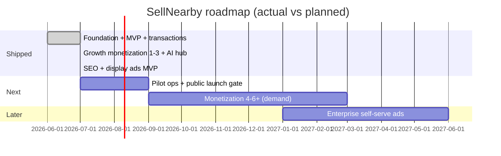

# Product Roadmap

> **Status:** Living roadmap · **Last updated:** 2026-07-23  
> **Canonical monetization detail:** [master-blueprint-v1.md](./master-blueprint-v1.md)  
> **Launch readiness:** [launch-checklist.md](./launch-checklist.md)

Timeline below reflects **what is shipped in code** vs **what remains planned**. Calendar quarters are indicative, not commitments.

## Shipped foundation (2026)

- [x] Monorepo (pnpm) · NestJS API · Next.js `apps/web` (marketplace + `/admin` + `/super-admin`)
- [x] Prisma + migrations · Docker Compose (local + OVH pilot) · Traefik / optional K8s scaffolding
- [x] Auth: phone OTP register, email activate (+ password), JWT sessions, password reset
- [x] Listings CRUD + moderation lifecycle · Meilisearch · chat (REST + WebSocket)
- [x] Stripe Connect + card checkout · notifications (in-app / push / email)
- [x] Unified `/account` hub (MEMBER / BUYER / SELLER); legacy `/buyer/*` · `/seller/*` still present
- [x] Storefront model · listing reserve · SEO Phases 0–4 in web · AI Marketing Hub Phases 0–4
- [x] Monetization Growth Phases 1 / 1.5 / 2 / 3 (boosts, featured, wallet spend, fast-track)
- [x] Buyer SKUs (partial): early cashback unlock · paid buyer statement
- [x] Seller ARPU: Growth Pack · AI credit packs · paid store slots · featured storefront
- [x] Admin display-ad campaigns (homepage + browse sidebar + search inline)

> **Note:** `apps/admin` is **deprecated** — do not treat it as a delivery target.

## Near-term (pilot → public)

| Area | Focus |
|------|--------|
| Ops / legal | Prod deploy checklist, Stripe live, SendGrid, lawyer-reviewed legal pack |
| Monetization | Enable priority message when ready; buyer protection (legal); optional extra package merchandising |
| AI Hub | Video / forecast only after pilot demand |
| Ads | Self-serve brand portal remains **Enterprise** (admin MVP already live) |
| Account UX | Continue consolidating on `/account/*`; retire parallel buyer/seller trees when ready |

## Later (Enterprise+)

| Area | Deliverables |
|------|-------------|
| Multi-tenancy | Community / neighborhood scopes |
| Analytics | Deeper seller insights, platform metrics polish |
| Compliance | GDPR tooling, data export automation |
| Integrations | Public webhooks / partner SDK |
| Advertising | Advertiser self-serve into display slots |

## Milestone overview

## Decision log

| Date | Decision | Rationale |
|------|----------|-----------|
| 2026-06 | pnpm monorepo | Workspace sharing, fast installs |
| 2026-06 | NestJS modular API | Clean architecture per domain |
| 2026-06 | Meilisearch | Fast full-text search, simple ops |
| 2026-06 | Stripe Connect | Marketplace payment splits |
| 2026-06 | Prisma ORM | Type-safe DB access (live in `apps/api`) |
| 2026-06-29 | Account vs storefront model | See [storefront-model.md](./storefront-model.md) |
| 2026-07 | Admin UI in `apps/web` | Single frontend; `apps/admin` retired |
| 2026-07 | Unified `/account` hub | MEMBER default role; buyer/seller namespaces legacy |
| 2026-07-22 | Roadmap rewritten to match shipped code | Prior placeholder timeline was obsolete |
| 2026-07-23 | Monetization status corrected | Buyer/seller SKUs beyond Phase 3 marked live where coded |
