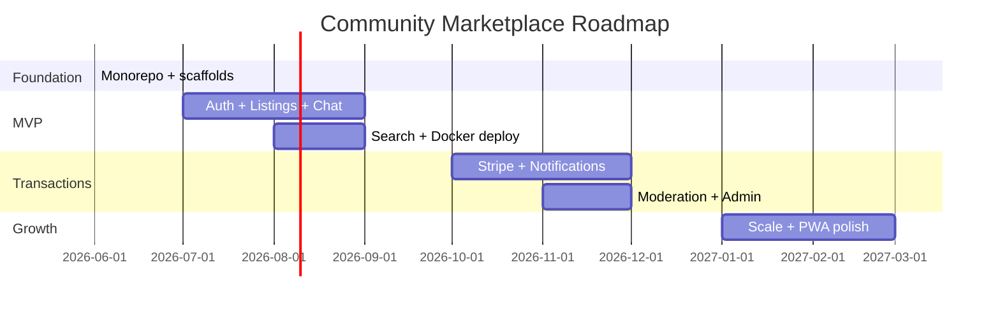

# Product Roadmap

> **Status:** Placeholder — subject to change.

## Phase 0 — Foundation ✅ (current)

- [x] Monorepo scaffold (pnpm workspaces)
- [x] Shared packages (types, validation, utils, config, ui)
- [x] Apps: web, admin, api
- [x] API domain module scaffolds
- [x] Infrastructure placeholders (Docker, Traefik, K8s)
- [x] Documentation skeleton

## Phase 1 — MVP (Q3 2026)

**Goal:** End-to-end listing browse, auth, and chat.

| Area | Deliverables |
|------|-------------|
| Auth | Password + OTP login, JWT, email activation |
| Listings | CRUD, categories, image URLs |
| Chat | REST + WebSocket messaging |
| Search | Meilisearch listing index |
| Infra | Docker Compose local stack |
| DB | Prisma schema + initial migrations |

## Phase 2 — Transactions (Q4 2026)

**Goal:** Enable secure payments between buyers and sellers.

| Area | Deliverables |
|------|-------------|
| Payments | Stripe Connect onboarding + card payments |
| Notifications | FCM push for messages and payments |
| Moderation | Reports, bans, admin review queue |
| Admin | Full dashboard with audit log |
| Infra | Staging K8s deployment |

## Phase 3 — Growth (Q1 2027)

**Goal:** Scale, optimize, and expand marketplace features.

| Area | Deliverables |
|------|-------------|
| Search | Faceted filters, geo search, autocomplete |
| Listings | Image upload (S3), saved items, seller ratings |
| Performance | CDN, Redis caching, API HPA tuning |
| Observability | Logging, tracing, alerting |
| Mobile | Enhanced PWA, push notification polish |

## Phase 4 — Enterprise (Q2 2027+)

**Goal:** Multi-community support and enterprise features.

| Area | Deliverables |
|------|-------------|
| Multi-tenancy | Community / neighborhood scopes |
| Analytics | Seller insights, platform metrics |
| Compliance | GDPR tooling, data export |
| Integrations | Webhooks, public API, partner SDK |

## Milestone timeline

## Decision log

| Date | Decision | Rationale |
|------|----------|-----------|
| 2026-06 | pnpm monorepo | Workspace sharing, fast installs |
| 2026-06 | NestJS modular API | Clean architecture per domain |
| 2026-06 | Meilisearch | Fast full-text search, simple ops |
| 2026-06 | Stripe Connect | Marketplace payment splits |
| TBD | Prisma ORM | Type-safe DB access (pending wiring) |
| 2026-06-29 | Account vs storefront model | See [storefront-model.md](./storefront-model.md) |
